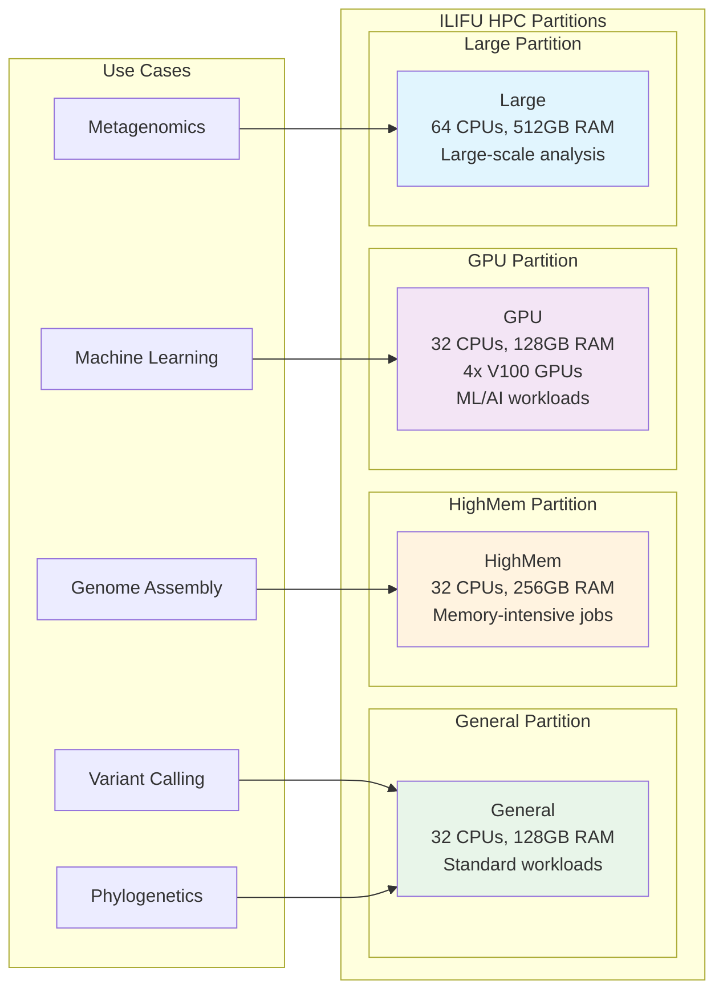
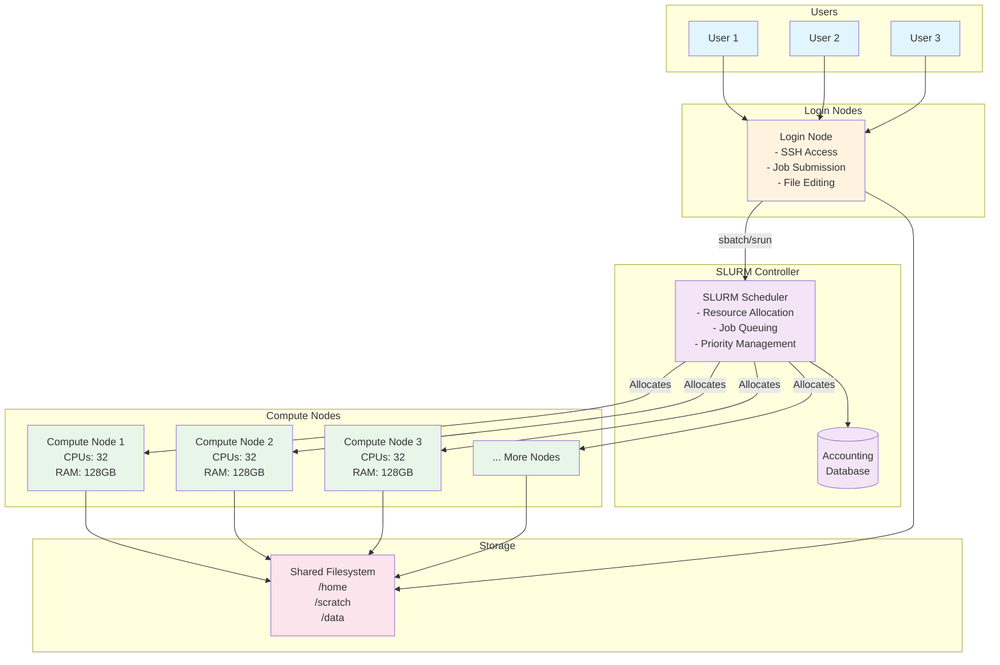

# HPC and ILIFU Training Materials

## Getting Started

This document provides an overview of HPC concepts and ILIFU infrastructure. 

**For hands-on practice:**
- **SLURM Jobs**: See [slurm-practical-tutorial.md](./slurm-practical-tutorial.md) for step-by-step SLURM exercises
- **Unix Commands**: See [unix-commands-pathogen-examples.md](./unix-commands-pathogen-examples.md) for genomics command-line basics

**Quick Setup** (if needed for examples below):
```bash
mkdir -p ~/hpc_practice && cd ~/hpc_practice
cp -r /cbio/training/courses/2025/micmet-genomics/sample-data/* .
```

## Table of Contents

1. [Introduction to High Performance Computing (HPC)](#introduction-to-hpc)
2. [ILIFU Infrastructure Overview](#ilifu-infrastructure)
3. [Getting Started with ILIFU](#getting-started)
4. [SLURM Job Scheduling](#slurm-basics)
5. [Resource Allocation and Management](#resource-management)
6. [Best Practices](#best-practices)
7. [Practical Examples](#practical-examples)
8. [Troubleshooting](#troubleshooting)

---

## Introduction to HPC

### What is High Performance Computing?

High Performance Computing (HPC) is the use of powerful computers with multiple processors working in parallel to solve complex computational problems that require significant processing power, memory, or time.

**Key Characteristics**:

- **Parallel processing**: Multiple CPUs/cores work simultaneously on the same problem
- **Cluster architecture**: Hundreds or thousands of interconnected compute nodes
- **High memory capacity**: Large RAM for data-intensive computations
- **Fast storage systems**: High-speed file systems for handling large datasets
- **Job scheduling**: Queue management systems to optimize resource allocation
- **Specialized hardware**: GPUs, high-speed interconnects (InfiniBand), and custom processors

### Why Use HPC?

- **Speed**: Complete computations faster than desktop computers
- **Scale**: Handle larger datasets and more complex problems
- **Efficiency**: Optimize resource utilization
- **Cost-effective**: Share expensive hardware among researchers

### Traditional Computing vs HPC

```
Desktop Computer          HPC Cluster
┌──────────────┐         ┌─────┬─────┬─────┐
│   1 CPU      │   vs    │Node1│Node2│Node3│
│   8GB RAM    │         │ 32  │ 64  │128  │
│   1TB Disk   │         │cores│cores│cores│
└──────────────┘         └─────┴─────┴─────┘
```

**HPC = Many computers working together**

| Traditional Computing | HPC Cluster |
|----------------------|-------------|
| Single processor | Hundreds of processors |
| Limited memory (8-32GB) | Massive shared memory (TB) |
| Local storage (TB) | Distributed storage (PB) |
| Individual use | Shared resources |
| Desktop/Laptop | Specialized data centers |

---

## Why Do We Need HPC?

### Real-world Problems That Need HPC

#### 🔬 **Astronomy**: Processing telescope data
- **Data volume**: 1-2 TB per night from modern telescopes
- **Local machine**: 3-4 weeks to process one night's data
- **HPC cluster**: 2-3 hours with parallel processing
- **Example**: MeerKAT telescope generates 2.5 TB/hour during observations

#### 🧬 **Bioinformatics**: Genome assembly
- **Data size**: 100-300 GB of raw sequencing reads
- **Local machine (8GB RAM)**: Often fails due to memory limits
- **Local machine (32GB RAM)**: 2-3 weeks for bacterial genome
- **HPC cluster**: 4-6 hours with 256GB RAM
- **Example**: Human genome assembly needs ~1TB RAM, impossible on most desktops

#### 🌡️ **Climate Modeling**: Weather simulations
- **Computation**: Millions of grid points × thousands of time steps
- **Local machine**: 6-8 months for regional model (if it runs at all)
- **HPC cluster**: 12-24 hours on 100+ cores
- **Example**: 10km resolution global model needs 10,000+ CPU hours

#### 🧮 **Machine Learning**: Training deep neural networks
- **Model size**: GPT-3 has 175 billion parameters
- **Local machine (single GPU)**: 355 years to train
- **HPC cluster (1000 GPUs)**: 34 days
- **Example**: Training ResNet-50 on ImageNet: 2 weeks (laptop) → 1 hour (8 GPUs)

#### 🦠 **Pathogen Genomics**: Outbreak analysis
- **Dataset**: 1000 M. tuberculosis genomes for outbreak investigation
- **Local machine tasks and times**:
  - Quality control: 50 hours (3 min/sample)
  - Read alignment: 167 hours (10 min/sample)  
  - Variant calling: 83 hours (5 min/sample)
  - Phylogenetic tree: 48-72 hours
  - **Total**: ~15 days of continuous processing
- **HPC cluster**: 
  - All samples in parallel: 4-6 hours total
  - Tree construction on high-memory node: 2-3 hours
- **Real example**: COVID-19 surveillance processing 10,000 genomes weekly - impossible without HPC

### Additional Pathogen Genomics Use Cases

#### 🧬 **Bacterial Genome Assembly (Illumina + Nanopore)**
- **Dataset**: Hybrid assembly of 50 bacterial isolates
- **Computational requirements**:
  - RAM: 16-32GB per genome
  - CPU: 8-16 cores optimal per assembly
- **Local machine (16GB RAM, 4 cores)**:
  - One genome at a time only
  - Per genome: 3-4 hours
  - Total time: 150-200 hours (6-8 days)
  - Risk of crashes with large genomes
- **HPC cluster (256GB RAM, 32 cores/node)**:
  - Process 8 genomes simultaneously per node
  - Use 7 nodes for all 50 genomes
  - Total time: 3-4 hours
  - **Speedup: 50x faster**

#### 💊 **AMR Gene Detection Across Multiple Species**
- **Dataset**: 5000 bacterial genomes from hospital surveillance
- **Tools**: AMRFinder, CARD-RGI, ResFinder
- **Computational requirements**:
  - Database size: 2-5GB per tool
  - RAM: 4-8GB per genome
  - CPU time: 5-10 minutes per genome per tool
- **Local machine (8 cores)**:
  - Sequential processing: 5000 × 3 tools × 7.5 min = 1875 hours (78 days)
  - Database loading overhead adds 20% more time
- **HPC cluster (100 nodes, 32 cores each)**:
  - Parallel processing across nodes
  - Shared database in memory
  - Total time: 6-8 hours
  - **Speedup: 230x faster**

#### 🌍 **Phylogeographic Analysis of Cholera Outbreak**
- **Dataset**: 2000 V. cholerae genomes from Haiti outbreak
- **Computational requirements**:
  - Alignment: 100GB RAM for reference-based
  - SNP calling: 4GB per genome
  - Tree building (RAxML-NG): 64-128GB RAM
  - BEAST analysis: 32GB RAM, 1000+ hours CPU time
- **Local machine attempts**:
  - Alignment: Often fails (out of memory)
  - If successful: 48 hours
  - SNP calling: 133 hours (4 min/genome)
  - RAxML tree: Fails on most laptops (needs >64GB RAM)
  - BEAST: 6-8 weeks for proper MCMC convergence
- **HPC cluster**:
  - Alignment: 2 hours on high-memory node
  - SNP calling: 2 hours (parallel)
  - RAxML: 4-6 hours on 64 cores
  - BEAST: 48 hours on 32 cores
  - **Total: 2-3 days vs 2-3 months**

#### 🔬 **Real-time Nanopore Sequencing Analysis**
- **Scenario**: Meningitis outbreak, need results in <24 hours
- **Data flow**: 20 samples, 5GB data/sample, arriving over 12 hours
- **Pipeline**: Basecalling → QC → Assembly → Typing → AMR
- **Local machine challenges**:
  - Can't keep up with data generation
  - Basecalling alone: 2 hours/sample (40 hours total)
  - Sequential processing: Miss the 24-hour deadline
- **HPC solution**:
  - Real-time processing as data arrives
  - GPU nodes for basecalling: 10 min/sample
  - Parallel assembly and analysis
  - Results available within 2-3 hours of sequencing
  - **Clinical impact: Treatment decisions in same day**

### Computational Requirements Comparison Table

| Task | Local Machine | HPC Cluster | Speedup |
|------|--------------|-------------|---------|
| **100 TB genomes QC** | 8GB RAM, 5 hours | 256GB RAM, 10 min | 30x |
| **1000 genome alignment** | 16GB RAM, 7 days | 32GB/node × 50, 3 hours | 56x |
| **Phylogenetic tree (5000 taxa)** | Often fails (>64GB needed) | 512GB RAM, 6 hours | ∞ |
| **Pan-genome analysis (500 genomes)** | 32GB RAM, 2 weeks | 256GB RAM, 8 hours | 42x |
| **GWAS (10,000 samples)** | Impossible (<1TB RAM) | 1TB RAM node, 24 hours | ∞ |
| **Metagenomic assembly** | 64GB RAM, 3 days | 512GB RAM, 4 hours | 18x |

### Why These Tasks Fail on Local Machines

1. **Memory Walls**:
   - De novo assembly: Needs 100-1000x coverage data in RAM
   - Tree building: O(n²) memory for distance matrices
   - Pan-genome: Stores all genomes simultaneously

2. **Time Constraints**:
   - Outbreak response: Need results in hours, not weeks
   - Grant deadlines: Can't wait months for analysis
   - Iterative analysis: Need to test multiple parameters

3. **Data Volume**:
   - Modern sequencer: 100-500GB per run
   - Surveillance programs: 100s of genomes weekly
   - Can't even store data on laptop (typical: 256GB-1TB SSD)

---

## ILIFU Infrastructure

### What is ILIFU?

- **Inter-University Institute for Data Intensive Astronomy**
- South African national research data facility
- Supports astronomy, bioinformatics, and other data-intensive sciences
- Located at University of Cape Town and University of the Western Cape

### ILIFU Services

1. **Compute Cluster**: High-performance computing resources
2. **Storage**: Large-scale data storage solutions
3. **Cloud Services**: Virtualized computing environments
4. **Data Transfer**: High-speed data movement capabilities
5. **Support**: Technical assistance and training

### ILIFU Cluster Architecture



**Figure: HPC cluster partitions showing different resource types and their specific use cases**

### Hardware Overview

**Partition Specifications:**

| Partition | Configuration | Nodes | Use Case |
|-----------|--------------|--------|----------|
| **Main, Jupyter, Devel** | 32 cores, ~232GB RAM | 85 + 12 | Stable, computational processing |
| **GPU** | 32 cores, ~232GB RAM, NVIDIA GPUs | 7 | GPU-accelerated computing |
| **HighMem** | 32 cores (503GB) / 96 cores (1.5TB RAM) | 3 | High-memory single jobs |

**Node Types:**

- **Login Node**: Access point for SLURM commands (cd, mkdir, ls, etc.)
- **Jupyter/Dev Node**: Development space for new code, workflows, debugging
- **Main Partition**: Stable, computationally heavy processing  
- **HighMem/GPU**: Specialized resources for memory-intensive or GPU workloads

---

## Getting Started

### Account Setup

1. **Request Access**: Apply through your institution
2. **SSH Keys**: Generate and register SSH key pairs
3. **VPN**: Configure institutional VPN if required
4. **Initial Login**: Connect to login nodes

### Basic Commands

```bash
# Login to ILIFU
ssh username@training.ilifu.ac.za

# Check your home directory
ls -la ~

# Check available modules
module avail

# Load a module
module load python/3.12.3  # Or use system python3
```

> 💡 **Next Steps**: After logging in, follow the hands-on exercises in [slurm-practical-tutorial.md](./slurm-practical-tutorial.md)

### File System Layout

```
/home/username/          # Your home directory (limited space)
/scratch/username/       # Temporary fast storage
/data/project/          # Shared project data
/software/              # Installed software
```

### Data Management

- **Home Directory**: Small, backed up, permanent
- **Scratch Space**: Large, fast, temporary (auto-cleaned)
- **Project Directories**: Shared, persistent, for collaboration

---

## SLURM Basics

> 📚 **For detailed SLURM tutorials and exercises, see: [slurm-practical-tutorial.md](./slurm-practical-tutorial.md)**

### What is SLURM?



**Figure: HPC cluster architecture showing the relationship between users, login nodes, SLURM scheduler, compute nodes, and shared storage**

**Simple Linux Utility for Resource Management (SLURM)** is a job scheduling and cluster management tool that:

- **Job scheduler**: Allocates compute resources efficiently among users
- **Resource manager**: Controls access to CPUs, memory, and other resources  
- **Workload manager**: Manages job queues and priorities based on fairness policies
- **Framework components**: Login nodes for access, compute nodes for execution, scheduler for coordination, and accounting database for tracking

### Key SLURM Concepts

- **Job**: A computational task submitted to the cluster
- **Partition**: Group of nodes with similar characteristics
- **Queue**: Collection of jobs waiting for resources
- **Node**: Individual compute server
- **Core/CPU**: Processing unit within a node

### Basic SLURM Commands

```bash
# Submit a job
sbatch job_script.sh

# Check job status
squeue -u username

# Cancel a job
scancel job_id

# Check node information
sinfo

# Check your job history
sacct -u username
```

### Job Script Template

```bash
#!/bin/bash
#SBATCH --job-name=my_job
#SBATCH --partition=Main
#SBATCH --nodes=1
#SBATCH --ntasks-per-node=1
#SBATCH --cpus-per-task=4
#SBATCH --mem=8GB
#SBATCH --time=01:00:00
#SBATCH --output=output_%j.log
#SBATCH --error=error_%j.log

# Load modules
module load python/3.12.3  # Or use system python3

# Run your program
python my_script.py
```

### SLURM Directives Explained

- `--job-name`: Human-readable job name
- `--partition`: Which partition to use
- `--nodes`: Number of nodes required
- `--ntasks-per-node`: Tasks per node
- `--cpus-per-task`: CPUs per task
- `--mem`: Memory requirement
- `--time`: Maximum runtime
- `--output/--error`: Log file locations

---

## Resource Management

### Understanding Resources

1. **CPU Cores**: Processing units
2. **Memory (RAM)**: Working memory
3. **GPU**: Graphics processing units
4. **Storage**: Disk space
5. **Network**: Data transfer bandwidth

### Resource Allocation Strategies

```bash
# CPU-intensive job
#SBATCH --cpus-per-task=16
#SBATCH --mem=32GB

# Memory-intensive job
#SBATCH --cpus-per-task=4
#SBATCH --mem=64GB

# GPU job
#SBATCH --gres=gpu:1
#SBATCH --partition=GPU

# Parallel job
#SBATCH --nodes=2
#SBATCH --ntasks=32
```

### Monitoring Resource Usage

```bash
# Check job efficiency
seff job_id

# Real-time job monitoring
sstat job_id

# Detailed job information
scontrol show job job_id
```

---

## Best Practices

### Job Submission

1. **Test small first**: Start with short test runs
2. **Use checkpoints**: Save progress regularly
3. **Estimate resources**: Don't over-request
4. **Use appropriate partitions**: Match job to partition
5. **Clean up**: Remove temporary files

### Code Optimization

```bash
# Use parallel processing
#SBATCH --cpus-per-task=8

# In Python
from multiprocessing import Pool
with Pool(8) as pool:
    results = pool.map(my_function, data)
```

### Data Management

1. **Use scratch space** for temporary files
2. **Compress data** when possible
3. **Clean up regularly**
4. **Use appropriate file formats**

### Common Mistakes to Avoid

- Requesting too many resources
- Running jobs on login nodes
- Not using version control
- Ignoring error messages
- Not testing scripts locally first

---

## Practical Examples

> 📝 **Complete Step-by-Step Tutorials**: For detailed, hands-on SLURM exercises with explanations, see [slurm-practical-tutorial.md](./slurm-practical-tutorial.md)

### Example 1: Python Data Analysis

```bash
#!/bin/bash
#SBATCH --job-name=data_analysis
#SBATCH --partition=Main
#SBATCH --cpus-per-task=4
#SBATCH --mem=16GB
#SBATCH --time=02:00:00
#SBATCH --output=analysis_%j.log

module load python/3.12.3  # Or use system python3
# Install with: pip install pandas numpy matplotlib

python data_analysis.py input.csv
```

### Example 2: R Statistical Analysis

```bash
#!/bin/bash
#SBATCH --job-name=r_stats
#SBATCH --partition=Main
#SBATCH --cpus-per-task=1
#SBATCH --mem=8GB
#SBATCH --time=01:30:00

module load R/4.4.1  # Check available version

Rscript statistical_analysis.R
```

### Example 3: GPU Machine Learning

```bash
#!/bin/bash
#SBATCH --job-name=ml_training
#SBATCH --partition=GPU
#SBATCH --gres=gpu:1
#SBATCH --cpus-per-task=8
#SBATCH --mem=32GB
#SBATCH --time=04:00:00

# module load cuda  # Check if GPU/CUDA is available
module load python/3.12.3  # Or use system python3

python train_model.py
```

### Example 4: Array Jobs

```bash
#!/bin/bash
#SBATCH --job-name=array_job
#SBATCH --partition=Main
#SBATCH --array=1-100
#SBATCH --cpus-per-task=1
#SBATCH --mem=4GB
#SBATCH --time=00:30:00

# Process different files based on array index
input_file="data_${SLURM_ARRAY_TASK_ID}.txt"
output_file="result_${SLURM_ARRAY_TASK_ID}.txt"

python process_data.py $input_file $output_file
```

---

## Troubleshooting

### Common Issues and Solutions

#### Job Won't Start

```bash
# Check partition limits
scontrol show partition

# Check job details
scontrol show job job_id

# Check node availability
sinfo -N
```

#### Out of Memory Errors

```bash
# Check memory usage
sstat -j job_id --format=AveCPU,AvePages,AveRSS,AveVMSize

# Increase memory request
#SBATCH --mem=32GB
```

#### Job Timeouts

```bash
# Check time limits
scontrol show partition

# Increase time limit
#SBATCH --time=04:00:00

# Use checkpointing for long jobs
```

#### Module Issues

```bash
# List available modules
module avail

# Check module conflicts
module list

# Purge and reload
module purge
module load python/3.12.3  # Or use system python3
```

### Getting Help

1. **Documentation**: Check ILIFU docs
2. **Help Desk**: Submit support tickets
3. **Community**: Ask on forums or Slack
4. **Training**: Attend workshops
5. **Practical Tutorials**: Work through [slurm-practical-tutorial.md](./slurm-practical-tutorial.md)

---

## Quick Reference

### Essential SLURM Commands

| Command | Purpose | Example Output |
|---------|---------|----------------|
| `sbatch script.sh` | Submit job | `Submitted batch job 10` |
| `squeue -u $USER` | Check your jobs | Shows running/pending jobs |
| `scancel job_id` | Cancel job | Terminates specified job |
| `sinfo` | Node information | Shows partition and node status |
| `sacct -j job_id` | Job accounting | Shows job completion details |
| `seff job_id` | Job efficiency | Shows resource utilization |

### Example Command Outputs

#### Checking Partition Information

```bash
$ sinfo
PARTITION AVAIL  TIMELIMIT  NODES  STATE NODELIST
training*    up 14-00:00:0      7   idle compute-1-sep2025,compute-2-sep2025,compute-3-sep2025,compute-4-sep2025,compute-5-sep2025,compute-6-sep2025,compute-7-sep2025
```

#### Job Submission and Status

```bash
$ sbatch hello.sh
Submitted batch job 10

$ squeue -u mamana
             JOBID PARTITION     NAME     USER ST       TIME  NODES NODELIST(REASON)
                10  training    hello   mamana  R       0:01      1 compute-1-sep2025
```

#### Job Efficiency Report

```bash
$ seff 10
Job ID: 10
Cluster: training
User/Group: mamana/training
State: COMPLETED (exit code 0)
Nodes: 1
Cores per node: 1
CPU Utilized: 00:00:00
CPU Efficiency: 0.00% of 00:00:01 core-walltime
Job Wall-clock time: 00:00:01
Memory Utilized: 4.80 MB
Memory Efficiency: 0.48% of 1.00 GB
```

### Common SBATCH Directives

| Directive | Purpose | Example |
|-----------|---------|---------|
| `--job-name` | Job name | `my_analysis` |
| `--partition` | Partition | `Main`, `GPU` |
| `--cpus-per-task` | CPU cores | `4` |
| `--mem` | Memory | `16GB` |
| `--time` | Runtime limit | `02:00:00` |
| `--gres` | GPU resources | `gpu:1` |

### File Transfer

```bash
# Upload data
scp local_file.txt username@training.ilifu.ac.za:~/

# Download results
scp username@training.ilifu.ac.za:~/results.txt ./

# Sync directories
rsync -av local_dir/ username@training.ilifu.ac.za:~/remote_dir/
```

---

## Additional Resources

- ILIFU Documentation: <https://docs.ilifu.ac.za>
- SLURM Documentation: <https://slurm.schedmd.com/documentation.html>
- HPC Best Practices: Various online resources
- Training Materials: Regular workshops and tutorials
