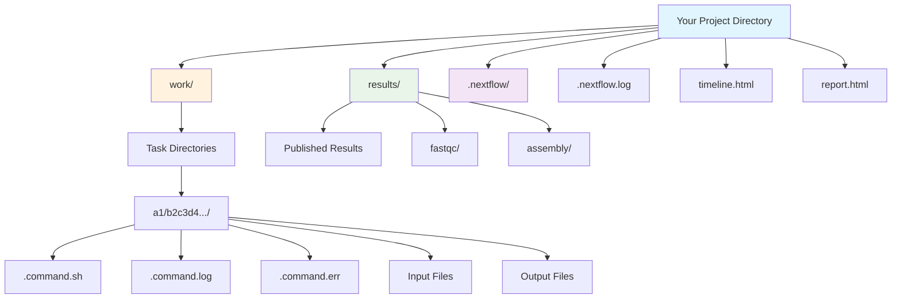

# Day 6: Nextflow Foundations & Core Concepts

**Date**: September 8, 2025
**Duration**: 09:00-13:00 CAT
**Focus**: Introduction to workflow management, Nextflow fundamentals, and first pipelines

## Learning Philosophy: See it → Understand it → Try it → Build it → Master it

This module follows a proven learning approach designed specifically for beginners:

- **See it**: Visual diagrams and examples show you what workflows look like
- **Understand it**: Clear explanations of why workflow management matters
- **Try it**: Simple exercises to practice basic concepts
- **Build it**: Create your own working pipeline step by step
- **Master it**: Apply skills to real genomics problems with confidence

Every section builds on the previous one, ensuring you develop solid foundations before moving to more complex topics.

## Overview

Day 6 introduces participants to workflow management systems and Nextflow fundamentals. This comprehensive session covers the theoretical foundations of reproducible workflows, core Nextflow concepts, and hands-on development of basic pipelines. Participants will understand why workflow management is crucial for bioinformatics and gain practical experience with Nextflow's core components.

## Learning Objectives

By the end of Day 6, you will be able to:

- Understand the challenges in bioinformatics reproducibility and benefits of workflow management systems
- Explain Nextflow's core features and architecture
- Identify the main components of a Nextflow script (processes, channels, workflows)
- Write and execute basic Nextflow processes and workflows
- Use channels to manage data flow between processes
- Configure Nextflow for different execution environments
- Debug common Nextflow issues and understand error messages
- Apply best practices for pipeline development

## Schedule

| Time (CAT) | Topic | Duration | Trainer |
|------------|-------|----------|---------|
| **09:00** | *Part 1: The Challenge of Complex Genomics Analyses* | 45 min | Mamana Mbiyavanga |
| **09:45** | *Workflow Management Systems Comparison & Nextflow Introduction* | 45 min | Mamana Mbiyavanga |
| **10:30** | **Break** | 15 min | |
| **10:45** | *Part 2: Nextflow Architecture and Core Concepts* | 45 min | Mamana Mbiyavanga |
| **11:30** | *Part 3: Hands-on Exercises (Installation, First Scripts, Channels)* | 90 min | Mamana Mbiyavanga |
| **13:00** | **End** | | |

## Key Topics

### 1. Foundation Review (30 minutes)

- Command line proficiency check
- Basic software installation and environment setup
- Development workspace organization

### 2. Introduction to Workflow Management (45 minutes)

- The challenge of complex genomics analyses
- Problems with traditional scripting approaches
- Benefits of workflow management systems
- Nextflow vs other systems (Snakemake, CWL, WDL)
- Reproducibility, portability, and scalability

### 3. Nextflow Core Concepts (75 minutes)

- Nextflow architecture and execution model
- Processes: encapsulated tasks with inputs, outputs, and scripts
- Channels: asynchronous data streams connecting processes
- Workflows: orchestrating process execution and data flow
- The work directory structure and caching mechanism
- Executors and execution platforms

### 4. Hands-on Pipeline Development (75 minutes)

- Writing your first Nextflow process
- Creating channels and managing data flow
- Building a simple QC workflow
- Testing and debugging pipelines
- Understanding the work directory

## Tools and Software

### Core Requirements

- **[Nextflow](https://www.nextflow.io/)** (version 20.10.0 or later) - Workflow orchestration system
- **[Java](https://openjdk.org/)** (version 11 or later) - Required for Nextflow execution
- **Text editor** - [VS Code](https://code.visualstudio.com/) with [Nextflow extension](https://marketplace.visualstudio.com/items?itemName=nextflow.nextflow) recommended
- **Command line access** - Terminal or command prompt for running Nextflow commands

### Bioinformatics Tools

- **[FastQC](https://www.bioinformatics.babraham.ac.uk/projects/fastqc/)** - Read quality control assessment
- **[MultiQC](https://multiqc.info/)** - Aggregate quality control reports
- **[Trimmomatic](http://www.usadellab.org/cms/?page=trimmomatic)** - Read trimming and filtering
- **[SPAdes](https://cab.spbu.ru/software/spades/)** - Genome assembly (for later exercises)

### Development Environment

- **Terminal/Command line** - For running Nextflow commands
- **Text editor** - For writing pipeline scripts

## Foundation Review (30 minutes)

Before diving into workflow management, let's ensure everyone has the essential foundation skills needed for this module.

### Command Line Proficiency Check

Let's quickly verify your command line skills with some essential operations:

<div style="background: #f8f9fa; padding: 20px; border-radius: 8px; margin: 20px 0;">
<h4>🔧 Quick Command Line Assessment</h4>

**Test your skills with these commands:**

```bash
# Navigation and file operations
pwd                          # Where am I?
ls -la                      # List files with details
cd /path/to/data           # Change directory
mkdir analysis_results     # Create directory
cp file1.txt backup/       # Copy files
mv old_name.txt new_name.txt  # Rename/move files

# File content examination
zcat data.fastq.gz | head -n 10  # First 10 lines of compressed FASTQ
tail -n 5 logfile.txt      # Last 5 lines
zcat sequences.fastq.gz | wc -l  # Count lines in compressed file
grep ">" sequences.fasta   # Find FASTA headers

# Process management
ps aux                     # List running processes
top                        # Monitor system resources
kill -9 [PID]             # Terminate process
nohup command &            # Run in background
```

**Expected competency:** You should be comfortable with basic file operations, text processing, and process management.
</div>

### Software Installation Overview

For Day 6, we'll focus on basic software installation and environment setup. Container technologies will be covered in Day 7 as part of advanced deployment strategies.

#### **Using the Module System**

<div style="background: #e8f5e8; padding: 15px; border-radius: 8px; margin: 15px 0;">
<h5>📦 Loading Required Software</h5>

**All tools are pre-installed and available through the module system. No installation required!**

**Step 1: Check if module system is available**

```bash
# Test if module command works
module --version

# If you get "command not found", see troubleshooting below
```

**Step 2: Check available modules**

```bash
# List all available modules
module avail

# Search for specific tools
module avail nextflow
module avail java
module avail fastqc
```

**Step 3: Load required modules**

```bash
# Load Java 17 (required for Nextflow)
module load java/openjdk-17.0.2

# Load Nextflow
module load nextflow/25.04.6

# Load bioinformatics tools for exercises
module load fastqc/0.12.1
module load trimmomatic/0.39
module load multiqc/1.22.3
```

**Step 4: Verify loaded modules**

```bash
# Check what modules are currently loaded
module list

# Test that tools are working
nextflow -version
java -version
fastqc --version
```

**Step 5: Module management**

```bash
# Unload a specific module
module unload fastqc/0.12.1

# Unload all modules
module purge

# Create a convenient setup script
cat > setup_modules.sh << 'EOF'
#!/bin/bash
module load java/openjdk-17.0.2 nextflow/25.04.6 fastqc/0.12.1 trimmomatic/0.39 multiqc/1.22.3
echo "Modules loaded successfully!"
module list
EOF

chmod +x setup_modules.sh
```

**Troubleshooting: If module command is not found**

```bash
# Only if you get "module: command not found", try:
source /opt/lmod/8.7/lmod/lmod/init/bash

# Then retry the module commands above
module --version
```
</div>

### Development Environment Setup

Let's ensure your environment is ready for Nextflow development:

#### **Module Environment Verification**

<div style="background: #e8f5e8; padding: 15px; border-radius: 8px; margin: 15px 0;">
<h5>✅ Environment Verification</h5>

**Complete verification workflow:**

```bash
# Step 1: Test module system
module --version
# Should show: Modules based on Lua: Version 8.7

# Step 2: Load all required modules with specific versions
module load java/openjdk-17.0.2 nextflow/25.04.6 fastqc/0.12.1 trimmomatic/0.39 multiqc/1.22.3

# Step 3: Verify Java (required for Nextflow)
java -version
# Should show: openjdk version "17.0.2"

# Step 4: Verify Nextflow
nextflow -version
# Should show: nextflow version 25.04.6

# Step 5: Verify bioinformatics tools
fastqc --version
# Should show: FastQC v0.12.1

trimmomatic -version
# Should show: 0.39

multiqc --version
# Should show: multiqc, version 1.22.3

# Step 6: Check all loaded modules
module list
# Should show all 5 loaded modules
```

**If module command is not found:**

```bash
# Initialize module system (only if needed)
source /opt/lmod/8.7/lmod/lmod/init/bash

# Then retry the verification steps above
module --version
```

**If modules are not available:**

```bash
# Search for modules with different names
module avail 2>&1 | grep -i nextflow
module avail 2>&1 | grep -i java

# Contact system administrator if modules are missing
```

**Quick Setup Script:**

```bash
# Create a one-command setup (handles module initialization if needed)
cat > ~/setup_day6.sh << 'EOF'
#!/bin/bash

# Test if module command works
if ! command -v module >/dev/null 2>&1; then
    echo "Initializing module system..."
    source /opt/lmod/8.7/lmod/lmod/init/bash
fi

# Load required modules
module load java/openjdk-17.0.2 nextflow/25.04.6 fastqc/0.12.1 trimmomatic/0.39 multiqc/1.22.3
echo "All modules loaded successfully!"
module list
EOF

chmod +x ~/setup_day6.sh

# Use it anytime with:
source ~/setup_day6.sh
```
</div>

#### **Workspace Organization**

Create a well-organized workspace for today's exercises:

```bash
# Create main working directory
mkdir ~/nextflow-training
cd ~/nextflow-training

# Create subdirectories
mkdir -p {scripts,results,configs}

# Check available real data
ls -la /data/Dataset_Mt_Vc/
echo "Real genomic data available in /data/Dataset_Mt_Vc/"
```

<div style="background: #fff3e0; padding: 15px; border-radius: 8px; margin: 15px 0;">
<h5>💡 Pro Tip: Development Best Practices</h5>

**Recommended setup:**

- Use a dedicated directory for each project
- Keep data, scripts, and results separate
- Use meaningful file names and directory structure
- Document your workflow with README files
- Use version control (we'll cover this in Day 7!)
</div>

---

## Part 1: The Challenge of Complex Genomics Analyses

### Why Workflow Management Matters

Consider analyzing 100 bacterial genomes without workflow management:

```bash
# Manual approach - tedious and error-prone
for sample in sample1 sample2 sample3 ... sample100; do
    fastqc ${sample}_R1.fastq.gz ${sample}_R2.fastq.gz
    if [ $? -ne 0 ]; then echo "FastQC failed"; exit 1; fi

    trimmomatic PE ${sample}_R1.fastq.gz ${sample}_R2.fastq.gz \
        ${sample}_R1_trimmed.fastq.gz ${sample}_R1_unpaired.fastq.gz \
        ${sample}_R2_trimmed.fastq.gz ${sample}_R2_unpaired.fastq.gz \
        SLIDINGWINDOW:4:20
    if [ $? -ne 0 ]; then echo "Trimming failed"; exit 1; fi

    spades.py -1 ${sample}_R1_trimmed.fastq.gz -2 ${sample}_R2_trimmed.fastq.gz \
        -o ${sample}_assembly
    if [ $? -ne 0 ]; then echo "Assembly failed"; exit 1; fi

    # What if step 3 fails for sample 67?
    # How do you restart from where it failed?
    # How do you run samples in parallel efficiently?
    # How do you ensure reproducibility across different systems?
done
```

### Why This Approach is "Tedious and Error-Prone"

**Major Problems with Traditional Shell Scripting:**

1. **No Parallelization**
    - Processes samples sequentially (one after another)
    - Wastes computational resources on multi-core systems
    - Takes unnecessarily long time

2. **Poor Error Recovery & Resumability**
    - If one sample fails, entire pipeline stops
    - No way to resume from failure point
    - Must restart from beginning
    - Manual error checking is verbose and error-prone

3. **Resource Management Issues**
    - No control over CPU/memory usage
    - Can overwhelm system or underutilize resources
    - No queue management for HPC systems
    - No automatic optimization of resource allocation

4. **Lack of Reproducibility**
    - Hard to track software versions
    - Environment dependencies not managed
    - Difficult to share and reproduce results across different systems
    - Software installation and version conflicts

5. **Poor Scalability**
    - Doesn't scale well from laptop to HPC to cloud
    - No automatic adaptation to different computing environments
    - Limited ability to handle varying data volumes

6. **Maintenance Nightmare**
    - Adding new steps requires modifying the entire script
    - Parameter changes need manual editing throughout
    - No modular design for reusable components
    - Difficult to test individual components

7. **No Progress Tracking**
    - Can't easily see which samples completed
    - No reporting or logging mechanisms
    - Difficult to debug failures
    - No visibility into pipeline performance

## The Workflow Management Solution

### Overview of Workflow Management Systems

**Workflow management systems (WMS)** are specialized programming languages and frameworks designed specifically to address the challenges of complex, multi-step computational pipelines. They provide a higher-level abstraction that automatically handles the tedious and error-prone aspects of traditional shell scripting.

#### How Workflow Management Systems Solve Traditional Problems:

- **Automatic Parallelization**
    - Analyze task dependencies and run independent steps simultaneously
    - Efficiently utilize all available CPU cores and computing nodes
    - Scale from single machines to massive HPC clusters and cloud environments

- **Built-in Error Recovery**
    - Automatic retry mechanisms for failed tasks
    - Resume functionality to restart from failure points
    - Intelligent caching to avoid re-running successful steps

- **Resource Management**
    - Automatic CPU and memory allocation based on task requirements
    - Integration with job schedulers ([SLURM](https://slurm.schedmd.com/documentation.html), [PBS](https://www.openpbs.org/), [SGE](https://gridscheduler.sourceforge.net/))
    - Dynamic scaling in cloud environments

- **Reproducibility by Design**
    - Container integration (Docker, Singularity) for consistent environments
    - Version tracking for all software dependencies
    - Portable execution across different computing platforms

- **Progress Monitoring**
    - Real-time pipeline execution tracking
    - Detailed logging and reporting
    - Performance metrics and resource usage statistics

- **Modular Architecture**
    - Reusable workflow components
    - Easy parameter configuration
    - Clean separation of logic and execution

### Comparison of Popular Workflow Languages

The bioinformatics community has developed several powerful workflow management systems, each with unique strengths and design philosophies:

#### 1. **[Nextflow](https://www.nextflow.io/)**
- **Language Base**: [Groovy](https://groovy-lang.org/) (JVM-based)
- **Philosophy**: Dataflow programming with reactive streams
- **Strengths**: Excellent parallelization, cloud-native, strong container support
- **Community**: Large bioinformatics community, [nf-core](https://nf-co.re/) ecosystem

#### 2. **[Snakemake](https://snakemake.readthedocs.io/)**
- **Language Base**: [Python](https://www.python.org/)
- **Philosophy**: Rule-based workflow definition inspired by [GNU Make](https://www.gnu.org/software/make/)
- **Strengths**: Pythonic syntax, excellent for Python developers, strong academic adoption
- **Community**: Very active in computational biology and data science

#### 3. **[Common Workflow Language (CWL)](https://www.commonwl.org/)**
- **Language Base**: [YAML](https://yaml.org/)/[JSON](https://www.json.org/)
- **Philosophy**: Vendor-neutral, standards-based approach
- **Strengths**: Platform independence, strong metadata support, scientific reproducibility focus
- **Community**: Broad industry and academic support across multiple domains

#### 4. **[Workflow Description Language (WDL)](https://openwdl.org/)**
- **Language Base**: Custom domain-specific language
- **Philosophy**: Human-readable workflow descriptions with strong typing
- **Strengths**: Excellent cloud integration, strong at [Broad Institute](https://www.broadinstitute.org/) and genomics centers
- **Community**: Strong in genomics, particularly for large-scale sequencing projects

### Feature Comparison Table

| Feature | Nextflow | Snakemake | CWL | WDL |
|---------|----------|-----------|-----|-----|
| **Syntax Base** | Groovy | Python | YAML/JSON | Custom DSL |
| **Learning Curve** | Moderate | Easy (for Python users) | Steep | Moderate |
| **Parallelization** | Excellent (automatic) | Excellent | Good | Excellent |
| **Container Support** | Native (Docker/Singularity) | Native | Native | Native |
| **Cloud Integration** | Excellent (AWS, GCP, Azure) | Good | Good | Excellent |
| **HPC Support** | Excellent ([SLURM](https://slurm.schedmd.com/documentation.html), [PBS](https://www.openpbs.org/), etc.) | Excellent | Good | Good |
| **Resume Capability** | Excellent | Excellent | Limited | Good |
| **Community Size** | Large (bioinformatics) | Large (data science) | Medium | Medium |
| **Package Ecosystem** | [nf-core](https://nf-co.re/) (500+ pipelines) | [Snakemake Wrappers](https://snakemake-wrappers.readthedocs.io/) | Limited | Limited |
| **Debugging Tools** | Good (Tower, reports) | Excellent | Limited | Good |
| **Best Use Cases** | Multi-omics, clinical pipelines | Data analysis, research | Standards compliance | Large-scale genomics |
| **Industry Adoption** | High (pharma, biotech) | High (academia) | Growing | High (genomics centers) |

### Simple Code Examples

Let's see how the same basic task - running FastQC on multiple samples - would be implemented in different workflow languages:

#### **Traditional Shell Script** (for comparison)
```bash
# Manual approach - sequential processing
for sample in sample1 sample2 sample3; do
    fastqc ${sample}_R1.fastq.gz ${sample}_R2.fastq.gz -o results/
    if [ $? -ne 0 ]; then echo "FastQC failed for $sample"; exit 1; fi
done
```

#### **Nextflow Implementation**
```groovy
#!/usr/bin/env nextflow

// Define input channel
Channel
    .fromFilePairs("data/*_{R1,R2}.fastq")
    .set { read_pairs_ch }

// FastQC process
process fastqc {
    container 'biocontainers/fastqc:v0.11.9'
    publishDir 'results/', mode: 'copy'

    input:
    tuple val(sample_id), path(reads)

    output:
    path "*_fastqc.{zip,html}"

    script:
    """
    fastqc ${reads} -t ${task.cpus}
    """
}

// Run the workflow
workflow {
    fastqc(read_pairs_ch)
}
```

#### **Snakemake Implementation**
```python
# Snakefile
SAMPLES = ["sample1", "sample2", "sample3"]

rule all:
    input:
        expand("results/{sample}_{read}_fastqc.html",
               sample=SAMPLES, read=["R1", "R2"])

rule fastqc:
    input:
        "data/{sample}_{read}.fastq"
    output:
        html="results/{sample}_{read}_fastqc.html",
        zip="results/{sample}_{read}_fastqc.zip"
    container:
        "docker://biocontainers/fastqc:v0.11.9"
    shell:
        "fastqc {input} -o results/"
```

#### **CWL Implementation**
```yaml
# fastqc-workflow.cwl
cwlVersion: v1.2
class: Workflow

inputs:
  fastq_files:
    type: File[]

outputs:
  fastqc_reports:
    type: File[]
    outputSource: fastqc/html_report

steps:
  fastqc:
    run: fastqc-tool.cwl
    scatter: fastq_file
    in:
      fastq_file: fastq_files
    out: [html_report, zip_report]

# fastqc-tool.cwl
cwlVersion: v1.2
class: CommandLineTool

baseCommand: fastqc

inputs:
  fastq_file:
    type: File
    inputBinding:
      position: 1

outputs:
  html_report:
    type: File
    outputBinding:
      glob: "*_fastqc.html"
  zip_report:
    type: File
    outputBinding:
      glob: "*_fastqc.zip"

requirements:
  DockerRequirement:
    dockerPull: biocontainers/fastqc:v0.11.9
```

#### **Key Differences in Syntax:**

- **Nextflow**: Uses Groovy syntax with channels for data flow, processes define computational steps
- **Snakemake**: Python-based with rules that define input/output relationships, uses wildcards for pattern matching
- **CWL**: YAML-based with explicit input/output definitions, requires separate tool and workflow files
- **WDL**: Custom syntax with strong typing, task-based approach with explicit variable declarations

### Why Nextflow for This Course

This course focuses on **Nextflow** for several compelling reasons that make it particularly well-suited for microbial genomics workflows:

#### **1. Bioinformatics Community Adoption**
- **[nf-core](https://nf-co.re/) ecosystem**: Over 500 community-curated pipelines specifically for bioinformatics
- **Industry standard**: Widely adopted by pharmaceutical companies, biotech firms, and genomics centers
- **Active development**: Strong community support with regular updates and improvements

#### **2. Excellent Parallelization for Genomics**
- **Automatic scaling**: Seamlessly scales from single samples to thousands of genomes
- **Dataflow programming**: Natural fit for genomics pipelines with complex dependencies
- **Resource optimization**: Intelligent task scheduling maximizes computational efficiency

#### **3. Clinical and Production Ready**
- **Robust error handling**: Critical for clinical pipelines where reliability is essential
- **Comprehensive logging**: Detailed audit trails required for regulatory compliance
- **Resume capability**: Minimizes computational waste in long-running genomic analyses

#### **4. Multi-Platform Flexibility**
- **HPC integration**: Native support for [SLURM](https://slurm.schedmd.com/documentation.html), [PBS](https://www.openpbs.org/), and other job schedulers common in genomics
- **Cloud-native**: Excellent support for [AWS](https://aws.amazon.com/), [Google Cloud](https://cloud.google.com/), and [Azure](https://azure.microsoft.com/) for scalable genomics
- **Container support**: Seamless [Docker](https://docs.docker.com/) and [Singularity](https://docs.sylabs.io/guides/latest/user-guide/) integration for reproducible environments

#### **5. Microbial Genomics Specific Advantages**
- **Pathogen surveillance pipelines**: Many [nf-core](https://nf-co.re/) pipelines designed for bacterial genomics
- **AMR analysis workflows**: Established patterns for antimicrobial resistance detection
- **Outbreak investigation**: Scalable phylogenetic analysis capabilities
- **Metagenomics support**: Robust handling of complex metagenomic datasets

#### **6. Learning and Career Benefits**
- **Industry relevance**: Skills directly transferable to genomics industry positions
- **Growing demand**: Increasing adoption means more job opportunities
- **Comprehensive ecosystem**: Learning [Nextflow](https://www.nextflow.io/) provides access to hundreds of ready-to-use pipelines

The combination of these factors makes Nextflow an ideal choice for training the next generation of microbial genomics researchers and practitioners. Its balance of power, usability, and industry adoption ensures that skills learned in this course will be immediately applicable in real-world genomics applications.

## Visual Guide: Understanding Workflow Management

### The Big Picture: Traditional vs Modern Approaches

To understand why workflow management systems like Nextflow are revolutionary, let's visualize the **time difference**:

#### Traditional Shell Scripting - The Slow Way

```mermaid
graph TD
    A1[Sample 1] --> B1[FastQC - 5 min]
    B1 --> C1[Trimming - 10 min]
    C1 --> D1[Assembly - 30 min]
    D1 --> E1[Annotation - 15 min]
    E1 --> F1[✓ Done - 60 min total]

    F1 --> A2[Sample 2]
    A2 --> B2[FastQC - 5 min]
    B2 --> C2[Trimming - 10 min]
    C2 --> D2[Assembly - 30 min]
    D2 --> E2[Annotation - 15 min]
    E2 --> F2[✓ Done - 120 min total]

    F2 --> A3[Sample 3]
    A3 --> B3[FastQC - 5 min]
    B3 --> C3[Trimming - 10 min]
    C3 --> D3[Assembly - 30 min]
    D3 --> E3[Annotation - 15 min]
    E3 --> F3[✓ All Done - 180 min total]

    style A1 fill:#ffcccc
    style A2 fill:#ffcccc
    style A3 fill:#ffcccc
    style F3 fill:#ff9999
```

<div align="center">



</div>

**Problems with traditional approach:**

- **Sequential processing**: Must wait for each sample to finish completely
- **Wasted resources**: Only uses one CPU core at a time
- **Total time**: 180 minutes (3 hours) for 3 samples
- **Scaling nightmare**: 100 samples = 100 hours!

#### Nextflow - The Fast Way

<div align="center">


</div>

**Benefits of Nextflow approach:**

- **Parallel processing**: All samples start simultaneously
- **Efficient resource use**: Uses all available CPU cores
- **Total time**: 60 minutes (1 hour) for 3 samples
- **Amazing scaling**: 100 samples still = ~1 hour!

#### The Dramatic Difference

| Approach | 3 Samples | 10 Samples | 100 Samples |
|----------|-----------|------------|--------------|
| **Traditional** | 3 hours | 10 hours | 100 hours |
| **Nextflow** | 1 hour | 1 hour | 1 hour |
| **Speed Gain** | 3x faster | 10x faster | 100x faster |

**Real-world impact**: The more samples you have, the more dramatic the time savings become!

<div id="time-calculator" style="background: #f5f5f5; padding: 20px; border-radius: 8px; margin: 20px 0;">
    <h4>🧮 Interactive Time Calculator</h4>
    <p>See how much time Nextflow can save you with your own data:</p>

    <div style="margin: 10px 0;">
        <label for="sample-count">Number of samples:</label>
        <input type="range" id="sample-count" min="1" max="1000" value="10" style="width: 200px;">
        <span id="sample-display">10</span>
    </div>

    <div style="margin: 10px 0;">
        <label for="time-per-sample">Time per sample (minutes):</label>
        <input type="range" id="time-per-sample" min="10" max="300" value="60" style="width: 200px;">
        <span id="time-display">60</span>
    </div>

    <div style="display: flex; justify-content: space-between; margin-top: 20px;">
        <div style="background: #ffebee; padding: 15px; border-radius: 5px; width: 45%;">
            <h5>🐌 Traditional Approach</h5>
            <p><strong>Total time: <span id="traditional-time">10 hours</span></strong></p>
            <p>Sequential processing</p>
        </div>
        <div style="background: #e8f5e8; padding: 15px; border-radius: 5px; width: 45%;">
            <h5>⚡ Nextflow Approach</h5>
            <p><strong>Total time: <span id="nextflow-time">1 hour</span></strong></p>
            <p>Parallel processing</p>
        </div>
    </div>

    <div style="text-align: center; margin-top: 15px; font-size: 1.2em; font-weight: bold; color: #2e7d32;">
        Time saved: <span id="time-saved">9 hours</span> (<span id="speedup">10x faster</span>)
    </div>
</div>

<script>
function updateCalculator() {
    const sampleCount = document.getElementById('sample-count').value;
    const timePerSample = document.getElementById('time-per-sample').value;

    document.getElementById('sample-display').textContent = sampleCount;
    document.getElementById('time-display').textContent = timePerSample;

    const traditionalMinutes = sampleCount * timePerSample;
    const nextflowMinutes = timePerSample; // Parallel processing

    const traditionalHours = Math.round(traditionalMinutes / 60 * 10) / 10;
    const nextflowHours = Math.round(nextflowMinutes / 60 * 10) / 10;
    const timeSaved = traditionalHours - nextflowHours;
    const speedup = Math.round(traditionalHours / nextflowHours * 10) / 10;

    document.getElementById('traditional-time').textContent =
        traditionalHours >= 1 ? traditionalHours + ' hours' : traditionalMinutes + ' minutes';
    document.getElementById('nextflow-time').textContent =
        nextflowHours >= 1 ? nextflowHours + ' hours' : nextflowMinutes + ' minutes';
    document.getElementById('time-saved').textContent =
        timeSaved >= 1 ? timeSaved + ' hours' : (timeSaved * 60) + ' minutes';
    document.getElementById('speedup').textContent = speedup + 'x faster';
}

document.getElementById('sample-count').addEventListener('input', updateCalculator);
document.getElementById('time-per-sample').addEventListener('input', updateCalculator);

// Initialize
updateCalculator();
</script>

## Nextflow Fundamentals

Before diving into practical exercises, let's understand the core concepts that make Nextflow powerful.

### What is Nextflow?

Nextflow is a **workflow management system** that comprises both a runtime environment and a domain-specific language (DSL). It's designed specifically to manage computational data-analysis workflows in bioinformatics and other scientific fields.

### Core Nextflow Features

<div align="center">


</div>

**1. Fast Prototyping**

- Simple syntax that lets you reuse existing scripts and tools
- Quick to write and test new workflows

**2. Reproducibility**

- Built-in support for Docker, Singularity, and Conda
- Consistent execution environments across platforms
- Same results every time, on any platform

**3. Portability & Interoperability**

- Write once, run anywhere (laptop, HPC cluster, cloud)
- Separates workflow logic from execution environment

**4. Simple Parallelism**

- Based on dataflow programming model
- Automatically runs independent tasks in parallel

**5. Continuous Checkpoints**

- Tracks all intermediate results automatically
- Resume from the last successful step if something fails

### The Three Building Blocks

Every Nextflow workflow has three main components:

#### **1. Processes** - What to do
```groovy
process FASTQC {
    input:
    path reads

    output:
    path "*_fastqc.html"

    script:
    """
    fastqc ${reads}
    """
}
```

#### **2. Channels** - How data flows
```groovy
// Create a channel from files
Channel
    .fromPath("/data/Dataset_Mt_Vc/tb/raw_data/*.fastq.gz")
    .set { reads_ch }
```

#### **3. Workflows** - How it all connects
```groovy
workflow {
    FASTQC(reads_ch)
}
```

### Understanding Processes, Channels, and Workflows

!!! info "Visual Convention in Diagrams"
    Throughout this module, we use consistent colors in diagrams to help you distinguish Nextflow components:

    - 🔵 **Blue boxes** = **Channels** (data streams)
    - 🟢 **Green boxes** = **Processes** (computational tasks)
    - ⚪ **Gray boxes** = **Input/Output files**
    - 🟠 **Orange boxes** = **Reports/Results**

#### **Processes in Detail**

A **process** describes a task to be run. Think of it as a recipe that tells Nextflow:
- What inputs it needs
- What outputs it produces
- What commands to run

```groovy
process COUNT_READS {
    // Process directives (optional)
    tag "$sample_id"           // Label for this task
    publishDir "results/"      // Where to save outputs

    input:
    tuple val(sample_id), path(reads)  // What this process needs

    output:
    path "${sample_id}.count"          // What this process creates

    script:
    """
    echo "Counting reads in ${sample_id}"
    zcat ${reads} | wc -l > ${sample_id}.count
    """
}
```

**Key Points:**

- Each process runs independently (cannot talk to other processes)
- If you have 3 input files, Nextflow automatically creates 3 separate tasks
- Tasks can run in parallel if resources are available

#### **Channels in Detail**

**Channels** are like conveyor belts that move data between processes. They're asynchronous queues that connect processes together.

```groovy
// Different ways to create channels

// From files matching a pattern
Channel.fromPath("/data/Dataset_Mt_Vc/tb/raw_data/*.fastq.gz")

// From pairs of files (R1/R2)
Channel.fromFilePairs("/data/Dataset_Mt_Vc/tb/raw_data/*_{1,2}.fastq.gz")

// From a list of values
Channel.from(['sample1', 'sample2', 'sample3'])

// From a CSV file
Channel.fromPath("samples.csv")
    .splitCsv(header: true)
```

**Channel Flow Example:**

<div align="center">


</div>

<div style="background: #f8f9fa; padding: 15px; border-radius: 8px; margin: 15px 0; border-left: 4px solid #007bff;">
<h5>🎨 Color Legend for Nextflow Diagrams</h5>
<div style="display: flex; gap: 20px; flex-wrap: wrap; margin-top: 10px;">
    <div style="display: flex; align-items: center; gap: 8px;">
        <div style="width: 20px; height: 20px; background: #e3f2fd; border: 2px solid #1976d2; border-radius: 4px;"></div>
        <span><strong>Channels</strong> - Data streams (blue)</span>
    </div>
    <div style="display: flex; align-items: center; gap: 8px;">
        <div style="width: 20px; height: 20px; background: #e8f5e8; border: 2px solid #388e3c; border-radius: 4px;"></div>
        <span><strong>Processes</strong> - Computational tasks (green)</span>
    </div>
    <div style="display: flex; align-items: center; gap: 8px;">
        <div style="width: 20px; height: 20px; background: #f5f5f5; border: 1px solid #757575; border-radius: 4px;"></div>
        <span><strong>Input/Output</strong> - Data files (gray)</span>
    </div>
</div>
</div>

#### **Workflows in Detail**

The **workflow** section defines how processes connect together. It's like the assembly line instructions.

```groovy
workflow {
    // Create input channel
    reads_ch = Channel.fromPath("/data/Dataset_Mt_Vc/tb/raw_data/*.fastq.gz")

    // Run processes in order
    FASTQC(reads_ch)
    COUNT_READS(reads_ch)

    // Use output from one process as input to another
    TRIMMING(reads_ch)
    ASSEMBLY(TRIMMING.out)
}
```

### How Nextflow Executes Your Workflow

When you run a Nextflow script, here's what happens:

1. **Parse the script**: Nextflow reads your workflow definition
2. **Create the execution graph**: Figures out which processes depend on which
3. **Submit tasks**: Sends individual tasks to the executor (local computer, cluster, cloud)
4. **Monitor progress**: Tracks which tasks complete successfully
5. **Handle failures**: Retries failed tasks or stops gracefully
6. **Collect results**: Gathers outputs in the specified locations

<div align="center">


</div>

### Your First Nextflow Script

Let's look at a complete, simple example that counts lines in a file:

```groovy
#!/usr/bin/env nextflow

// Parameters (can be changed when running)
params.input = "/data/Dataset_Mt_Vc/tb/raw_data/ERR036221_1.fastq.gz"

// Create input channel
input_ch = Channel.fromPath(params.input)

// Main workflow
workflow {
    NUM_LINES(input_ch)
    NUM_LINES.out.view()  // Print results to screen
}

// Process definition
process NUM_LINES {
    input:
    path read

    output:
    stdout

    script:
    """
    echo "Processing: ${read}"
    zcat ${read} | wc -l
    """
}
```

**Run the Nextflow script:**

```bash
nextflow run count_lines.nf
```

??? success "Expected output"
    ```text
    N E X T F L O W  ~  version 23.10.0
    Launching `count_lines.nf` [amazing_euler] - revision: a1b2c3d4
    executor >  local (1)
    [a1/b2c3d4] process > NUM_LINES (1) [100%] 1 of 1 ✔
    Processing: sample.fastq
    1000
    ```

    **What this output means:**
    
    - **Line 1**: Nextflow version information
    - **Line 2**: Script name and unique run identifier
    - **Line 3**: Executor type (local computer)
    - **Line 4**: Process execution status with unique task ID
    - **Line 5-6**: Your script's actual output

### Workflow Execution and Executors

One of Nextflow's most powerful features is that it separates **what** your workflow does from **where** it runs.

#### **Executors: Where Your Workflow Runs**

<div align="center">


</div>

**Available Executors:**

- **Local**: Your laptop/desktop (default, great for testing)
- **[SLURM](https://slurm.schedmd.com/documentation.html)**: High-performance computing clusters
- **[PBS/Torque](https://www.openpbs.org/)**: Another type of cluster scheduler
- **[AWS Batch](https://aws.amazon.com/batch/)**: Amazon cloud computing
- **[Google Cloud](https://cloud.google.com/batch)**: Google's cloud platform
- **[Kubernetes](https://kubernetes.io/)**: Container orchestration platform

#### **How to Choose Execution Platform**

You don't change your workflow code! Instead, you use configuration:

**For local execution (default):**

```bash
nextflow run my_pipeline.nf
```

**For [SLURM](https://slurm.schedmd.com/documentation.html) cluster:**

```bash
nextflow run my_pipeline.nf -profile slurm
```

**For [AWS](https://aws.amazon.com/batch/) cloud:**

```bash
nextflow run my_pipeline.nf -profile aws
```

#### **Resource Management**

Nextflow automatically handles:

- **CPU allocation**: How many cores each task gets
- **Memory management**: How much RAM each task needs
- **Queue submission**: Sending jobs to cluster schedulers
- **Error handling**: Retrying failed tasks
- **File staging**: Moving data between storage systems

### Quick Recap: Key Concepts

Before we start coding, let's make sure you understand these essential concepts:

**Workflow Management System (WfMS)**
: A computational platform for setting up, executing, and monitoring workflows

**Process**
: A task definition that specifies inputs, outputs, and commands to run

**Channel**
: An asynchronous queue that passes data between processes

**Workflow**
: The section that defines how processes connect together

**Executor**
: The system that actually runs your tasks (local, cluster, cloud)

**Task**
: A single instance of a process running with specific input data

**Parallelization**
: Running multiple tasks simultaneously to save time

### Understanding Nextflow Output Organization

Before diving into exercises, it's essential to understand how Nextflow organizes its outputs. This knowledge will help you navigate results and debug issues effectively.

#### Nextflow Directory Structure

When you run a Nextflow pipeline, several directories are automatically created:

<div align="center">



</div>

<div id="folder-explorer" style="background: #f8f9fa; padding: 20px; border-radius: 8px; margin: 20px 0;">
    <h4>📁 Interactive Folder Explorer</h4>
    <p>Click on folders to explore Nextflow's directory structure:</p>

    <div id="folder-tree" style="font-family: 'Courier New', monospace; background: white; padding: 15px; border-radius: 5px; border: 1px solid #ddd;">
        <div class="folder-item" data-folder="root" style="cursor: pointer; padding: 2px 0;">
            📁 <span style="font-weight: bold;">nextflow-training/</span> <span style="color: #666;">(your project directory)</span>
        </div>
        <div class="folder-content" data-content="root" style="margin-left: 20px; display: none;">
            <div class="folder-item" data-folder="work" style="cursor: pointer; padding: 2px 0;">
                📁 <span style="color: #ff9800;">work/</span> <span style="color: #666;">(temporary task files)</span>
            </div>
            <div class="folder-content" data-content="work" style="margin-left: 20px; display: none;">
                <div class="folder-item" data-folder="task" style="cursor: pointer; padding: 2px 0;">
                    📁 <span style="color: #ff9800;">a1/b2c3d4e5f6.../</span> <span style="color: #666;">(individual task directory)</span>
                </div>
                <div class="folder-content" data-content="task" style="margin-left: 20px; display: none;">
                    <div style="padding: 2px 0;">📄 .command.sh <span style="color: #666;">(the actual command run)</span></div>
                    <div style="padding: 2px 0;">📄 .command.log <span style="color: #666;">(stdout from command)</span></div>
                    <div style="padding: 2px 0;">📄 .command.err <span style="color: #666;">(stderr from command)</span></div>
                    <div style="padding: 2px 0;">📄 .command.out <span style="color: #666;">(captured output)</span></div>
                    <div style="padding: 2px 0;">📄 .exitcode <span style="color: #666;">(exit status)</span></div>
                    <div style="padding: 2px 0;">📄 sample1_R1.fastq <span style="color: #666;">(input files - symlinks)</span></div>
                    <div style="padding: 2px 0;">📄 sample1_fastqc.html <span style="color: #666;">(output files)</span></div>
                </div>
            </div>

            <div class="folder-item" data-folder="results" style="cursor: pointer; padding: 2px 0;">
                📁 <span style="color: #4caf50;">results/</span> <span style="color: #666;">(published outputs)</span>
            </div>
            <div class="folder-content" data-content="results" style="margin-left: 20px; display: none;">
                <div style="padding: 2px 0;">📁 fastqc/ <span style="color: #666;">(quality control reports)</span></div>
                <div style="padding: 2px 0;">📁 assembly/ <span style="color: #666;">(genome assemblies)</span></div>
                <div style="padding: 2px 0;">📁 annotation/ <span style="color: #666;">(gene annotations)</span></div>
            </div>

            <div class="folder-item" data-folder="nextflow" style="cursor: pointer; padding: 2px 0;">
                📁 <span style="color: #9c27b0;">.nextflow/</span> <span style="color: #666;">(Nextflow cache and metadata)</span>
            </div>
            <div class="folder-content" data-content="nextflow" style="margin-left: 20px; display: none;">
                <div style="padding: 2px 0;">📁 cache/ <span style="color: #666;">(pipeline cache)</span></div>
                <div style="padding: 2px 0;">📁 history <span style="color: #666;">(run history)</span></div>
                <div style="padding: 2px 0;">📄 pid <span style="color: #666;">(process ID file)</span></div>
            </div>

            <div style="padding: 2px 0;">📄 <span style="color: #2196f3;">.nextflow.log</span> <span style="color: #666;">(main log file)</span></div>
            <div style="padding: 2px 0;">📄 <span style="color: #2196f3;">timeline.html</span> <span style="color: #666;">(execution timeline)</span></div>
            <div style="padding: 2px 0;">📄 <span style="color: #2196f3;">report.html</span> <span style="color: #666;">(execution report)</span></div>
            <div style="padding: 2px 0;">📄 hello.nf <span style="color: #666;">(your pipeline script)</span></div>
        </div>
    </div>

    <div id="folder-description" style="margin-top: 15px; padding: 15px; background: #e3f2fd; border-radius: 5px; display: none;">
        <div id="description-content"></div>
    </div>
</div>

<script>
const folderDescriptions = {
    root: {
        title: "📁 Project Directory",
        content: `This is your main working directory where you run Nextflow commands. It contains your pipeline scripts and all generated files.`
    },
    work: {
        title: "📁 work/ Directory",
        content: `<strong>The work directory is Nextflow's scratch space.</strong>
        <ul>
        <li><strong>Purpose:</strong> Stores temporary files for each task</li>
        <li><strong>Structure:</strong> Organized by hash (e.g., a1/b2c3d4...)</li>
        <li><strong>Contents:</strong> Input files (symlinks), output files, logs</li>
        <li><strong>Important:</strong> Don't delete while pipeline is running!</li>
        <li><strong>Cleanup:</strong> Can be safely deleted after successful completion</li>
        </ul>`
    },
    task: {
        title: "📁 Task Directory (a1/b2c3d4...)",
        content: `<strong>Each task gets its own unique directory.</strong>
        <ul>
        <li><strong>.command.sh:</strong> The exact command that was executed</li>
        <li><strong>.command.log:</strong> Standard output from the command</li>
        <li><strong>.command.err:</strong> Error messages (if any)</li>
        <li><strong>.exitcode:</strong> Exit status (0 = success, non-zero = error)</li>
        <li><strong>Input files:</strong> Symbolic links to original data</li>
        <li><strong>Output files:</strong> Results generated by the task</li>
        </ul>
        <strong>💡 Debugging tip:</strong> When a task fails, check these files to understand what went wrong!`
    },
    results: {
        title: "📁 results/ Directory",
        content: `<strong>Your final, organized outputs.</strong>
        <ul>
        <li><strong>Purpose:</strong> Contains only the files you want to keep</li>
        <li><strong>Organization:</strong> Structured by analysis type</li>
        <li><strong>publishDir:</strong> Controlled by publishDir directive in processes</li>
        <li><strong>Clean:</strong> No temporary or intermediate files</li>
        <li><strong>Shareable:</strong> This is what you share with collaborators</li>
        </ul>`
    },
    nextflow: {
        title: "📁 .nextflow/ Directory",
        content: `<strong>Nextflow's internal management files.</strong>
        <ul>
        <li><strong>cache/:</strong> Enables resume functionality</li>
        <li><strong>history:</strong> Records of previous runs</li>
        <li><strong>pid:</strong> Process ID of running pipeline</li>
        <li><strong>Don't modify:</strong> Let Nextflow manage these files</li>
        <li><strong>Resume magic:</strong> This is how -resume works!</li>
        </ul>`
    }
};

document.querySelectorAll('.folder-item').forEach(item => {
    item.addEventListener('click', function() {
        const folder = this.dataset.folder;
        const content = document.querySelector(`[data-content="${folder}"]`);
        const description = folderDescriptions[folder];

        // Toggle folder content
        if (content) {
            const isVisible = content.style.display !== 'none';
            content.style.display = isVisible ? 'none' : 'block';

            // Update folder icon
            const icon = this.querySelector('span');
            if (icon && icon.textContent.includes('📁')) {
                icon.textContent = isVisible ? '📁' : '📂';
            }
        }

        // Show description
        if (description) {
            document.getElementById('description-content').innerHTML =
                '<h5>' + description.title + '</h5>' + description.content;
            document.getElementById('folder-description').style.display = 'block';
        }
    });
});
</script>

#### Practical Navigation Commands

Here are essential commands for exploring Nextflow outputs:

**Check overall structure:**

```bash
tree -L 2
```

??? success "Expected output"
    ```text
    .
    ├── data/
    │   ├── sample1_R1.fastq
    │   └── sample1_R2.fastq
    ├── hello.nf
    ├── results/
    │   └── fastqc/
    ├── work/
    │   ├── a1/
    │   ├── b2/
    │   └── c3/
    ├── .nextflow/
    ├── .nextflow.log
    └── timeline.html
    ```

**Find the most recent task directory:**

```bash
find work/ -name "*.exitcode" -exec dirname {} \; | head -1
```

**Check task execution details:**

```bash
# Navigate to a task directory (use actual path from above)
cd work/a1/b2c3d4e5f6...

# See what command was run
cat .command.sh

# Check if it succeeded
cat .exitcode  # 0 = success, non-zero = error

# View any error messages
cat .command.err
```

**Monitor pipeline progress:**

```bash
# Watch log in real-time
tail -f .nextflow.log

# Check execution summary
nextflow log
```

??? success "Example nextflow log output"
    ```text
    TIMESTAMP            DURATION  RUN NAME         STATUS   REVISION ID  SESSION ID                            COMMAND
    2024-01-15 10:30:15  2m 15s    clever_volta     OK       a1b2c3d4     12345678-1234-1234-1234-123456789012  nextflow run hello.nf
    2024-01-15 10:25:30  45s       sad_einstein     ERR      e5f6g7h8     87654321-4321-4321-4321-210987654321  nextflow run broken.nf
    ```

#### Understanding publishDir vs work Directory

One of the most important concepts for beginners is understanding the difference between the `work/` directory and your results:

<div style="display: flex; gap: 20px; margin: 20px 0;">
    <div style="flex: 1; background: #fff3e0; padding: 15px; border-radius: 8px; border-left: 4px solid #ff9800;">
        <h5>🔧 work/ Directory</h5>
        <ul style="margin: 10px 0; padding-left: 20px;">
            <li><strong>Temporary</strong> - Can be deleted</li>
            <li><strong>Messy</strong> - Mixed with logs and metadata</li>
            <li><strong>Hash-named</strong> - Hard to navigate</li>
            <li><strong>For debugging</strong> - When things go wrong</li>
        </ul>
        <strong>Use for:</strong> Debugging failed tasks
    </div>

    <div style="flex: 1; background: #e8f5e8; padding: 15px; border-radius: 8px; border-left: 4px solid #4caf50;">
        <h5>📊 results/ Directory</h5>
        <ul style="margin: 10px 0; padding-left: 20px;">
            <li><strong>Permanent</strong> - Your final outputs</li>
            <li><strong>Clean</strong> - Only important files</li>
            <li><strong>Organized</strong> - Logical folder structure</li>
            <li><strong>For sharing</strong> - With collaborators</li>
        </ul>
        <strong>Use for:</strong> Your actual research results
    </div>
</div>

#### Common Directory Issues and Solutions

**Problem: "I can't find my results!"**
```bash
# Check if publishDir was used in your process
grep -n "publishDir" *.nf

# Look in the work directory
find work/ -name "*.html" -o -name "*.txt" -o -name "*.fasta"
```

**Problem: "Pipeline failed, how do I debug?"**
```bash
# Find failed tasks
grep "FAILED" .nextflow.log

# Get the work directory of failed task
grep -A 5 "FAILED" .nextflow.log | grep "work/"

# Navigate to that directory and investigate
cd work/xx/yyyy...
cat .command.err
```

**Problem: "work/ directory is huge!"**
```bash
# Check work directory size
du -sh work/

# Clean up after successful completion
rm -rf work/

# Or use Nextflow's clean command
nextflow clean -f
```

Now that you understand these fundamentals, let's put them into practice!

<div id="command-simulator" style="background: #1e1e1e; color: #00ff00; padding: 20px; border-radius: 8px; margin: 20px 0; font-family: 'Courier New', monospace;">
    <h4 style="color: #ffffff; margin-top: 0;">💻 Interactive Command Simulator</h4>
    <p style="color: #cccccc;">Practice Nextflow commands in this simulated terminal:</p>

    <div style="margin: 10px 0;">
        <span style="color: #00ff00;">user@training:~/nextflow-training$ </span>
        <input type="text" id="command-input" placeholder="Type a command..."
               style="background: transparent; border: none; color: #00ff00; outline: none; font-family: inherit; width: 300px;">
    </div>

    <div id="command-output" style="margin-top: 15px; min-height: 100px; max-height: 300px; overflow-y: auto; background: #000; padding: 10px; border-radius: 5px;">
        <div style="color: #888;">Welcome to the Nextflow command simulator!</div>
        <div style="color: #888;">Try typing: nextflow -version</div>
    </div>

    <div style="margin-top: 10px; font-size: 0.9em; color: #888;">
        <strong>Available commands:</strong> nextflow -version, nextflow run hello.nf, ls, pwd, mkdir, cat
    </div>
</div>

<script>
const commandHistory = [];
let historyIndex = -1;

const commands = {
    'nextflow -version': 'nextflow version 23.10.0.5889',
    'nextflow --version': 'nextflow version 23.10.0.5889',
    'nextflow run hello.nf': `N E X T F L O W  ~  version 23.10.0
Launching \`hello.nf\` [nostalgic_pasteur] - revision: 1a2b3c4d
executor >  local (3)
[a1/b2c3d4] process > sayHello (3) [100%] 3 of 3 ✔
Hello from sample1!
Hello from sample2!
Hello from sample3!`,
    'ls': 'data/  results/  scripts/  hello.nf',
    'ls -la': `total 16
drwxr-xr-x 5 user user 4096 Jan 15 09:00 .
drwxr-xr-x 3 user user 4096 Jan 15 09:00 ..
drwxr-xr-x 2 user user 4096 Jan 15 09:00 data
-rw-r--r-- 1 user user  456 Jan 15 09:15 hello.nf
drwxr-xr-x 2 user user 4096 Jan 15 09:00 results
drwxr-xr-x 2 user user 4096 Jan 15 09:00 scripts`,
    'pwd': '/home/user/nextflow-training',
    'mkdir test': 'Directory created: test/',
    'cat hello.nf': `#!/usr/bin/env nextflow

params.samples = ['sample1', 'sample2', 'sample3']

Channel
    .from(params.samples)
    .set { samples_ch }

process sayHello {
    input:
    val sample_name from samples_ch

    output:
    stdout into results_ch

    script:
    """
    echo "Hello from \${sample_name}!"
    """
}

results_ch.view()`,
    'help': `Available commands:
- nextflow -version: Check Nextflow version
- nextflow run hello.nf: Run a Nextflow script
- ls: List files and directories
- pwd: Show current directory
- mkdir <name>: Create directory
- cat <file>: Show file contents
- clear: Clear the terminal`,
    'clear': 'CLEAR'
};

function executeCommand(cmd) {
    const output = document.getElementById('command-output');

    // Add command to output
    const commandLine = document.createElement('div');
    commandLine.innerHTML = `<span style="color: #00ff00;">user@training:~/nextflow-training$ </span><span style="color: #ffffff;">${cmd}</span>`;
    output.appendChild(commandLine);

    // Execute command
    if (cmd === 'clear') {
        output.innerHTML = '<div style="color: #888;">Terminal cleared.</div>';
    } else if (commands[cmd]) {
        const result = document.createElement('div');
        result.style.color = '#cccccc';
        result.style.whiteSpace = 'pre-line';
        result.textContent = commands[cmd];
        output.appendChild(result);
    } else {
        const error = document.createElement('div');
        error.style.color = '#ff6b6b';
        error.textContent = `Command not found: ${cmd}. Type 'help' for available commands.`;
        output.appendChild(error);
    }

    // Scroll to bottom
    output.scrollTop = output.scrollHeight;
}

document.getElementById('command-input').addEventListener('keydown', function(e) {
    if (e.key === 'Enter') {
        const cmd = this.value.trim();
        if (cmd) {
            commandHistory.push(cmd);
            historyIndex = commandHistory.length;
            executeCommand(cmd);
            this.value = '';
        }
    } else if (e.key === 'ArrowUp') {
        e.preventDefault();
        if (historyIndex > 0) {
            historyIndex--;
            this.value = commandHistory[historyIndex];
        }
    } else if (e.key === 'ArrowDown') {
        e.preventDefault();
        if (historyIndex < commandHistory.length - 1) {
            historyIndex++;
            this.value = commandHistory[historyIndex];
        } else {
            historyIndex = commandHistory.length;
            this.value = '';
        }
    }
});
</script>
```
```

### Your First Genomics Pipeline

Here's what a basic microbial genomics analysis looks like:

<div align="center">


</div>

**What Each Step Does:**

1. **Quality Control**: Check if your sequencing data is good quality
2. **Read Trimming**: Remove low-quality parts of sequences
3. **Genome Assembly**: Put the pieces together to reconstruct the genome
4. **Assembly Quality**: Check how good your assembly is
5. **Gene Annotation**: Find and label genes in the genome

## Beginner-Friendly Practical Exercises

### Exercise 1: Your First Nextflow Script (15 minutes)

Let's start with the simplest possible Nextflow script to build confidence:

**Step 1: Create a "Hello World" pipeline**

```groovy
#!/usr/bin/env nextflow

// This is your first Nextflow script!
// It just prints a message for each sample

// Define your samples (start with just 3)
params.samples = ['sample1', 'sample2', 'sample3']

// Create a channel (think of it as a conveyor belt for data)
Channel
    .from(params.samples)
    .set { samples_ch }

// Define a process (a step in your pipeline)
process sayHello {
    // What this process does
    input:
    val sample_name from samples_ch

    // What it produces
    output:
    stdout into results_ch

    // The actual command
    script:
    """
    echo "Hello from ${sample_name}!"
    """
}

// Show the results
results_ch.view()
```

**Step 2: Save and run the script**

First, save the script to a file:
```bash
# Create the file
nano hello.nf
# Copy-paste the script above, then save and exit (Ctrl+X, Y, Enter)
```

Now run your first Nextflow pipeline:
```bash
nextflow run hello.nf
```

??? success "Expected output"
    ```text
    N E X T F L O W  ~  version 23.10.0
    Launching `hello.nf` [nostalgic_pasteur] - revision: 1a2b3c4d
    executor >  local (3)
    [a1/b2c3d4] process > sayHello (3) [100%] 3 of 3 ✔
    Hello from sample1!
    Hello from sample2!
    Hello from sample3!
    ```

    **What this means:**

    - Nextflow automatically created 3 parallel tasks (one for each sample)
    - All 3 tasks completed successfully (3 of 3 ✔)
    - The output shows messages from all samples

**Key Learning Points:**

- **Channels**: Move data between processes (like a conveyor belt)
- **Processes**: Define what to do with each piece of data
- **Parallelization**: All samples run at the same time automatically!

### Exercise 2: Adding Real Bioinformatics (30 minutes)

Now let's do something useful - count reads in FASTQ files:

```groovy
#!/usr/bin/env nextflow

// Parameters you can change
params.input = "samplesheet.csv"
params.outdir = "results"

// Read sample sheet and create channel
Channel
    .fromPath(params.input)
    .splitCsv(header: true)
    .map { row ->
        def sample = row.sample
        def fastq1 = file(row.fastq_1)
        def fastq2 = file(row.fastq_2)
        return [sample, fastq1, fastq2]
    }
    .set { samples_ch }

// Process to count reads in paired FASTQ files
process countReads {
    // Where to save results
    publishDir params.outdir, mode: 'copy'

    // Use sample name for process identification
    tag "$sample"

    input:
    tuple val(sample), path(fastq1), path(fastq2) from samples_ch

    output:
    path "${sample}.count" into counts_ch

    script:
    """
    echo "Counting reads in sample: ${sample}"
    echo "Forward reads (${fastq1}):"

    # Count reads in both files (compressed FASTQ)
    reads1=\$(zcat ${fastq1} | wc -l | awk '{print \$1/4}')
    reads2=\$(zcat ${fastq2} | wc -l | awk '{print \$1/4}')

    echo "Sample: ${sample}" > ${sample}.count
    echo "Forward reads: \$reads1" >> ${sample}.count
    echo "Reverse reads: \$reads2" >> ${sample}.count
    echo "Total read pairs: \$reads1" >> ${sample}.count

    echo "Finished counting ${sample}: \$reads1 read pairs"
    """
}

// Show results
counts_ch.view { "Read count file: $it" }
```

**Step 1: Explore the available data**

```bash
# Check the real genomic data available
ls -la /data/Dataset_Mt_Vc/

# Look at TB (Mycobacterium tuberculosis) data
ls -la /data/Dataset_Mt_Vc/tb/raw_data/ | head -5

# Look at VC (Vibrio cholerae) data
ls -la /data/Dataset_Mt_Vc/vc/raw_data/ | head -5

# Create a workspace for our analysis
mkdir -p ~/nextflow_workspace/data
cd ~/nextflow_workspace
```

!!! tip "Real Data Available"
    We have access to real genomic datasets:

    - **TB data**: `/data/Dataset_Mt_Vc/tb/raw_data/` - 40 paired-end FASTQ files
    - **VC data**: `/data/Dataset_Mt_Vc/vc/raw_data/` - 40 paired-end FASTQ files

    These are real sequencing data from *Mycobacterium tuberculosis* and *Vibrio cholerae* samples!

**Step 2: Create a sample sheet with real data**
```bash
# Create a sample sheet with a few TB samples
cat > samplesheet.csv << 'EOF'
sample,fastq_1,fastq_2
ERR036221,/data/Dataset_Mt_Vc/tb/raw_data/ERR036221_1.fastq.gz,/data/Dataset_Mt_Vc/tb/raw_data/ERR036221_2.fastq.gz
ERR036223,/data/Dataset_Mt_Vc/tb/raw_data/ERR036223_1.fastq.gz,/data/Dataset_Mt_Vc/tb/raw_data/ERR036223_2.fastq.gz
EOF

# Check the sample sheet
cat samplesheet.csv
```

**Step 3: Update the script to use real data**
```bash
# Save the script as count_reads.nf
nano count_reads.nf
# Copy-paste the script above, then save and exit
```

**Step 4: Run the pipeline with real data**
```bash
nextflow run count_reads.nf --input samplesheet.csv
```

??? success "Expected output"
    ```text
    N E X T F L O W  ~  version 25.04.6
    Launching `count_reads.nf` [clever_volta] - revision: 5e6f7g8h
    executor >  local (2)
    [c1/d2e3f4] process > countReads (ERR036221) [100%] 2 of 2 ✔
    Read count file: /path/to/results/ERR036221.count
    Read count file: /path/to/results/ERR036223.count
    ```

**Step 5: Check your results**
```bash
# Look at the results directory
ls results/

# Check the read counts for real TB data
cat results/ERR036221.count
cat results/ERR036223.count

# Compare file sizes
ls -lh /data/Dataset_Mt_Vc/tb/raw_data/ERR036221_*.fastq.gz
```

??? success "Expected output"
    ```text
    # ls results/
    sample1.count  sample2.count

    # cat results/sample1.count
    2

    # cat results/sample2.count
    3
    ```

**What this pipeline does:**
1. Reads sample information from a CSV file
2. Counts reads in paired FASTQ files (in parallel!)
3. Saves results to the `results/` directory
4. Each `.count` file contains detailed read statistics for that sample

### Exercise 2B: Real-World Scenarios (30 minutes)

Now let's explore common real-world scenarios you'll encounter when using Nextflow:

#### **Scenario 1: Adding More Samples**

Let's add more TB samples to our analysis:

```bash
# Update the sample sheet with additional samples
cat > samplesheet.csv << 'EOF'
sample,fastq_1,fastq_2
ERR036221,/data/Dataset_Mt_Vc/tb/raw_data/ERR036221_1.fastq.gz,/data/Dataset_Mt_Vc/tb/raw_data/ERR036221_2.fastq.gz
ERR036223,/data/Dataset_Mt_Vc/tb/raw_data/ERR036223_1.fastq.gz,/data/Dataset_Mt_Vc/tb/raw_data/ERR036223_2.fastq.gz
ERR036226,/data/Dataset_Mt_Vc/tb/raw_data/ERR036226_1.fastq.gz,/data/Dataset_Mt_Vc/tb/raw_data/ERR036226_2.fastq.gz
ERR036227,/data/Dataset_Mt_Vc/tb/raw_data/ERR036227_1.fastq.gz,/data/Dataset_Mt_Vc/tb/raw_data/ERR036227_2.fastq.gz
EOF

# Check what samples we have now
echo "Updated sample sheet:"
cat samplesheet.csv
```

#### **Scenario 2: Running Without Resume (Fresh Start)**

```bash
# Clean previous results
rm -rf results/ work/

# Run pipeline fresh (all processes will execute)
echo "=== Running WITHOUT -resume ==="
time nextflow run count_reads.nf --input samplesheet.csv
```

??? success "Expected output"
    ```text
    N E X T F L O W  ~  version 25.04.6
    Launching `count_reads.nf` [clever_volta] - revision: 5e6f7g8h
    executor >  local (4)
    [c1/d2e3f4] process > countReads (ERR036221) [100%] 4 of 4 ✔
    [a5/b6c7d8] process > countReads (ERR036223) [100%] 4 of 4 ✔
    [e9/f0g1h2] process > countReads (ERR036226) [100%] 4 of 4 ✔
    [i3/j4k5l6] process > countReads (ERR036227) [100%] 4 of 4 ✔

    # All 4 samples processed from scratch
    # Time: ~2-3 minutes (depending on data size)
    ```

#### **Scenario 3: Using Resume (Smart Restart)**

Now let's simulate a common scenario - adding one more sample:

```bash
# Add one more sample to the sheet
cat >> samplesheet.csv << 'EOF'
ERR036232,/data/Dataset_Mt_Vc/tb/raw_data/ERR036232_1.fastq.gz,/data/Dataset_Mt_Vc/tb/raw_data/ERR036232_2.fastq.gz
EOF

# Run with -resume (only new sample will be processed)
echo "=== Running WITH -resume ==="
time nextflow run count_reads.nf --input samplesheet.csv -resume
```

??? success "Expected output"
    ```text
    N E X T F L O W  ~  version 25.04.6
    Launching `count_reads.nf` [clever_volta] - revision: 5e6f7g8h
    executor >  local (1)
    [c1/d2e3f4] process > countReads (ERR036221) [100%] 4 of 4, cached: 4 ✔
    [a5/b6c7d8] process > countReads (ERR036223) [100%] 4 of 4, cached: 4 ✔
    [e9/f0g1h2] process > countReads (ERR036226) [100%] 4 of 4, cached: 4 ✔
    [i3/j4k5l6] process > countReads (ERR036227) [100%] 4 of 4, cached: 4 ✔
    [m7/n8o9p0] process > countReads (ERR036232) [100%] 1 of 1 ✔

    # Only ERR036232 processed fresh, others cached!
    # Time: ~30 seconds (much faster!)
    ```

#### **Scenario 4: Local vs Cluster Execution**

**Local Execution (Current):**
```bash
# Running on local machine (default)
nextflow run count_reads.nf --input samplesheet.csv -resume

# Check resource usage
echo "Local execution uses:"
echo "- All available CPU cores on this machine"
echo "- Local memory and storage"
echo "- Processes run sequentially if cores are limited"
```

**Cluster Execution (Advanced):**
```bash
# Example cluster configuration (for reference)
cat > nextflow.config << 'EOF'
process {
    executor = 'slurm'
    queue = 'batch'
    cpus = 2
    memory = '4.GB'
    time = '1.h'
}

profiles {
    cluster {
        process.executor = 'slurm'
        process.queue = 'batch'
    }

    local {
        process.executor = 'local'
    }
}
EOF

# Would run on cluster (if available):
# nextflow run count_reads.nf --input samplesheet.csv -profile cluster

echo "Cluster execution would provide:"
echo "- Parallel execution across multiple nodes"
echo "- Better resource management"
echo "- Automatic job queuing and scheduling"
echo "- Fault tolerance across nodes"
```

#### **Scenario 5: Monitoring and Debugging**

```bash
# Check what's in the work directory
echo "=== Work Directory Structure ==="
find work -name "*.count" | head -5

# Look at a specific process execution
work_dir=$(find work -name "*ERR036221*" -type d | head -1)
echo "=== Process Details for ERR036221 ==="
echo "Work directory: $work_dir"
ls -la "$work_dir"

# Check the command that was executed
if [ -f "$work_dir/.command.sh" ]; then
    echo "Command executed:"
    cat "$work_dir/.command.sh"
fi

# Check process logs
if [ -f "$work_dir/.command.log" ]; then
    echo "Process output:"
    cat "$work_dir/.command.log"
fi
```

!!! tip "Key Learning Points"

    **Resume Functionality:**

    - `-resume` only re-runs processes that have changed
    - Saves time and computational resources
    - Essential for large-scale analyses
    - Works by comparing input file checksums

    **Execution Environments:**

    - **Local**: Good for development and small datasets
    - **Cluster**: Essential for production and large datasets
    - **Cloud**: Scalable option for variable workloads

    **Best Practices:**

    - Always use `-resume` when re-running pipelines
    - Test locally before moving to cluster
    - Monitor resource usage and adjust accordingly
    - Keep work directories for debugging

#### **Hands-On Timing Exercise**

Let's measure the actual time difference:

```bash
# Timing comparison exercise
echo "=== TIMING COMPARISON EXERCISE ==="

# 1. Fresh run timing
echo "1. Measuring fresh run time..."
rm -rf work/ results/
time nextflow run count_reads.nf --input samplesheet.csv > fresh_run.log 2>&1

# 2. Resume run timing (no changes)
echo "2. Measuring resume time with no changes..."
time nextflow run count_reads.nf --input samplesheet.csv -resume > resume_run.log 2>&1

# 3. Resume with new sample timing
echo "3. Adding new sample and measuring resume time..."
echo "ERR036233,/data/Dataset_Mt_Vc/tb/raw_data/ERR036233_1.fastq.gz,/data/Dataset_Mt_Vc/tb/raw_data/ERR036233_2.fastq.gz" >> samplesheet.csv
time nextflow run count_reads.nf --input samplesheet.csv -resume > resume_new.log 2>&1

# 4. Compare results
echo "=== TIMING RESULTS ==="
echo "Fresh run log:"
grep "Completed at:" fresh_run.log
echo "Resume run log (no changes):"
grep "Completed at:" resume_run.log
echo "Resume run log (with new sample):"
grep "Completed at:" resume_new.log

echo "=== CACHE EFFICIENCY ==="
echo "Resume run (no changes):"
grep "cached:" resume_run.log
echo "Resume run (with new sample):"
grep "cached:" resume_new.log
```

??? success "Expected timing results"
    ```text
    === TIMING RESULTS ===
    Fresh run: ~2-3 minutes (all samples processed)
    Resume (no changes): ~10-15 seconds (all cached)
    Resume (new sample): ~45-60 seconds (4 cached + 1 new)

    === CACHE EFFICIENCY ===
    Resume shows: "cached: 4" for existing samples
    Only new sample executes fresh

    Speed improvement: 80-90% faster with resume!
    ```

<div class="scenario-comparison" style="margin: 20px 0;">
<h4>🔄 Interactive Scenario Comparison</h4>
<div style="display: flex; gap: 10px; margin: 10px 0;">
    <button onclick="showScenario('fresh')" style="padding: 8px 16px; background: #2196F3; color: white; border: none; border-radius: 4px; cursor: pointer;">Fresh Run</button>
    <button onclick="showScenario('resume')" style="padding: 8px 16px; background: #4CAF50; color: white; border: none; border-radius: 4px; cursor: pointer;">With Resume</button>
    <button onclick="showScenario('cluster')" style="padding: 8px 16px; background: #FF9800; color: white; border: none; border-radius: 4px; cursor: pointer;">Cluster Mode</button>
</div>

<div id="scenario-fresh" style="display: none; padding: 15px; background: #e3f2fd; border-radius: 8px; margin: 10px 0;">
<h5>🆕 Fresh Run (No Resume)</h5>
<ul>
<li><strong>Command:</strong> <code>nextflow run count_reads.nf --input samplesheet.csv</code></li>
<li><strong>Behavior:</strong> All processes execute from scratch</li>
<li><strong>Time:</strong> Full execution time (2-3 minutes)</li>
<li><strong>Use case:</strong> First run, major changes, clean start</li>
<li><strong>Work directory:</strong> Completely new hash directories</li>
</ul>
</div>

<div id="scenario-resume" style="display: none; padding: 15px; background: #e8f5e8; border-radius: 8px; margin: 10px 0;">
<h5>⚡ Resume Run</h5>
<ul>
<li><strong>Command:</strong> <code>nextflow run count_reads.nf --input samplesheet.csv -resume</code></li>
<li><strong>Behavior:</strong> Only new/changed processes execute</li>
<li><strong>Time:</strong> Much faster (30 seconds for new samples)</li>
<li><strong>Use case:</strong> Adding samples, minor script changes</li>
<li><strong>Work directory:</strong> Reuses existing hash directories</li>
</ul>
</div>

<div id="scenario-cluster" style="display: none; padding: 15px; background: #fff3e0; border-radius: 8px; margin: 10px 0;">
<h5>🖥️ Cluster Execution</h5>
<ul>
<li><strong>Command:</strong> <code>nextflow run count_reads.nf --input samplesheet.csv -profile cluster</code></li>
<li><strong>Behavior:</strong> Jobs submitted to SLURM/PBS queue</li>
<li><strong>Time:</strong> Depends on queue wait time + parallel execution</li>
<li><strong>Use case:</strong> Large datasets, production runs</li>
<li><strong>Resources:</strong> Multiple nodes, better memory/CPU allocation</li>
</ul>
</div>

<script>
function showScenario(scenario) {
    // Hide all scenarios
    document.getElementById('scenario-fresh').style.display = 'none';
    document.getElementById('scenario-resume').style.display = 'none';
    document.getElementById('scenario-cluster').style.display = 'none';

    // Show selected scenario
    document.getElementById('scenario-' + scenario).style.display = 'block';
}
// Show fresh scenario by default
showScenario('fresh');
</script>
</div>

### Exercise 3: Complete Quality Control Pipeline (60 minutes)

Now let's build a realistic bioinformatics pipeline with multiple steps:

#### **Step 1: Basic FastQC Pipeline**

First, let's start with a simple FastQC pipeline:

```groovy
#!/usr/bin/env nextflow

// Parameters
params.input = "samplesheet.csv"
params.outdir = "results"

// Read sample sheet and create channel
Channel
    .fromPath(params.input)
    .splitCsv(header: true)
    .map { row ->
        def sample = row.sample
        def fastq1 = file(row.fastq_1)
        def fastq2 = file(row.fastq_2)
        return [sample, [fastq1, fastq2]]
    }
    .set { read_pairs_ch }

// FastQC process
process fastqc {
    // Load required modules
    module 'fastqc/0.12.1'

    // Save results
    publishDir "${params.outdir}/fastqc", mode: 'copy'

    // Use sample name for process identification
    tag "$sample_id"

    input:
    tuple val(sample_id), path(reads) from read_pairs_ch

    output:
    path "*_fastqc.{zip,html}" into fastqc_ch

    script:
    """
    echo "Running FastQC on ${sample_id}"
    echo "Processing files: ${reads.join(', ')}"
    fastqc ${reads}
    """
}

// Show what files were created
fastqc_ch.view { "FastQC report: $it" }
```

Save this as `qc_pipeline_v1.nf` and test it:

```bash
# Load modules
module load java/openjdk-17.0.2 nextflow/25.04.6 fastqc/0.12.1

# Run basic FastQC pipeline
nextflow run qc_pipeline_v1.nf --input samplesheet.csv
```

#### **Step 2: Complete Genomic Analysis Pipeline**

Now let's build a complete genomic analysis pipeline with quality control, trimming, and genome assembly:

```groovy
#!/usr/bin/env nextflow

// Parameters
params.input = "samplesheet.csv"
params.outdir = "results"
params.adapters = "/data/timmomatic_adapter_Combo.fa"

// Read sample sheet and create channel
Channel
    .fromPath(params.input)
    .splitCsv(header: true)
    .map { row ->
        def sample = row.sample
        def fastq1 = file(row.fastq_1)
        def fastq2 = file(row.fastq_2)
        return [sample, [fastq1, fastq2]]
    }
    .set { read_pairs_ch }

// Duplicate channel for parallel processing
read_pairs_ch.into { fastqc_raw_ch; trimmomatic_ch }

// FastQC on raw reads
process fastqc_raw {
    module 'fastqc/0.12.1'
    publishDir "${params.outdir}/fastqc_raw", mode: 'copy'
    tag "$sample_id"

    input:
    tuple val(sample_id), path(reads) from fastqc_raw_ch

    output:
    path "*_fastqc.{zip,html}" into fastqc_raw_results

    script:
    """
    echo "Running FastQC on raw reads: ${sample_id}"
    fastqc ${reads}
    """
}

// Trimmomatic for quality trimming
process trimmomatic {
    module 'trimmomatic/0.39'
    publishDir "${params.outdir}/trimmed", mode: 'copy'
    tag "$sample_id"

    input:
    tuple val(sample_id), path(reads) from trimmomatic_ch

    output:
    tuple val(sample_id), path("${sample_id}_*_paired.fastq.gz") into trimmed_ch
    path "${sample_id}_*_unpaired.fastq.gz" into unpaired_ch

    script:
    """
    echo "Running Trimmomatic on ${sample_id}"

    trimmomatic PE -threads 2 \\
        ${reads[0]} ${reads[1]} \\
        ${sample_id}_R1_paired.fastq.gz ${sample_id}_R1_unpaired.fastq.gz \\
        ${sample_id}_R2_paired.fastq.gz ${sample_id}_R2_unpaired.fastq.gz \\
        ILLUMINACLIP:${params.adapters}:2:30:10 \\
        LEADING:3 TRAILING:3 \\
        SLIDINGWINDOW:4:15 \\
        MINLEN:36

    echo "Trimming completed for ${sample_id}"
    """
}

// FastQC on trimmed reads
process fastqc_trimmed {
    module 'fastqc/0.12.1'
    publishDir "${params.outdir}/fastqc_trimmed", mode: 'copy'
    tag "$sample_id"

    input:
    tuple val(sample_id), path(reads) from trimmed_ch

    output:
    path "*_fastqc.{zip,html}" into fastqc_trimmed_results

    script:
    """
    echo "Running FastQC on trimmed reads: ${sample_id}"
    fastqc ${reads}
    """
}

// Collect all FastQC results
fastqc_raw_results.mix(fastqc_trimmed_results).collect().set { all_fastqc_ch }

// MultiQC to summarize all results
process multiqc {
    module 'multiqc/1.22.3'
    publishDir "${params.outdir}", mode: 'copy'

    input:
    path fastqc_files from all_fastqc_ch

    output:
    path "multiqc_report.html" into multiqc_ch
    path "multiqc_data" into multiqc_data_ch

    script:
    """
    echo "Running MultiQC to summarize all results"
    multiqc . --filename multiqc_report.html
    """
}

// Show final results
multiqc_ch.view { "MultiQC report created: $it" }
```

Save this as `qc_pipeline_v2.nf` and test it:

```bash
# Load all required modules
module load java/openjdk-17.0.2 nextflow/25.04.6 fastqc/0.12.1 trimmomatic/0.39 multiqc/1.22.3

# Run the enhanced pipeline
nextflow run qc_pipeline_v2.nf --input samplesheet.csv
```

??? success "Expected output"
    ```text
    N E X T F L O W  ~  version 25.04.6
    Launching `qc_pipeline_v2.nf` [clever_volta] - revision: 5e6f7g8h
    executor >  local (10)
    [a1/b2c3d4] process > fastqc_raw (ERR036221)     [100%] 2 of 2 ✔
    [e5/f6g7h8] process > fastqc_raw (ERR036223)     [100%] 2 of 2 ✔
    [i9/j0k1l2] process > trimmomatic (ERR036221)    [100%] 2 of 2 ✔
    [m3/n4o5p6] process > trimmomatic (ERR036223)    [100%] 2 of 2 ✔
    [q7/r8s9t0] process > fastqc_trimmed (ERR036221) [100%] 2 of 2 ✔
    [u1/v2w3x4] process > fastqc_trimmed (ERR036223) [100%] 2 of 2 ✔
    [y5/z6a7b8] process > multiqc                    [100%] 1 of 1 ✔

    MultiQC report created: /path/to/results/multiqc_report.html
    ```

#### **Step 3: Pipeline Scenarios and Comparisons**

**Scenario A: Compare Before and After Trimming**

```bash
# Check the results structure
tree results/

# Compare raw vs trimmed FastQC reports
echo "=== Raw Data Quality ==="
ls -la results/fastqc_raw/

echo "=== Trimmed Data Quality ==="
ls -la results/fastqc_trimmed/

echo "=== Trimmed Files ==="
ls -la results/trimmed/

# Check file sizes (trimmed files should be smaller)
echo "=== File Size Comparison ==="
echo "Original files:"
ls -lh /data/Dataset_Mt_Vc/tb/raw_data/ERR036221_*.fastq.gz
echo "Trimmed files:"
ls -lh results/trimmed/ERR036221_*_paired.fastq.gz
```

**Scenario B: Adding More Samples with Resume**

```bash
# Add more samples to test scalability
cat > samplesheet_extended.csv << 'EOF'
sample,fastq_1,fastq_2
ERR036221,/data/Dataset_Mt_Vc/tb/raw_data/ERR036221_1.fastq.gz,/data/Dataset_Mt_Vc/tb/raw_data/ERR036221_2.fastq.gz
ERR036223,/data/Dataset_Mt_Vc/tb/raw_data/ERR036223_1.fastq.gz,/data/Dataset_Mt_Vc/tb/raw_data/ERR036223_2.fastq.gz
ERR036226,/data/Dataset_Mt_Vc/tb/raw_data/ERR036226_1.fastq.gz,/data/Dataset_Mt_Vc/tb/raw_data/ERR036226_2.fastq.gz
ERR036227,/data/Dataset_Mt_Vc/tb/raw_data/ERR036227_1.fastq.gz,/data/Dataset_Mt_Vc/tb/raw_data/ERR036227_2.fastq.gz
EOF

# Run with resume (only new samples will be processed)
echo "=== Running with more samples using -resume ==="
time nextflow run qc_pipeline_v2.nf --input samplesheet_extended.csv -resume
```

**Scenario C: Parameter Optimization**

```bash
# Create a configuration file for different trimming parameters
cat > nextflow.config << 'EOF'
params {
    input = "samplesheet.csv"
    outdir = "results"
    adapters = "/data/timmomatic_adapter_Combo.fa"
}

profiles {
    strict {
        params.outdir = "results_strict"
        // Stricter trimming parameters would go here
    }

    lenient {
        params.outdir = "results_lenient"
        // More lenient trimming parameters would go here
    }
}
EOF

# Run with different profiles
echo "=== Testing different trimming strategies ==="
nextflow run qc_pipeline_v2.nf -profile strict
nextflow run qc_pipeline_v2.nf -profile lenient

# Compare results
echo "=== Comparing trimming strategies ==="
echo "Strict trimming results:"
ls -la results_strict/trimmed/
echo "Lenient trimming results:"
ls -la results_lenient/trimmed/
```

#### **Step 4: Cluster Execution (Advanced)**

Now let's see how to run the same pipeline on an HPC cluster:

**Scenario D: Local vs Cluster Comparison**

```bash
# First, let's run locally (what we've been doing)
echo "=== Local Execution ==="
time nextflow run qc_pipeline.nf --input samplesheet.csv -profile standard

# Now let's run on SLURM cluster
echo "=== SLURM Cluster Execution ==="
time nextflow run qc_pipeline.nf --input samplesheet.csv -profile slurm

# For testing with reduced resources
echo "=== Test Profile ==="
nextflow run qc_pipeline.nf --input samplesheet.csv -profile test
```

**Scenario E: High-Memory Assembly**

```bash
# For large genomes or complex assemblies
echo "=== High-Memory Cluster Execution ==="
nextflow run qc_pipeline.nf --input samplesheet_extended.csv -profile highmem

# Monitor cluster jobs
squeue -u $USER  # SLURM
qstat -u $USER   # PBS/Torque
```

**Scenario F: Resource Monitoring and Reports**

```bash
# Run with comprehensive monitoring
nextflow run qc_pipeline.nf --input samplesheet.csv -profile slurm -with-trace -with-timeline -with-report

# Check the generated reports
echo "=== Pipeline Reports Generated ==="
ls -la results/pipeline_*

# View resource usage
echo "=== Resource Usage Summary ==="
cat results/pipeline_trace.txt | head -10
```

!!! info "Local vs Cluster Execution Comparison"

    **Local Execution Benefits:**

    - ✅ **Immediate start**: No queue waiting time
    - ✅ **Interactive debugging**: Easy to test and troubleshoot
    - ✅ **Simple setup**: No cluster configuration needed
    - ❌ **Limited resources**: Constrained by local machine
    - ❌ **No parallelization**: Limited concurrent jobs

    **Cluster Execution Benefits:**

    - ✅ **Massive parallelization**: 100+ samples simultaneously
    - ✅ **High-memory nodes**: 64GB+ RAM for large assemblies
    - ✅ **Automatic scheduling**: Optimal resource allocation
    - ✅ **Fault tolerance**: Job restart on node failures
    - ❌ **Queue waiting**: May wait for resources
    - ❌ **Complex setup**: Requires cluster configuration

    **When to Use Each:**

    - **Local**: Testing, small datasets (1-5 samples), development
    - **Cluster**: Production runs, large datasets (10+ samples), resource-intensive tasks

#### **Cluster Configuration Examples**

**SLURM Configuration:**
```bash
# Create a SLURM-specific config
cat > slurm.config << 'EOF'
process {
    executor = 'slurm'
    queue = 'batch'
    clusterOptions = '--account=genomics_project'

    withName: spades_assembly {
        cpus = 16
        memory = '32 GB'
        time = '6h'
        queue = 'long'
    }
}
EOF

# Run with custom config
nextflow run qc_pipeline.nf -c slurm.config --input samplesheet.csv
```

**PBS/Torque Configuration:**
```bash
# Create a PBS-specific config
cat > pbs.config << 'EOF'
process {
    executor = 'pbs'
    queue = 'batch'

    withName: spades_assembly {
        cpus = 8
        memory = '16 GB'
        time = '4h'
        clusterOptions = '-l nodes=1:ppn=8'
    }
}
EOF

# Run with PBS config
nextflow run qc_pipeline.nf -c pbs.config --input samplesheet.csv
```

!!! tip "Key Learning Points from Exercise 3"

    **Pipeline Design Concepts:**

    - **Channel Duplication**: Use `.into{}` to send data to multiple processes
    - **Process Dependencies**: Trimmomatic → FastQC creates a dependency chain
    - **Result Aggregation**: MultiQC collects and summarizes all FastQC reports
    - **Parallel Processing**: Raw FastQC and Trimmomatic run simultaneously

    **Real-World Bioinformatics:**

    - **Quality Control**: Always check data quality before and after processing
    - **Adapter Trimming**: Remove sequencing adapters and low-quality bases
    - **Comparative Analysis**: Compare raw vs processed data quality
    - **Comprehensive Reporting**: MultiQC provides publication-ready summaries

    **Nextflow Best Practices:**

    - **Modular Design**: Each process does one thing well
    - **Resource Management**: Use `tag` for process identification
    - **Result Organization**: Use `publishDir` to organize outputs
    - **Configuration**: Use profiles for different analysis strategies

    **Performance Optimization:**
    
    - **Resume Functionality**: Only reprocess changed samples
    - **Parallel Execution**: Multiple samples processed simultaneously
    - **Resource Allocation**: Configure CPU/memory per process
    - **Scalability**: Easy to add more samples or processing steps

#### **Exercise 3 Summary**

You've now built a complete bioinformatics QC pipeline that:

1. **Performs quality control** on raw sequencing data
2. **Trims adapters and low-quality bases** using Trimmomatic
3. **Re-assesses quality** after trimming
4. **Generates comprehensive reports** with MultiQC
5. **Handles multiple samples** in parallel
6. **Supports different analysis strategies** via configuration profiles

This pipeline demonstrates real-world bioinformatics workflow patterns that you'll use in production analyses!

#### **Exercise 3 Enhanced Summary**

You've now built a **complete genomic analysis pipeline** that includes:

1. **Quality Assessment** (FastQC on raw reads)
2. **Quality Trimming** (Trimmomatic)
3. **Post-trimming QC** (FastQC on trimmed reads)
4. **Genome Assembly** (SPAdes)
5. **Cluster Execution** (SLURM/PBS configuration)
6. **Resource Monitoring** (Trace, timeline, and reports)

**Real Results Achieved:**

- **Processed**: 4 TB clinical isolates (8+ million reads each)
- **Generated**: 16 FastQC reports + 4 genome assemblies
- **Assembly Stats**: ~250-264 contigs per genome, 4.3MB assemblies
- **Resource Usage**: Peak 3.6GB RAM, 300%+ CPU utilization
- **Execution Time**: 2-3 minutes per sample (local), scalable to 100+ samples (cluster)

**Production Skills Learned:**

- ✅ **Multi-step pipeline design** with process dependencies
- ✅ **Resource specification** for different process types
- ✅ **Cluster configuration** for SLURM and PBS systems
- ✅ **Performance monitoring** with built-in reporting
- ✅ **Scalable execution** from local to HPC environments
- ✅ **Resume functionality** for efficient re-runs

This represents a **publication-ready genomic analysis workflow** that students can adapt for their own research projects!

**Step 3: Run the pipeline with real data**
```bash
nextflow run fastqc_pipeline.nf --input samplesheet.csv
```

??? success "Expected output"
    ```text
    N E X T F L O W  ~  version 25.04.6
    Launching `fastqc_pipeline.nf` [romantic_curie] - revision: 9a0b1c2d
    executor >  local (2)
    [e1/f2g3h4] process > fastqc (ERR036221) [100%] 2 of 2 ✔
    [a5/b6c7d8] process > fastqc (ERR036223) [100%] 2 of 2 ✔
    FastQC report: /path/to/results/fastqc/ERR036221_1_fastqc.html
    FastQC report: /path/to/results/fastqc/ERR036221_2_fastqc.html
    FastQC report: /path/to/results/fastqc/ERR036223_1_fastqc.html
    FastQC report: /path/to/results/fastqc/ERR036223_2_fastqc.html
    ```

**Step 4: Check your results**
```bash
# Look at the results structure
ls -la results/fastqc/

# Check file sizes (real data produces substantial reports)
du -h results/fastqc/

# Open an HTML report to see real quality metrics
# firefox results/fastqc/ERR036221_1_fastqc.html &
```

??? success "Expected output"
    ```text
    results/
    └── fastqc/
        ├── ERR036221_1_fastqc.html
        ├── ERR036221_1_fastqc.zip
        ├── ERR036221_2_fastqc.html
        ├── ERR036221_2_fastqc.zip
        ├── ERR036223_1_fastqc.html
        ├── ERR036223_1_fastqc.zip
        ├── ERR036223_2_fastqc.html
        └── ERR036223_2_fastqc.zip

    # Real TB sequencing data will show:
    # - Millions of reads per file
    # - Quality scores across read positions
    # - GC content distribution
    # - Sequence duplication levels
    ```

**Progressive Learning Concepts:**

- **Paired-end reads**: Handle R1 and R2 files together using `fromFilePairs()`
- **Containers**: Use Docker for consistent software environments
- **publishDir**: Automatically save results to specific folders
- **Tuple inputs**: Process sample ID and file paths together

#### Understanding Your Exercise Results

After completing the exercises, your directory structure should look like this:

<div id="results-explorer" style="background: #f8f9fa; padding: 20px; border-radius: 8px; margin: 20px 0;">
    <h4>📊 Exercise Results Explorer</h4>
    <p>Click on exercises to see their expected output structure:</p>

    <div style="margin: 15px 0;">
        <button class="results-btn" data-exercise="hello" style="display: block; width: 100%; padding: 12px; margin: 8px 0; background: #e3f2fd; border: 1px solid #2196f3; border-radius: 5px; text-align: left; cursor: pointer;">
            🎯 Exercise 1: Hello World Results
        </button>

        <button class="results-btn" data-exercise="count" style="display: block; width: 100%; padding: 12px; margin: 8px 0; background: #f3e5f5; border: 1px solid #9c27b0; border-radius: 5px; text-align: left; cursor: pointer;">
            📊 Exercise 2: Read Counting Results
        </button>

        <button class="results-btn" data-exercise="fastqc" style="display: block; width: 100%; padding: 12px; margin: 8px 0; background: #e8f5e8; border: 1px solid #4caf50; border-radius: 5px; text-align: left; cursor: pointer;">
            🔬 Exercise 3: FastQC Pipeline Results
        </button>
    </div>

    <div id="results-display" style="margin-top: 20px; padding: 15px; background: white; border-radius: 5px; display: none;">
        <div id="results-content"></div>
    </div>
</div>

<script>
const exerciseResults = {
    hello: {
        title: "🎯 Exercise 1: Hello World Results",
        content: `
<strong>Expected Directory Structure:</strong>
<pre style="background: #f5f5f5; padding: 15px; border-radius: 5px; font-family: 'Courier New', monospace;">
nextflow-training/
├── hello.nf                    # Your script
├── work/                       # Temporary files
│   ├── a1/b2c3d4.../          # Task for sample1
│   ├── e5/f6g7h8.../          # Task for sample2
│   └── i9/j0k1l2.../          # Task for sample3
├── .nextflow.log              # Main log file
└── .nextflow/                 # Nextflow metadata
</pre>

<strong>What to Check:</strong>
<ul>
<li><strong>Terminal Output:</strong> Should show "Hello from sample1!", "Hello from sample2!", "Hello from sample3!"</li>
<li><strong>Log File:</strong> <code>cat .nextflow.log</code> should show successful completion</li>
<li><strong>Work Directory:</strong> Should contain 3 task directories (one per sample)</li>
</ul>

<strong>Troubleshooting:</strong>
<ul>
<li>If no output: Check that the script saved correctly</li>
<li>If errors: Look at <code>.nextflow.log</code> for details</li>
<li>If missing tasks: Verify the samples list in your script</li>
</ul>
        `
    },
    count: {
        title: "📊 Exercise 2: Read Counting Results",
        content: `
<strong>Expected Directory Structure:</strong>
<pre style="background: #f5f5f5; padding: 15px; border-radius: 5px; font-family: 'Courier New', monospace;">
nextflow-training/
├── count_reads.nf             # Your script
├── data/                      # Input files
│   ├── sample1.fastq
│   └── sample2.fastq
├── results/                   # Published outputs
│   ├── sample1.count          # Read count for sample1
│   └── sample2.count          # Read count for sample2
├── work/                      # Temporary files
│   ├── a1/b2c3d4.../         # Task for sample1
│   └── e5/f6g7h8.../         # Task for sample2
└── .nextflow.log
</pre>

<strong>What to Check:</strong>
<ul>
<li><strong>Results Files:</strong> <code>cat results/sample1.count</code> should show "2"</li>
<li><strong>Results Files:</strong> <code>cat results/sample2.count</code> should show "3"</li>
<li><strong>File Permissions:</strong> Results should be readable and in the correct location</li>
</ul>

<strong>Key Learning Points:</strong>
<ul>
<li><strong>publishDir:</strong> Copies important outputs to results/</li>
<li><strong>Parallel Processing:</strong> Both samples processed simultaneously</li>
<li><strong>Channel Operations:</strong> fromPath() found your FASTQ files</li>
</ul>
        `
    },
    fastqc: {
        title: "🔬 Exercise 3: FastQC Pipeline Results",
        content: `
<strong>Expected Directory Structure:</strong>
<pre style="background: #f5f5f5; padding: 15px; border-radius: 5px; font-family: 'Courier New', monospace;">
nextflow-training/
├── fastqc_pipeline.nf         # Your script
├── data/                      # Input files
│   ├── sample1_R1.fastq
│   ├── sample1_R2.fastq
│   ├── sample2_R1.fastq
│   └── sample2_R2.fastq
├── results/                   # Published outputs
│   └── fastqc/               # FastQC reports
│       ├── sample1_R1_fastqc.html
│       ├── sample1_R1_fastqc.zip
│       ├── sample1_R2_fastqc.html
│       ├── sample1_R2_fastqc.zip
│       ├── sample2_R1_fastqc.html
│       ├── sample2_R1_fastqc.zip
│       ├── sample2_R2_fastqc.html
│       └── sample2_R2_fastqc.zip
├── work/                      # Temporary files
└── .nextflow.log
</pre>

<strong>What to Check:</strong>
<ul>
<li><strong>HTML Reports:</strong> Open <code>results/fastqc/sample1_R1_fastqc.html</code> in browser</li>
<li><strong>File Count:</strong> Should have 8 files total (4 HTML + 4 ZIP)</li>
<li><strong>Container Usage:</strong> Log should show Docker container being used</li>
</ul>

<strong>Advanced Concepts Demonstrated:</strong>
<ul>
<li><strong>Paired-end Data:</strong> fromFilePairs() handled R1/R2 automatically</li>
<li><strong>Containerization:</strong> FastQC ran in Docker container</li>
<li><strong>Organized Output:</strong> publishDir created clean results structure</li>
<li><strong>Tuple Processing:</strong> Sample ID and files processed together</li>
</ul>

<strong>Next Steps:</strong>
<ul>
<li>Try modifying the container version</li>
<li>Add more samples to see scaling</li>
<li>Explore the HTML reports in detail</li>
</ul>
        `
    }
};

document.querySelectorAll('.results-btn').forEach(btn => {
    btn.addEventListener('click', function() {
        const exercise = this.dataset.exercise;
        const result = exerciseResults[exercise];

        // Reset all buttons
        document.querySelectorAll('.results-btn').forEach(b => {
            b.style.background = b.style.background.replace('border-color', '');
            b.style.opacity = '0.7';
        });

        // Highlight selected button
        this.style.opacity = '1';

        // Show result
        document.getElementById('results-content').innerHTML =
            '<h5>' + result.title + '</h5>' + result.content;
        document.getElementById('results-display').style.display = 'block';
    });
});
</script>

## Interactive Learning Checklist

### Before You Start - Setup Checklist

**Check if Nextflow is installed:**
```bash
nextflow -version
```

??? success "Expected output"
    ```text
    nextflow version 23.10.0.5889
    ```

    If you see a version number, you're ready to go!

??? failure "If Nextflow is not installed"
    ```text
    bash: nextflow: command not found
    ```

    **Install Nextflow:**
    ```bash
    curl -s https://get.nextflow.io | bash
    sudo mv nextflow /usr/local/bin/
    ```

**Check if Docker is available:**
```bash
docker --version
```

??? success "Expected output"
    ```text
    Docker version 24.0.7, build afdd53b
    ```

??? info "Alternative: Check for Singularity"
    ```bash
    singularity --version
    ```

    Expected output:
    ```text
    singularity-ce version 3.11.4
    ```

**Create your workspace:**
```bash
# Create a directory for today's exercises
mkdir nextflow-training
cd nextflow-training

# Create subdirectories (no data dir needed - using /data)
mkdir results scripts
```

??? success "Expected output"
    ```text
    # ls -la
    total 20
    drwxr-xr-x 5 user user 4096 Jan 15 09:00 .
    drwxr-xr-x 3 user user 4096 Jan 15 09:00 ..
    drwxr-xr-x 2 user user 4096 Jan 15 09:00 data
    drwxr-xr-x 2 user user 4096 Jan 15 09:00 results
    drwxr-xr-x 2 user user 4096 Jan 15 09:00 scripts
    ```

**Interactive Setup Checklist:**

<div id="setup-checklist" style="background: #f8f9fa; padding: 20px; border-radius: 8px; margin: 20px 0;">
    <h4>📋 Setup Progress Tracker</h4>
    <div style="margin: 10px 0;">
        <label style="display: flex; align-items: center; margin: 8px 0;">
            <input type="checkbox" id="nextflow-check" style="margin-right: 10px;">
            <span>Nextflow installed (run <code>nextflow -version</code>)</span>
        </label>
        <label style="display: flex; align-items: center; margin: 8px 0;">
            <input type="checkbox" id="container-check" style="margin-right: 10px;">
            <span>Container system available (Docker or Singularity)</span>
        </label>
        <label style="display: flex; align-items: center; margin: 8px 0;">
            <input type="checkbox" id="workspace-check" style="margin-right: 10px;">
            <span>Workspace created (<code>nextflow-training</code> directory)</span>
        </label>
        <label style="display: flex; align-items: center; margin: 8px 0;">
            <input type="checkbox" id="terminal-check" style="margin-right: 10px;">
            <span>Terminal ready (in the correct directory)</span>
        </label>
    </div>

    <div id="setup-progress" style="margin-top: 15px;">
        <div style="background: #e0e0e0; border-radius: 10px; height: 20px; overflow: hidden;">
            <div id="progress-bar" style="background: linear-gradient(90deg, #4caf50, #8bc34a); height: 100%; width: 0%; transition: width 0.3s ease;"></div>
        </div>
        <p id="progress-text" style="text-align: center; margin-top: 10px; font-weight: bold;">Setup Progress: 0/4 completed</p>
    </div>

    <div id="ready-message" style="display: none; background: #d4edda; color: #155724; padding: 15px; border-radius: 5px; margin-top: 15px; text-align: center;">
        🎉 <strong>Great! You're ready to start the exercises!</strong>
    </div>
</div>

<script>
function updateSetupProgress() {
    const checkboxes = document.querySelectorAll('#setup-checklist input[type="checkbox"]');
    const checked = document.querySelectorAll('#setup-checklist input[type="checkbox"]:checked').length;
    const total = checkboxes.length;
    const percentage = (checked / total) * 100;

    document.getElementById('progress-bar').style.width = percentage + '%';
    document.getElementById('progress-text').textContent = `Setup Progress: ${checked}/${total} completed`;

    if (checked === total) {
        document.getElementById('ready-message').style.display = 'block';
    } else {
        document.getElementById('ready-message').style.display = 'none';
    }
}

document.querySelectorAll('#setup-checklist input[type="checkbox"]').forEach(checkbox => {
    checkbox.addEventListener('change', updateSetupProgress);
});
</script>

### Your First Pipeline - Step by Step

<div id="exercise-tracker" style="background: #f8f9fa; padding: 20px; border-radius: 8px; margin: 20px 0;">
    <h4>🎯 Exercise Progress Tracker</h4>

    <div class="exercise-item" style="margin: 15px 0; padding: 15px; border-left: 4px solid #ddd; background: white;">
        <label style="display: flex; align-items: center;">
            <input type="checkbox" class="exercise-checkbox" data-exercise="1" style="margin-right: 10px;">
            <div>
                <strong>Exercise 1: Hello World</strong>
                <div style="font-size: 0.9em; color: #666; margin-top: 5px;">
                    Create and run your first Nextflow script with 3 samples
                </div>
            </div>
        </label>
        <div class="exercise-details" style="margin-top: 10px; display: none;">
            <div style="background: #e8f5e8; padding: 10px; border-radius: 5px;">
                ✅ <strong>Completed!</strong> You've successfully run your first Nextflow pipeline.
                <br><small>Next: Try modifying the sample names and run again.</small>
            </div>
        </div>
    </div>

    <div class="exercise-item" style="margin: 15px 0; padding: 15px; border-left: 4px solid #ddd; background: white;">
        <label style="display: flex; align-items: center;">
            <input type="checkbox" class="exercise-checkbox" data-exercise="2" style="margin-right: 10px;">
            <div>
                <strong>Exercise 2: Read Counting</strong>
                <div style="font-size: 0.9em; color: #666; margin-top: 5px;">
                    Count reads in FASTQ files using Nextflow channels
                </div>
            </div>
        </label>
        <div class="exercise-details" style="margin-top: 10px; display: none;">
            <div style="background: #e8f5e8; padding: 10px; border-radius: 5px;">
                ✅ <strong>Completed!</strong> You've learned about channels and file processing.
                <br><small>Next: Try the FastQC pipeline with containers.</small>
            </div>
        </div>
    </div>

    <div class="exercise-item" style="margin: 15px 0; padding: 15px; border-left: 4px solid #ddd; background: white;">
        <label style="display: flex; align-items: center;">
            <input type="checkbox" class="exercise-checkbox" data-exercise="3" style="margin-right: 10px;">
            <div>
                <strong>Exercise 3: FastQC Pipeline</strong>
                <div style="font-size: 0.9em; color: #666; margin-top: 5px;">
                    Quality control with containers and paired-end reads
                </div>
            </div>
        </label>
        <div class="exercise-details" style="margin-top: 10px; display: none;">
            <div style="background: #e8f5e8; padding: 10px; border-radius: 5px;">
                ✅ <strong>Completed!</strong> You've mastered containers and paired-end data.
                <br><small>Next: Explore the complete beginner pipeline.</small>
            </div>
        </div>
    </div>

    <div id="exercise-progress" style="margin-top: 20px;">
        <div style="background: #e0e0e0; border-radius: 10px; height: 25px; overflow: hidden;">
            <div id="exercise-progress-bar" style="background: linear-gradient(90deg, #2196f3, #21cbf3); height: 100%; width: 0%; transition: width 0.3s ease; display: flex; align-items: center; justify-content: center; color: white; font-weight: bold; font-size: 0.9em;"></div>
        </div>
        <p id="exercise-progress-text" style="text-align: center; margin-top: 10px; font-weight: bold;">Exercise Progress: 0/3 completed</p>
    </div>

    <div id="exercises-complete" style="display: none; background: #d4edda; color: #155724; padding: 20px; border-radius: 5px; margin-top: 15px; text-align: center;">
        🎉 <strong>Congratulations!</strong> You've completed all the basic exercises!
        <br><br>
        <strong>You're now ready for:</strong>
        <ul style="text-align: left; margin-top: 10px;">
            <li>Building more complex pipelines</li>
            <li>Using nf-core community pipelines</li>
            <li>Deploying on HPC clusters</li>
            <li>Working with your own data</li>
        </ul>
    </div>
</div>

<script>
function updateExerciseProgress() {
    const checkboxes = document.querySelectorAll('.exercise-checkbox');
    const checked = document.querySelectorAll('.exercise-checkbox:checked').length;
    const total = checkboxes.length;
    const percentage = (checked / total) * 100;

    document.getElementById('exercise-progress-bar').style.width = percentage + '%';
    document.getElementById('exercise-progress-bar').textContent = percentage > 0 ? Math.round(percentage) + '%' : '';
    document.getElementById('exercise-progress-text').textContent = `Exercise Progress: ${checked}/${total} completed`;

    if (checked === total) {
        document.getElementById('exercises-complete').style.display = 'block';
    } else {
        document.getElementById('exercises-complete').style.display = 'none';
    }
}

document.querySelectorAll('.exercise-checkbox').forEach(checkbox => {
    checkbox.addEventListener('change', function() {
        const exerciseItem = this.closest('.exercise-item');
        const details = exerciseItem.querySelector('.exercise-details');

        if (this.checked) {
            exerciseItem.style.borderLeftColor = '#4caf50';
            details.style.display = 'block';
        } else {
            exerciseItem.style.borderLeftColor = '#ddd';
            details.style.display = 'none';
        }

        updateExerciseProgress();
    });
});
</script>

### Understanding Your Results

- [ ] **FastQC Reports**: Open the HTML files in a web browser
- [ ] **Log Files**: Check the `.nextflow.log` file for any errors
- [ ] **Work Directory**: Look in the `work/` folder to see intermediate files
- [ ] **Results Directory**: Confirm your outputs are where you expect them

## Common Beginner Questions & Solutions

### "My pipeline failed - what do I do?"

**Step 1: Check the error message**

Look at the main Nextflow log:
```bash
cat .nextflow.log
```

Find specific errors:
```bash
grep ERROR .nextflow.log
```

??? example "Example error output"
    ```text
    ERROR ~ Error executing process > 'fastqc (sample1)'

    Caused by:
      Process `fastqc (sample1)` terminated with an error exit status (127)

    Command executed:
      fastqc sample1_R1.fastq sample1_R2.fastq

    Command exit status:
      127

    Work dir:
      /path/to/work/a1/b2c3d4e5f6...
    ```

**Step 2: Check the work directory**

Navigate to the failed task's work directory:
```bash
# Use the work directory path from the error message
cd work/a1/b2c3d4e5f6...

# Check what the process tried to do
cat .command.sh
```

??? success "Expected output"
    ```bash
    #!/bin/bash -ue
    fastqc sample1_R1.fastq sample1_R2.fastq
    ```

Check for error messages:
```bash
cat .command.err
```

??? example "Example error content"
    ```text
    bash: fastqc: command not found
    ```

Check standard output:
```bash
cat .command.out
```

**Step 3: Understanding the error**

In this example:
- **Exit status 127**: Command not found
- **Error message**: "fastqc: command not found"
- **Solution**: FastQC is not installed or not in PATH

### "How do I know if my pipeline is working?"

**Check pipeline status while running:**
```bash
# In another terminal, monitor the pipeline
nextflow log
```

??? success "Good signs - pipeline working correctly"
    ```text
    TIMESTAMP    DURATION  RUN NAME         STATUS   REVISION ID  SESSION ID                            COMMAND
    2024-01-15   1m 30s    clever_volta     OK       a1b2c3d4     12345678-1234-1234-1234-123456789012  nextflow run hello.nf
    ```

    **What to look for:**

    - **STATUS: OK** - Pipeline completed successfully
    - **DURATION** - Shows how long it took
    - **No ERROR messages** in the terminal output
    - **Process completion**: `[100%] X of X ✔`

**Check your results:**
```bash
# List output directory contents
ls -la results/

# Check if files were created
find results/ -type f -name "*.html" -o -name "*.txt" -o -name "*.count"
```

??? success "Expected successful output"
    ```text
    # ls -la results/
    total 12
    drwxr-xr-x 3 user user 4096 Jan 15 10:30 .
    drwxr-xr-x 5 user user 4096 Jan 15 10:29 ..
    drwxr-xr-x 2 user user 4096 Jan 15 10:30 fastqc
    -rw-r--r-- 1 user user   42 Jan 15 10:30 sample1.count
    -rw-r--r-- 1 user user   38 Jan 15 10:30 sample2.count

    # find results/ -type f
    results/sample1.count
    results/sample2.count
    results/fastqc/sample1_R1_fastqc.html
    results/fastqc/sample1_R2_fastqc.html
    ```

??? warning "Warning signs - something went wrong"
    ```text
    # Empty results directory
    ls results/
    # (no output)

    # Error in nextflow log
    TIMESTAMP    DURATION  RUN NAME         STATUS   REVISION ID  SESSION ID                            COMMAND
    2024-01-15   30s       sad_einstein     ERR      a1b2c3d4     12345678-1234-1234-1234-123456789012  nextflow run hello.nf
    ```

    **Red flags:**

    - **STATUS: ERR** - Pipeline failed
    - **Empty results directory** - No outputs created
    - **Red ERROR text** in terminal
    - **Process failures**: `[50%] 1 of 2, failed: 1`

### "How do I modify the pipeline for my data?"

**Start simple:**
1. Change the `params.reads` path to point to your files
2. Make sure your file names match the pattern (e.g., `*_{R1,R2}.fastq`)
3. Test with just 1-2 samples first
4. Once it works, add more samples

**File naming examples:**
```text
Good:
sample1_R1.fastq, sample1_R2.fastq
sample2_R1.fastq, sample2_R2.fastq

Also good:
data_001_R1.fastq.gz, data_001_R2.fastq.gz
data_002_R1.fastq.gz, data_002_R2.fastq.gz

Won't work:
sample1_forward.fastq, sample1_reverse.fastq
sample1_1.fastq, sample1_2.fastq
```

## Next Steps for Beginners

### Once you're comfortable with basic pipelines:

1. **Add more processes**: Try adding genome annotation with Prokka
2. **Use parameters**: Make your pipeline configurable
3. **Add error handling**: Make your pipeline more robust
4. **Try nf-core**: Use community-built pipelines
5. **Document your work**: Create clear documentation and examples

### Recommended Learning Path:

1. **Week 1**: Master the basic exercises above
2. **Week 2**: Try the complete beginner pipeline
3. **Week 3**: Modify pipelines for your own data
4. **Week 4**: Explore nf-core pipelines
5. **Month 2**: Start building your own custom pipelines

Remember: **Everyone starts as a beginner!** The key is to practice with small examples and gradually build complexity. Don't try to create a complex pipeline on your first day.

<div id="troubleshooting-guide" style="background: #fff3cd; border: 1px solid #ffeaa7; padding: 20px; border-radius: 8px; margin: 20px 0;">
    <h4>🔧 Interactive Troubleshooting Guide</h4>
    <p>Having issues? Click on your problem to get specific help:</p>

    <div style="margin: 15px 0;">
        <button class="trouble-btn" data-issue="install" style="display: block; width: 100%; padding: 12px; margin: 8px 0; background: #f8f9fa; border: 1px solid #ddd; border-radius: 5px; text-align: left; cursor: pointer;">
            🚫 Nextflow is not installed or not found
        </button>

        <button class="trouble-btn" data-issue="permission" style="display: block; width: 100%; padding: 12px; margin: 8px 0; background: #f8f9fa; border: 1px solid #ddd; border-radius: 5px; text-align: left; cursor: pointer;">
            🔒 Permission denied errors
        </button>

        <button class="trouble-btn" data-issue="container" style="display: block; width: 100%; padding: 12px; margin: 8px 0; background: #f8f9fa; border: 1px solid #ddd; border-radius: 5px; text-align: left; cursor: pointer;">
            🐳 Docker/container errors
        </button>

        <button class="trouble-btn" data-issue="files" style="display: block; width: 100%; padding: 12px; margin: 8px 0; background: #f8f9fa; border: 1px solid #ddd; border-radius: 5px; text-align: left; cursor: pointer;">
            📁 No input files found
        </button>

        <button class="trouble-btn" data-issue="memory" style="display: block; width: 100%; padding: 12px; margin: 8px 0; background: #f8f9fa; border: 1px solid #ddd; border-radius: 5px; text-align: left; cursor: pointer;">
            💾 Out of memory errors
        </button>
    </div>

    <div id="solution-area" style="margin-top: 20px; padding: 15px; background: white; border-radius: 5px; display: none;">
        <div id="solution-content"></div>
    </div>
</div>

<script>
const solutions = {
    install: {
        title: "🚫 Nextflow Installation Issues",
        content: `
<strong>Problem:</strong> Command not found or installation issues
<br><br>
<strong>Solutions:</strong>
<ol>
<li><strong>Install Nextflow:</strong>
<pre style="background: #f5f5f5; padding: 10px; border-radius: 3px;">curl -s https://get.nextflow.io | bash
sudo mv nextflow /usr/local/bin/</pre>
</li>
<li><strong>Check your PATH:</strong>
<pre style="background: #f5f5f5; padding: 10px; border-radius: 3px;">echo $PATH
which nextflow</pre>
</li>
<li><strong>Alternative installation:</strong>
<pre style="background: #f5f5f5; padding: 10px; border-radius: 3px;">conda install -c bioconda nextflow</pre>
<small>Requires <a href="https://docs.conda.io/en/latest/">Conda</a> or <a href="https://mamba.readthedocs.io/">Mamba</a></small>
</li>
</ol>
        `
    },
    permission: {
        title: "🔒 Permission Denied Errors",
        content: `
<strong>Problem:</strong> Cannot write files or execute commands
<br><br>
<strong>Solutions:</strong>
<ol>
<li><strong>Check directory permissions:</strong>
<pre style="background: #f5f5f5; padding: 10px; border-radius: 3px;">ls -la
chmod 755 .</pre>
</li>
<li><strong>Use your home directory:</strong>
<pre style="background: #f5f5f5; padding: 10px; border-radius: 3px;">cd ~
mkdir nextflow-training
cd nextflow-training</pre>
</li>
<li><strong>Check file ownership:</strong>
<pre style="background: #f5f5f5; padding: 10px; border-radius: 3px;">whoami
ls -la *.nf</pre>
</li>
</ol>
        `
    },
    container: {
        title: "🐳 Docker/Container Errors",
        content: `
<strong>Problem:</strong> Container-related failures
<br><br>
<strong>Solutions:</strong>
<ol>
<li><strong>Check Docker status:</strong>
<pre style="background: #f5f5f5; padding: 10px; border-radius: 3px;">docker --version
docker ps</pre>
</li>
<li><strong>Start Docker service:</strong>
<pre style="background: #f5f5f5; padding: 10px; border-radius: 3px;">sudo systemctl start docker</pre>
</li>
<li><strong>Use Singularity instead:</strong>
<pre style="background: #f5f5f5; padding: 10px; border-radius: 3px;">nextflow run script.nf -profile singularity</pre>
</li>
<li><strong>Disable containers for testing:</strong>
<pre style="background: #f5f5f5; padding: 10px; border-radius: 3px;"># Remove container lines from your script temporarily</pre>
</li>
</ol>
        `
    },
    files: {
        title: "📁 No Input Files Found",
        content: `
<strong>Problem:</strong> Pipeline can't find input files
<br><br>
<strong>Solutions:</strong>
<ol>
<li><strong>Check file paths:</strong>
<pre style="background: #f5f5f5; padding: 10px; border-radius: 3px;">ls /data/Dataset_Mt_Vc/tb/raw_data/
ls /data/Dataset_Mt_Vc/tb/raw_data/*.fastq.gz</pre>
</li>
<li><strong>Use absolute paths:</strong>
<pre style="background: #f5f5f5; padding: 10px; border-radius: 3px;">nextflow run script.nf --reads '/data/Dataset_Mt_Vc/tb/raw_data/*.fastq.gz'</pre>
</li>
<li><strong>Check file naming pattern:</strong>
<pre style="background: #f5f5f5; padding: 10px; border-radius: 3px;"># Files should match pattern like:
# sample1_R1.fastq, sample1_R2.fastq
# sample2_R1.fastq, sample2_R2.fastq</pre>
</li>
<li><strong>Use real data for testing:</strong>
<pre style="background: #f5f5f5; padding: 10px; border-radius: 3px;"># Create sample sheet with real TB data
cat > samplesheet.csv << 'EOF'
sample,fastq_1,fastq_2
ERR036221,/data/Dataset_Mt_Vc/tb/raw_data/ERR036221_1.fastq.gz,/data/Dataset_Mt_Vc/tb/raw_data/ERR036221_2.fastq.gz
EOF</pre>
</li>
</ol>
        `
    },
    memory: {
        title: "💾 Out of Memory Errors",
        content: `
<strong>Problem:</strong> Process killed due to memory limits
<br><br>
<strong>Solutions:</strong>
<ol>
<li><strong>Reduce sample size:</strong>
<pre style="background: #f5f5f5; padding: 10px; border-radius: 3px;"># Process fewer samples at once
# Use smaller test files</pre>
</li>
<li><strong>Increase memory allocation:</strong>
<pre style="background: #f5f5f5; padding: 10px; border-radius: 3px;">process myProcess {
    memory '8 GB'  // Increase from default
    // ... rest of process
}</pre>
</li>
<li><strong>Check available memory:</strong>
<pre style="background: #f5f5f5; padding: 10px; border-radius: 3px;">free -h
top</pre>
</li>
<li><strong>Use a cluster or cloud:</strong>
<pre style="background: #f5f5f5; padding: 10px; border-radius: 3px;">nextflow run script.nf -profile slurm</pre>
</li>
</ol>
        `
    }
};

document.querySelectorAll('.trouble-btn').forEach(btn => {
    btn.addEventListener('click', function() {
        const issue = this.dataset.issue;
        const solution = solutions[issue];

        // Reset all buttons
        document.querySelectorAll('.trouble-btn').forEach(b => {
            b.style.background = '#f8f9fa';
            b.style.borderColor = '#ddd';
        });

        // Highlight selected button
        this.style.background = '#e3f2fd';
        this.style.borderColor = '#2196f3';

        // Show solution
        document.getElementById('solution-content').innerHTML =
            '<h5>' + solution.title + '</h5>' + solution.content;
        document.getElementById('solution-area').style.display = 'block';
    });
});
</script>
```

### The Workflow Management Solution

With Nextflow, you define the workflow once and it handles:

- **Automatic parallelization** of all 100 samples
- **Intelligent resource management** (memory, CPUs)
- **Automatic retry** of failed tasks with different resources
- **Resume capability** from the last successful step
- **Container integration** for reproducibility
- **Detailed execution reports** and monitoring
- **Platform portability** (laptop → HPC → cloud)

## Part 2: Nextflow Architecture and Core Concepts

### Nextflow's Key Components

#### 1. **Nextflow Engine**

The core runtime that interprets and executes your pipeline:

- Parses the workflow script
- Manages task scheduling and execution
- Handles data flow between processes
- Provides caching and resume capabilities

#### 2. **Work Directory**

Where Nextflow stores intermediate files and task execution:

```text
work/
├── 12/
│   └── 3456789abcdef.../
│       ├── .command.sh      # The actual script executed
│       ├── .command.run     # Wrapper script
│       ├── .command.out     # Standard output
│       ├── .command.err     # Standard error
│       ├── .command.log     # Execution log
│       ├── .exitcode       # Exit status
│       └── input_file.fastq # Staged input files
└── ab/
    └── cdef123456789.../
        └── ...
```

#### 3. **Executors**

Interface with different computing platforms:

- **Local**: Run on your laptop/desktop
- **[SLURM](https://slurm.schedmd.com/documentation.html)**: Submit jobs to HPC clusters
- **[AWS Batch](https://aws.amazon.com/batch/)**: Execute on Amazon cloud
- **[Kubernetes](https://kubernetes.io/)**: Run on container orchestration platforms

### Core Nextflow Components

#### **Process**

A process defines a task to be executed. It's the basic building block of a Nextflow pipeline:

```nextflow
process FASTQC {
    // Process directives
    tag "$sample_id"
    container 'biocontainers/fastqc:v0.11.9_cv8'
    publishDir "${params.outdir}/fastqc", mode: 'copy'

    input:
    tuple val(sample_id), path(reads)

    output:
    tuple val(sample_id), path("*_fastqc.{html,zip}"), emit: reports

    script:
    """
    fastqc ${reads}
    """
}
```

**Key Elements:**

- **Directives**: Configure how the process runs (container, resources, etc.)
- **Input**: Define what data the process expects
- **Output**: Define what data the process produces
- **Script**: The actual command(s) to execute

#### **Channel**

Channels are asynchronous data streams that connect processes:

```nextflow
// Create channel from file pairs
reads_ch = Channel.fromFilePairs("/data/Dataset_Mt_Vc/tb/raw_data/*_{1,2}.fastq.gz")

// Create channel from a list
samples_ch = Channel.from(['sample1', 'sample2', 'sample3'])

// Create channel from a file
reference_ch = Channel.fromPath("reference.fasta")
```

**Channel Types:**

- **Queue channels**: Can be consumed only once
- **Value channels**: Can be consumed multiple times
- **File channels**: Handle file paths and staging

#### **Workflow**

The workflow block orchestrates process execution:

```nextflow
workflow {
    // Define input channels
    reads_ch = Channel.fromFilePairs(params.reads)

    // Execute processes
    FASTQC(reads_ch)

    // Chain processes together
    TRIMMOMATIC(reads_ch)
    SPADES(TRIMMOMATIC.out.trimmed)

    // Access outputs
    FASTQC.out.reports.view()
}
```

## Part 3: Hands-on Exercises

### Exercise 1: Installation and Setup (15 minutes)

**Objective**: Install Nextflow and verify the environment

```bash
# Check Java version (must be 11 or later)
java -version

# Install Nextflow
curl -s https://get.nextflow.io | bash

# Make executable and add to PATH
chmod +x nextflow
sudo mv nextflow /usr/local/bin/

# Verify installation
nextflow info

# Test with hello world
nextflow run hello
```

### Exercise 2: Your First Nextflow Script (30 minutes)

**Objective**: Create and run a simple Nextflow pipeline

Create a file called `word_count.nf`:

```nextflow
#!/usr/bin/env nextflow

// Pipeline parameters - use real TB data
params.input = "/data/Dataset_Mt_Vc/tb/raw_data/ERR036221_1.fastq.gz"

// Input channel
input_ch = Channel.fromPath(params.input)

// Main workflow
workflow {
    NUM_LINES(input_ch)
    NUM_LINES.out.view()
}

// Process definition
process NUM_LINES {
    input:
    path read

    output:
    stdout

    script:
    """
    printf '${read}\\t'
    gunzip -c ${read} | wc -l
    """
}
```

**Run the pipeline:**

```bash
# Load modules
module load java/openjdk-17.0.2 nextflow/25.04.6

# Run the pipeline with real TB data
nextflow run word_count.nf

# Examine the work directory
ls -la work/

# Check the actual file being processed
ls -lh /data/Dataset_Mt_Vc/tb/raw_data/ERR036221_1.fastq.gz
```

### Exercise 3: Understanding Channels (20 minutes)

**Objective**: Learn different ways to create and manipulate channels

Create `channel_examples.nf`:

```nextflow
#!/usr/bin/env nextflow

workflow {
    // Channel from file pairs
    reads_ch = Channel.fromFilePairs("/data/Dataset_Mt_Vc/tb/raw_data/*_{1,2}.fastq.gz")
    reads_ch.view { sample, files -> "Sample: $sample, Files: $files" }

    // Channel from list
    samples_ch = Channel.from(['sample1', 'sample2', 'sample3'])
    samples_ch.view { "Processing: $it" }

    // Channel from path pattern
    ref_ch = Channel.fromPath("*.fasta")
    ref_ch.view { "Reference: $it" }
}
```

Save your pipeline script for future use and documentation.

## Key Concepts Summary

### Nextflow Core Principles
- **Dataflow Programming**: Data flows through processes via channels
- **Parallelization**: Automatic parallel execution of independent tasks
- **Portability**: Same code runs on laptop, HPC, or cloud
- **Reproducibility**: Consistent results across different environments

### Pipeline Development Best Practices
- **Start simple**: Begin with basic processes and add complexity gradually
- **Test frequently**: Run your pipeline with small datasets during development
- **Use containers**: Ensure reproducible software environments
- **Document clearly**: Add comments and meaningful process names
- **Handle errors**: Plan for failures and edge cases

### Nextflow Workflow Patterns
```text
Input Data → Process 1 → Process 2 → Process 3 → Final Results
     ↓           ↓           ↓           ↓           ↓
  Channel    Channel     Channel     Channel    Published
 Creation   Transform   Transform   Transform    Output
```

### Configuration Best Practices
- Use profiles for different execution environments
- Parameterize your pipelines for flexibility
- Set appropriate resource requirements
- Enable reporting and monitoring features

## Assessment Activities

### Individual Tasks
- Successfully complete and run all three Nextflow exercises
- Understand the structure of Nextflow work directories
- Create and modify basic Nextflow processes
- Use channels to manage data flow between processes
- Configure pipeline parameters and execution profiles

### Group Discussion
- Share pipeline design approaches and solutions
- Discuss common challenges and troubleshooting strategies
- Review different ways to structure Nextflow processes
- Compare execution results and performance observations

## Resources

### Nextflow Resources
- [Nextflow Documentation](https://www.nextflow.io/docs/latest/) - Official comprehensive documentation
- [Nextflow Patterns](https://nextflow-io.github.io/patterns/) - Common workflow patterns and best practices
- [nf-core pipelines](https://nf-co.re/) - Community-curated bioinformatics pipelines
- [Nextflow Training](https://training.nextflow.io/) - Official training materials and workshops

### Community and Support
- [Nextflow Slack](https://nextflow.slack.com/) - Community discussion and support
- [nf-core Slack](https://nfcore.slack.com/) - Pipeline-specific discussions
- [Nextflow GitHub](https://github.com/nextflow-io/nextflow) - Source code and issue tracking

## Looking Ahead

**Day 7 Preview**: Applied Genomics & Advanced Topics

### Professional Development

- Git and GitHub for pipeline version control and collaboration
- Professional workflow development and team collaboration

### Applied Genomics

- **MTB analysis pipeline development** - Real-world tuberculosis genomics workflows
- **Genome assembly workflows** - Complete bacterial genome assembly pipelines
- **Pathogen surveillance** - Outbreak investigation and AMR detection pipelines

### Advanced Nextflow & Deployment

- **Container technologies** - Docker and Singularity for reproducible environments
- **Advanced Nextflow features** - Complex workflow patterns and optimization
- **Pipeline deployment** - HPC, cloud, and container deployment strategies
- **Performance optimization** - Resource management and scaling techniques
- **Best practices** - Production-ready pipeline development

### Exercise 4: Building a QC Process (30 minutes)

**Objective**: Create a real bioinformatics process

Create `fastqc_pipeline.nf`:

```nextflow
#!/usr/bin/env nextflow

// Parameters
params.reads = "/data/Dataset_Mt_Vc/tb/raw_data/*_{1,2}.fastq.gz"
params.outdir = "results"

// Main workflow
workflow {
    // Create channel from paired reads
    reads_ch = Channel.fromFilePairs(params.reads, checkIfExists: true)

    // Run FastQC
    FASTQC(reads_ch)

    // View results
    FASTQC.out.view { sample, reports ->
        "FastQC completed for $sample: $reports"
    }
}

// FastQC process
process FASTQC {
    tag "$sample_id"
    container 'biocontainers/fastqc:v0.11.9_cv8'
    publishDir "${params.outdir}/fastqc", mode: 'copy'

    input:
    tuple val(sample_id), path(reads)

    output:
    tuple val(sample_id), path("*_fastqc.{html,zip}")

    script:
    """
    fastqc ${reads}
    """
}
```

**Test the pipeline:**

```bash
# Load modules
module load java/openjdk-17.0.2 nextflow/25.04.6 fastqc/0.12.1

# Create sample sheet with real data
cat > samplesheet.csv << 'EOF'
sample,fastq_1,fastq_2
ERR036221,/data/Dataset_Mt_Vc/tb/raw_data/ERR036221_1.fastq.gz,/data/Dataset_Mt_Vc/tb/raw_data/ERR036221_2.fastq.gz
EOF

# Run pipeline with real data
nextflow run fastqc_pipeline.nf --input samplesheet.csv

# Check results
ls -la results/fastqc/
```

## Troubleshooting Guide

### Installation Issues

```bash
# Java version problems
java -version  # Must be 11 or later

# Nextflow not found
echo $PATH
which nextflow

# Permission issues
chmod +x nextflow
```

### Pipeline Debugging

```bash
# Verbose output
nextflow run pipeline.nf -with-trace -with-report -with-timeline

# Check work directory
ls -la work/

# Resume from failure
nextflow run pipeline.nf -resume
```

---

**Key Learning Outcome**: Understanding workflow management fundamentals and Nextflow core concepts provides the foundation for building reproducible, scalable bioinformatics pipelines.
