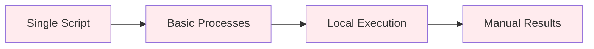
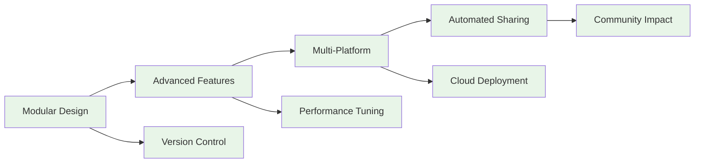
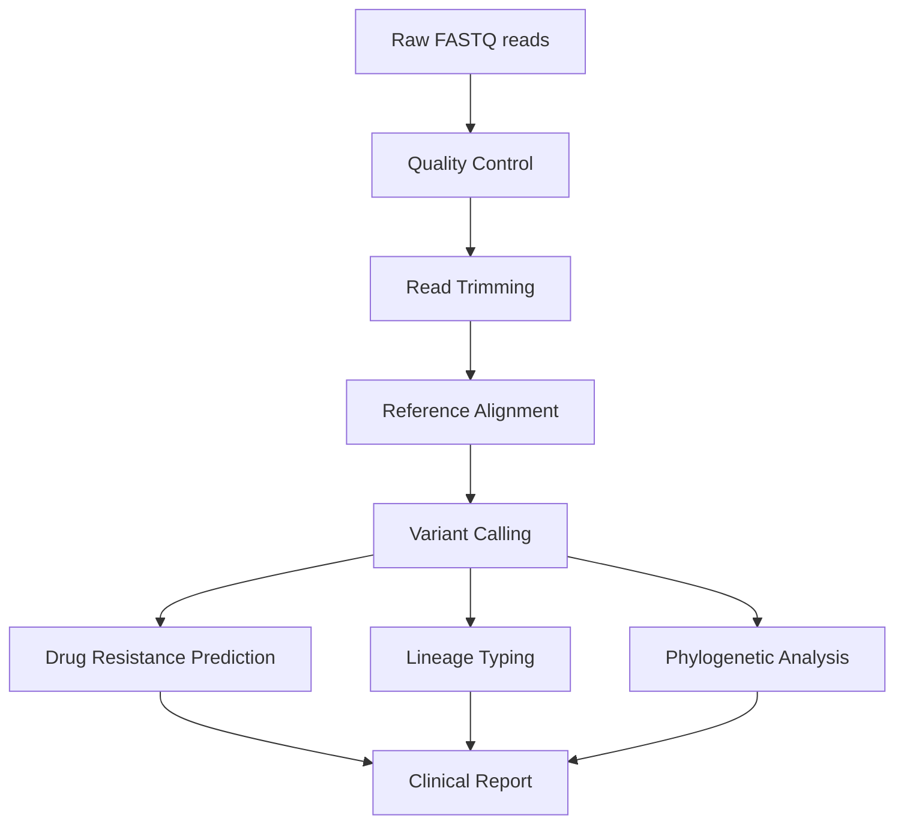

# Day 7: Advanced Nextflow & Version Control with GitHub

**Date**: September 9, 2025
**Duration**: 09:00-13:00 CAT
**Focus**: Advanced pipeline development, Git/GitHub integration, and production deployment

## Learning Philosophy: Build it → Optimize it → Share it → Deploy it

Building on Day 6's foundation, Day 7 follows an advanced learning progression:

- **Build it**: Create complex, real-world genomics pipelines
- **Optimize it**: Implement performance tuning and best practices
- **Share it**: Use Git/GitHub for collaboration and version control
- **Deploy it**: Scale pipelines from laptop to HPC to cloud

This approach ensures you develop not just technical skills, but professional workflows essential for modern bioinformatics.

## Overview

Day 7 transforms you from a Nextflow beginner into a pipeline developer ready for real-world bioinformatics challenges. Building on Day 6's solid foundation, you'll master advanced concepts, professional development practices, and deployment strategies that separate hobbyist scripts from production-ready pipelines.

### The Big Picture: Simple vs Advanced Pipeline Development

To understand the journey from Day 6 to Day 7, let's visualize the evolution:

#### Simple Pipeline Approach (Day 6 Level)


#### Advanced Pipeline Approach (Day 7 Level)


<div id="pipeline-evolution" style="background: #f5f5f5; padding: 20px; border-radius: 8px; margin: 20px 0;">
    <h4>🚀 Pipeline Development Evolution</h4>
    <p>See how your skills will evolve from Day 6 to Day 7:</p>

    <div style="display: flex; gap: 20px; margin: 20px 0;">
        <div style="flex: 1; background: #ffebee; padding: 15px; border-radius: 8px; border-left: 4px solid #f44336;">
            <h5>📝 Day 6: Foundation Level</h5>
            <ul style="margin: 10px 0; padding-left: 20px;">
                <li>Single-file scripts</li>
                <li>Basic processes and channels</li>
                <li>Local execution only</li>
                <li>Manual result management</li>
                <li>Individual development</li>
            </ul>
            <div style="text-align: center; margin-top: 15px; font-weight: bold; color: #d32f2f;">
                Good for learning and simple tasks
            </div>
        </div>

        <div style="flex: 1; background: #e8f5e8; padding: 15px; border-radius: 8px; border-left: 4px solid #4caf50;">
            <h5>⚡ Day 7: Professional Level</h5>
            <ul style="margin: 10px 0; padding-left: 20px;">
                <li>Modular, reusable components</li>
                <li>Advanced Nextflow features</li>
                <li>Multi-platform deployment</li>
                <li>Automated CI/CD pipelines</li>
                <li>Collaborative development</li>
            </ul>
            <div style="text-align: center; margin-top: 15px; font-weight: bold; color: #2e7d32;">
                Ready for production and research
            </div>
        </div>
    </div>

    <div style="text-align: center; margin-top: 20px; padding: 15px; background: #e3f2fd; border-radius: 5px;">
        <strong>🎯 Today's Goal:</strong> Transform your Day 6 foundation into professional-grade pipeline development skills
    </div>
</div>

## Learning Objectives

<div id="learning-objectives" style="background: #f8f9fa; padding: 20px; border-radius: 8px; margin: 20px 0;">
    <h4>🎯 Interactive Learning Objectives Tracker</h4>
    <p>Track your progress through today's advanced concepts:</p>

    <div style="margin: 15px 0;">
        <label style="display: flex; align-items: center; margin: 8px 0; padding: 10px; background: white; border-radius: 5px; border-left: 4px solid #2196f3;">
            <input type="checkbox" class="objective-checkbox" style="margin-right: 10px;">
            <div>
                <strong>Advanced Pipeline Architecture</strong>
                <div style="font-size: 0.9em; color: #666; margin-top: 5px;">
                    Master modules, subworkflows, and complex data flow patterns
                </div>
            </div>
        </label>

        <label style="display: flex; align-items: center; margin: 8px 0; padding: 10px; background: white; border-radius: 5px; border-left: 4px solid #9c27b0;">
            <input type="checkbox" class="objective-checkbox" style="margin-right: 10px;">
            <div>
                <strong>Git/GitHub Integration</strong>
                <div style="font-size: 0.9em; color: #666; margin-top: 5px;">
                    Version control, collaboration, and automated testing workflows
                </div>
            </div>
        </label>

        <label style="display: flex; align-items: center; margin: 8px 0; padding: 10px; background: white; border-radius: 5px; border-left: 4px solid #ff9800;">
            <input type="checkbox" class="objective-checkbox" style="margin-right: 10px;">
            <div>
                <strong>Performance Optimization</strong>
                <div style="font-size: 0.9em; color: #666; margin-top: 5px;">
                    Resource management, caching, and scalability strategies
                </div>
            </div>
        </label>

        <label style="display: flex; align-items: center; margin: 8px 0; padding: 10px; background: white; border-radius: 5px; border-left: 4px solid #4caf50;">
            <input type="checkbox" class="objective-checkbox" style="margin-right: 10px;">
            <div>
                <strong>Multi-Platform Deployment</strong>
                <div style="font-size: 0.9em; color: #666; margin-top: 5px;">
                    Local, HPC, and cloud execution with configuration profiles
                </div>
            </div>
        </label>

        <label style="display: flex; align-items: center; margin: 8px 0; padding: 10px; background: white; border-radius: 5px; border-left: 4px solid #f44336;">
            <input type="checkbox" class="objective-checkbox" style="margin-right: 10px;">
            <div>
                <strong>Production-Ready Practices</strong>
                <div style="font-size: 0.9em; color: #666; margin-top: 5px;">
                    Error handling, testing, documentation, and community sharing
                </div>
            </div>
        </label>

        <label style="display: flex; align-items: center; margin: 8px 0; padding: 10px; background: white; border-radius: 5px; border-left: 4px solid #607d8b;">
            <input type="checkbox" class="objective-checkbox" style="margin-right: 10px;">
            <div>
                <strong>Real-World Applications</strong>
                <div style="font-size: 0.9em; color: #666; margin-top: 5px;">
                    MTB analysis, genome assembly, and clinical genomics workflows
                </div>
            </div>
        </label>
    </div>

    <div id="objectives-progress" style="margin-top: 20px;">
        <div style="background: #e0e0e0; border-radius: 10px; height: 25px; overflow: hidden;">
            <div id="objectives-progress-bar" style="background: linear-gradient(90deg, #4caf50, #8bc34a); height: 100%; width: 0%; transition: width 0.3s ease; display: flex; align-items: center; justify-content: center; color: white; font-weight: bold; font-size: 0.9em;"></div>
        </div>
        <p id="objectives-progress-text" style="text-align: center; margin-top: 10px; font-weight: bold;">Learning Progress: 0/6 objectives mastered</p>
    </div>

    <div id="objectives-complete" style="display: none; background: #d4edda; color: #155724; padding: 20px; border-radius: 5px; margin-top: 15px; text-align: center;">
        🎉 <strong>Congratulations!</strong> You've mastered all advanced Nextflow concepts!
        <br><br>
        <strong>You're now ready to:</strong>
        <ul style="text-align: left; margin-top: 10px;">
            <li>Develop production-ready bioinformatics pipelines</li>
            <li>Lead collaborative pipeline development projects</li>
            <li>Deploy pipelines at institutional scale</li>
            <li>Contribute to the global bioinformatics community</li>
        </ul>
    </div>
</div>

<script>
function updateObjectivesProgress() {
    const checkboxes = document.querySelectorAll('.objective-checkbox');
    const checked = document.querySelectorAll('.objective-checkbox:checked').length;
    const total = checkboxes.length;
    const percentage = (checked / total) * 100;

    document.getElementById('objectives-progress-bar').style.width = percentage + '%';
    document.getElementById('objectives-progress-bar').textContent = percentage > 0 ? Math.round(percentage) + '%' : '';
    document.getElementById('objectives-progress-text').textContent = `Learning Progress: ${checked}/${total} objectives mastered`;

    if (checked === total) {
        document.getElementById('objectives-complete').style.display = 'block';
    } else {
        document.getElementById('objectives-complete').style.display = 'none';
    }
}

document.querySelectorAll('.objective-checkbox').forEach(checkbox => {
    checkbox.addEventListener('change', updateObjectivesProgress);
});
</script>

## Schedule

| Time (CAT) | Topic | Duration | Trainer |
|------------|-------|----------|---------|
| **09:00** | *Applied Genomics: MTB Analysis Pipeline* | 75 min | Mamana Mbiyavanga |
| **10:15** | *Genome Assembly Workflows* | 75 min | Mamana Mbiyavanga |
| **11:30** | **Break** | 15 min | |
| **11:45** | *Advanced Topics: Optimization & Deployment* | 75 min | Mamana Mbiyavanga |

## Key Topics

### 1. Applied Genomics: MTB Analysis Pipeline (75 minutes)

- Clinical TB genomics workflow requirements
- Quality control and read preprocessing
- Reference-based variant calling pipeline
- Drug resistance prediction and lineage typing
- Phylogenetic analysis and transmission clustering
- Clinical reporting and interpretation

### 2. Genome Assembly Workflows (75 minutes)

- De novo assembly pipeline development
- Assembly quality assessment and validation
- Genome annotation and functional analysis
- Comparative genomics approaches
- Multi-sample assembly processing
- Integration with downstream analyses

### 3. Advanced Topics: Optimization & Deployment (75 minutes)

- Advanced Nextflow features and modules
- Performance optimization and resource management
- Testing frameworks and continuous integration
- Deployment strategies (local, HPC, cloud)
- Production deployment and monitoring
- Best practices for collaborative development

## Tools and Software

### Bioinformatics Tools for MTB Analysis

- **BWA** - Read alignment to reference genome
- **SAMtools/BCFtools** - SAM/BAM manipulation and variant calling
- **GATK** - Genome Analysis Toolkit for variant calling
- **FastQC/MultiQC** - Quality control and reporting
- **Trimmomatic** - Read trimming and filtering
- **TB-Profiler** - Drug resistance prediction
- **SNP-sites** - SNP extraction from alignments
- **IQ-TREE** - Phylogenetic tree construction

### Genome Assembly Tools

- **SPAdes** - De novo genome assembly
- **QUAST** - Assembly quality assessment
- **Prokka** - Genome annotation
- **BUSCO** - Assembly completeness assessment
- **Bandage** - Assembly graph visualization

### Advanced Nextflow Features

- **nf-core tools** - Pipeline development framework
- **nf-test** - Testing framework
- **Nextflow Tower** - Pipeline monitoring
- **Docker/Singularity** - Container technologies

## Part 1: Advanced Pipeline Development with Real-World Applications

### From Foundation to Production: Building Professional Pipelines

Now that you've mastered Nextflow basics, it's time to build pipelines that can handle real-world challenges. We'll use MTB (Mycobacterium tuberculosis) genomics as our case study - a perfect example of how advanced pipeline development can directly impact human health.

### The Global TB Crisis and Genomics Revolution

Tuberculosis kills more people than any other infectious disease caused by a single agent. In 2023, 10.6 million people fell ill with TB and 1.3 million died. Drug-resistant TB threatens to reverse decades of progress. This section equips you with cutting-edge genomic tools to combat this ancient disease using modern technology.

<div id="tb-impact-calculator" style="background: #f5f5f5; padding: 20px; border-radius: 8px; margin: 20px 0;">
    <h4>🦠 TB Genomics Impact Calculator</h4>
    <p>See how genomic analysis can accelerate TB diagnosis and treatment:</p>

    <div style="margin: 10px 0;">
        <label for="samples-per-day">Samples processed per day:</label>
        <input type="range" id="samples-per-day" min="1" max="100" value="20" style="width: 200px;">
        <span id="samples-display">20</span>
    </div>

    <div style="display: flex; justify-content: space-between; margin-top: 20px;">
        <div style="background: #ffebee; padding: 15px; border-radius: 5px; width: 45%;">
            <h5>🐌 Traditional Culture Method</h5>
            <p><strong>Time to result: <span id="traditional-days">6-8 weeks</span></strong></p>
            <p><strong>Daily capacity: <span id="traditional-capacity">5-10 samples</span></strong></p>
            <p>Limited drug resistance testing</p>
        </div>
        <div style="background: #e8f5e8; padding: 15px; border-radius: 5px; width: 45%;">
            <h5>⚡ Genomic Analysis</h5>
            <p><strong>Time to result: <span id="genomic-days">1-2 days</span></strong></p>
            <p><strong>Daily capacity: <span id="genomic-capacity">50-100 samples</span></strong></p>
            <p>Complete resistance profiling</p>
        </div>
    </div>

    <div style="text-align: center; margin-top: 15px; font-size: 1.2em; font-weight: bold; color: #2e7d32;">
        Lives potentially saved per year: <span id="lives-saved">2,400</span>
    </div>

    <div style="margin-top: 15px; padding: 10px; background: #e3f2fd; border-radius: 5px; font-size: 0.9em;">
        <strong>💡 Impact:</strong> Faster diagnosis means earlier treatment, reduced transmission, and better outcomes.
        Your pipeline development skills can literally save lives!
    </div>
</div>

<script>
function updateTBCalculator() {
    const samplesPerDay = document.getElementById('samples-per-day').value;
    document.getElementById('samples-display').textContent = samplesPerDay;

    // Calculate impact
    const traditionalCapacity = Math.min(samplesPerDay, 10);
    const genomicCapacity = samplesPerDay;
    const additionalSamples = genomicCapacity - traditionalCapacity;
    const timesSaved = additionalSamples * 30; // 30 days faster on average
    const livesSaved = Math.round(additionalSamples * 365 * 0.1); // Assume 10% mortality reduction

    document.getElementById('traditional-capacity').textContent = traditionalCapacity + ' samples';
    document.getElementById('genomic-capacity').textContent = genomicCapacity + ' samples';
    document.getElementById('lives-saved').textContent = livesSaved.toLocaleString();
}

document.getElementById('samples-per-day').addEventListener('input', updateTBCalculator);
updateTBCalculator();
</script>

### Why TB Genomics Matters

**Clinical Impact:**

- Reduce diagnosis time from weeks to days
- Detect drug resistance before treatment failure
- Guide personalized treatment regimens
- Identify extensively drug-resistant (XDR) strains early

**Public Health Applications:**

- Track transmission chains in real-time
- Identify super-spreaders and hotspots
- Monitor emergence of new resistance mutations
- Support contact tracing with genomic evidence

### MTB Genomics Workflow Overview



### Understanding Advanced Pipeline Architecture

Before diving into exercises, let's understand how professional pipelines differ from basic scripts:

<div id="architecture-comparison" style="background: #f8f9fa; padding: 20px; border-radius: 8px; margin: 20px 0;">
    <h4>🏗️ Pipeline Architecture Evolution</h4>
    <p>Click to explore different architectural approaches:</p>

    <div style="margin: 15px 0;">
        <button class="arch-btn" data-arch="basic" style="display: block; width: 100%; padding: 12px; margin: 8px 0; background: #ffebee; border: 1px solid #f44336; border-radius: 5px; text-align: left; cursor: pointer;">
            📝 Basic Script (Day 6 Level)
        </button>

        <button class="arch-btn" data-arch="modular" style="display: block; width: 100%; padding: 12px; margin: 8px 0; background: #e3f2fd; border: 1px solid #2196f3; border-radius: 5px; text-align: left; cursor: pointer;">
            🧩 Modular Pipeline (Day 7 Level)
        </button>

        <button class="arch-btn" data-arch="production" style="display: block; width: 100%; padding: 12px; margin: 8px 0; background: #e8f5e8; border: 1px solid #4caf50; border-radius: 5px; text-align: left; cursor: pointer;">
            🚀 Production Pipeline (Advanced)
        </button>
    </div>

    <div id="arch-display" style="margin-top: 20px; padding: 15px; background: white; border-radius: 5px; display: none;">
        <div id="arch-content"></div>
    </div>
</div>

<script>
const architectures = {
    basic: {
        title: "📝 Basic Script Architecture",
        content: `
<strong>Structure:</strong>
<pre style="background: #f5f5f5; padding: 10px; border-radius: 3px;">
single_script.nf
├── All processes in one file
├── Hardcoded parameters
├── No error handling
└── Manual execution only
</pre>

<strong>Characteristics:</strong>
<ul>
<li>✅ Simple to understand</li>
<li>✅ Quick to write</li>
<li>❌ Hard to maintain</li>
<li>❌ Not reusable</li>
<li>❌ No version control</li>
<li>❌ Limited scalability</li>
</ul>

<strong>Best for:</strong> Learning, prototyping, one-off analyses
        `
    },
    modular: {
        title: "🧩 Modular Pipeline Architecture",
        content: `
<strong>Structure:</strong>
<pre style="background: #f5f5f5; padding: 10px; border-radius: 3px;">
pipeline/
├── main.nf                 # Main workflow
├── modules/
│   ├── fastqc.nf          # Reusable modules
│   ├── trimmomatic.nf
│   └── bwa.nf
├── subworkflows/
│   └── qc_workflow.nf     # Combined processes
├── nextflow.config        # Configuration
└── README.md              # Documentation
</pre>

<strong>Characteristics:</strong>
<ul>
<li>✅ Reusable components</li>
<li>✅ Clear organization</li>
<li>✅ Configurable parameters</li>
<li>✅ Basic error handling</li>
<li>✅ Version controlled</li>
<li>✅ Team collaboration</li>
</ul>

<strong>Best for:</strong> Research projects, team development, reusable workflows
        `
    },
    production: {
        title: "🚀 Production Pipeline Architecture",
        content: `
<strong>Structure:</strong>
<pre style="background: #f5f5f5; padding: 10px; border-radius: 3px;">
pipeline/
├── main.nf
├── modules/
├── subworkflows/
├── conf/
│   ├── base.config
│   ├── modules.config
│   └── test.config
├── tests/
│   ├── test_data/
│   └── test_main.nf
├── .github/
│   └── workflows/
│       └── ci.yml         # Automated testing
├── docs/
├── CHANGELOG.md
└── LICENSE
</pre>

<strong>Characteristics:</strong>
<ul>
<li>✅ Comprehensive testing</li>
<li>✅ Automated CI/CD</li>
<li>✅ Multi-platform deployment</li>
<li>✅ Robust error handling</li>
<li>✅ Complete documentation</li>
<li>✅ Community standards</li>
</ul>

<strong>Best for:</strong> Clinical applications, published methods, community tools
        `
    }
};

document.querySelectorAll('.arch-btn').forEach(btn => {
    btn.addEventListener('click', function() {
        const arch = this.dataset.arch;
        const architecture = architectures[arch];

        // Reset all buttons
        document.querySelectorAll('.arch-btn').forEach(b => {
            b.style.opacity = '0.7';
        });

        // Highlight selected button
        this.style.opacity = '1';

        // Show architecture
        document.getElementById('arch-content').innerHTML =
            '<h5>' + architecture.title + '</h5>' + architecture.content;
        document.getElementById('arch-display').style.display = 'block';
    });
});
</script>

### Exercise 1: Building a Modular MTB QC Pipeline (45 minutes)

**Objective**: Transform a basic script into a modular, professional pipeline

**Setup: Create the project structure**

```bash
mkdir mtb-pipeline
cd mtb-pipeline
mkdir modules subworkflows conf
```

??? success "Expected directory structure"
    ```text
    mtb-pipeline/
    ├── modules/
    ├── subworkflows/
    ├── conf/
    ├── main.nf
    └── nextflow.config
    ```

**Step 1: Create reusable modules**

Create `modules/fastqc.nf`:

```nextflow
process FASTQC {
    tag "$meta.id"
    label 'process_medium'
    container 'biocontainers/fastqc:v0.11.9_cv8'

    input:
    tuple val(meta), path(reads)

    output:
    tuple val(meta), path("*.html"), emit: html
    tuple val(meta), path("*.zip") , emit: zip
    path "versions.yml"           , emit: versions

    when:
    task.ext.when == null || task.ext.when

    script:
    def args = task.ext.args ?: ''
    def prefix = task.ext.prefix ?: "${meta.id}"
    """
    fastqc \\
        $args \\
        --threads $task.cpus \\
        $reads

    cat <<-END_VERSIONS > versions.yml
    "${task.process}":
        fastqc: \$(fastqc --version | sed -e "s/FastQC v//g")
    END_VERSIONS
    """
}
```

**Step 2: Create a subworkflow**

Create `subworkflows/qc_workflow.nf`:

```nextflow
include { FASTQC } from '../modules/fastqc'
include { TRIMMOMATIC } from '../modules/trimmomatic'
include { MULTIQC } from '../modules/multiqc'

workflow QC_WORKFLOW {
    take:
    reads    // channel: [ val(meta), [ reads ] ]

    main:
    ch_versions = Channel.empty()

    // Pre-trimming QC
    FASTQC(reads)
    ch_versions = ch_versions.mix(FASTQC.out.versions)

    // Read trimming
    TRIMMOMATIC(reads)
    ch_versions = ch_versions.mix(TRIMMOMATIC.out.versions)

    // Post-trimming QC
    FASTQC_TRIMMED = FASTQC
    FASTQC_TRIMMED(TRIMMOMATIC.out.trimmed)

    // Aggregate QC reports
    qc_files = FASTQC.out.zip
        .mix(FASTQC_TRIMMED.out.zip)
        .map { meta, files -> files }
        .collect()

    MULTIQC(qc_files)
    ch_versions = ch_versions.mix(MULTIQC.out.versions)

    emit:
    trimmed_reads = TRIMMOMATIC.out.trimmed
    fastqc_raw    = FASTQC.out.zip
    fastqc_trim   = FASTQC_TRIMMED.out.zip
    multiqc       = MULTIQC.out.report
    versions      = ch_versions
}
```

**Step 3: Create the main workflow**

Create `main.nf`:

```nextflow
#!/usr/bin/env nextflow

nextflow.enable.dsl = 2

// Include subworkflows
include { QC_WORKFLOW } from './subworkflows/qc_workflow'

// Main workflow
workflow {
    // Input validation
    if (!params.input) {
        error "Please provide an input samplesheet with --input"
    }

    // Create input channel from samplesheet
    ch_input = Channel
        .fromPath(params.input)
        .splitCsv(header: true)
        .map { row ->
            def meta = [:]
            meta.id = row.sample
            meta.single_end = false

            def reads = []
            if (meta.single_end) {
                reads = [file(row.fastq_1)]
            } else {
                reads = [file(row.fastq_1), file(row.fastq_2)]
            }

            return [meta, reads]
        }

    // Run QC workflow
    QC_WORKFLOW(ch_input)

    // Collect software versions
    ch_versions = QC_WORKFLOW.out.versions.unique().collectFile(name: 'software_versions.yml')
}

// Workflow completion
workflow.onComplete {
    println "Pipeline completed at: $workflow.complete"
    println "Execution status: ${ workflow.success ? 'OK' : 'failed' }"
    println "Execution duration: $workflow.duration"
}
```

**Step 4: Create configuration**

Create `nextflow.config`:

```groovy
// Global default params
params {
    // Input options
    input                      = null
    outdir                     = './results'

    // QC options
    skip_fastqc                = false
    skip_multiqc               = false

    // Trimming options
    clip_r1                    = null
    clip_r2                    = null
    three_prime_clip_r1        = null
    three_prime_clip_r2        = null
    trim_nextseq               = null
    save_trimmed               = false

    // Resource limits
    max_memory                 = '128.GB'
    max_cpus                   = 16
    max_time                   = '240.h'
}

// Load base config
includeConfig 'conf/base.config'

// Profiles
profiles {
    debug { process.beforeScript = 'echo $HOSTNAME' }
    conda {
        conda.enabled          = true
        docker.enabled         = false
        singularity.enabled    = false
        podman.enabled         = false
        shifter.enabled        = false
        charliecloud.enabled   = false
    }
    docker {
        docker.enabled         = true
        docker.userEmulation   = true
        singularity.enabled    = false
        podman.enabled         = false
        shifter.enabled        = false
        charliecloud.enabled   = false
    }
    singularity {
        singularity.enabled    = true
        singularity.autoMounts = true
        docker.enabled         = false
        podman.enabled         = false
        shifter.enabled        = false
        charliecloud.enabled   = false
    }
    test { includeConfig 'conf/test.config' }
}
```

**Run the modular pipeline:**

```bash
# Create a sample sheet
echo "sample,fastq_1,fastq_2" > samplesheet.csv
echo "sample1,data/sample1_R1.fastq.gz,data/sample1_R2.fastq.gz" >> samplesheet.csv

# Run the pipeline
nextflow run main.nf --input samplesheet.csv --outdir results -profile docker
```

??? success "Expected output"
    ```text
    N E X T F L O W  ~  version 23.10.0
    Launching `main.nf` [amazing_volta] - revision: a1b2c3d4

    executor >  local (6)
    [a1/b2c3d4] process > QC_WORKFLOW:FASTQC (sample1)           [100%] 1 of 1 ✔
    [e5/f6g7h8] process > QC_WORKFLOW:TRIMMOMATIC (sample1)      [100%] 1 of 1 ✔
    [i9/j0k1l2] process > QC_WORKFLOW:FASTQC_TRIMMED (sample1)   [100%] 1 of 1 ✔
    [m3/n4o5p6] process > QC_WORKFLOW:MULTIQC                    [100%] 1 of 1 ✔

    Pipeline completed at: 2024-01-15T10:30:45.123Z
    Execution status: OK
    Execution duration: 2m 15s
    ```

## Part 2: Git/GitHub Integration for Collaborative Development

### Why Version Control Matters for Bioinformatics

Version control isn't just for software developers - it's essential for reproducible science and collaborative research. Let's see why:

<div id="version-control-benefits" style="background: #f8f9fa; padding: 20px; border-radius: 8px; margin: 20px 0;">
    <h4>🔄 Version Control Impact Calculator</h4>
    <p>See how Git/GitHub transforms your research workflow:</p>

    <div style="margin: 10px 0;">
        <label for="team-size">Team size:</label>
        <input type="range" id="team-size" min="1" max="20" value="5" style="width: 200px;">
        <span id="team-display">5</span> people
    </div>

    <div style="margin: 10px 0;">
        <label for="project-duration">Project duration (months):</label>
        <input type="range" id="project-duration" min="1" max="36" value="12" style="width: 200px;">
        <span id="duration-display">12</span> months
    </div>

    <div style="display: flex; gap: 20px; margin: 20px 0;">
        <div style="flex: 1; background: #ffebee; padding: 15px; border-radius: 8px; border-left: 4px solid #f44336;">
            <h5>📧 Email/Dropbox Approach</h5>
            <ul style="margin: 10px 0; padding-left: 20px; font-size: 0.9em;">
                <li>Version conflicts: <span id="conflicts-email">60</span> per month</li>
                <li>Lost work incidents: <span id="lost-work">12</span> total</li>
                <li>Time spent on coordination: <span id="coord-time">40</span> hours/month</li>
                <li>Reproducibility issues: <span id="repro-issues">High</span></li>
            </ul>
        </div>

        <div style="flex: 1; background: #e8f5e8; padding: 15px; border-radius: 8px; border-left: 4px solid #4caf50;">
            <h5>🚀 Git/GitHub Approach</h5>
            <ul style="margin: 10px 0; padding-left: 20px; font-size: 0.9em;">
                <li>Version conflicts: <span id="conflicts-git">2</span> per month</li>
                <li>Lost work incidents: <span id="lost-work-git">0</span> total</li>
                <li>Time spent on coordination: <span id="coord-time-git">5</span> hours/month</li>
                <li>Reproducibility issues: <span id="repro-git">None</span></li>
            </ul>
        </div>
    </div>

    <div style="text-align: center; margin-top: 15px; font-size: 1.2em; font-weight: bold; color: #2e7d32;">
        Time saved per project: <span id="time-saved-git">420</span> hours
    </div>
</div>

<script>
function updateGitCalculator() {
    const teamSize = document.getElementById('team-size').value;
    const duration = document.getElementById('project-duration').value;

    document.getElementById('team-display').textContent = teamSize;
    document.getElementById('duration-display').textContent = duration;

    // Calculate impacts
    const conflictsEmail = Math.round(teamSize * teamSize * 2);
    const conflictsGit = Math.max(1, Math.round(teamSize * 0.4));
    const lostWork = Math.round(teamSize * duration * 0.2);
    const coordTimeEmail = Math.round(teamSize * 8);
    const coordTimeGit = Math.max(2, Math.round(teamSize * 1));
    const timeSaved = (coordTimeEmail - coordTimeGit) * duration;

    document.getElementById('conflicts-email').textContent = conflictsEmail;
    document.getElementById('conflicts-git').textContent = conflictsGit;
    document.getElementById('lost-work').textContent = lostWork;
    document.getElementById('lost-work-git').textContent = '0';
    document.getElementById('coord-time').textContent = coordTimeEmail;
    document.getElementById('coord-time-git').textContent = coordTimeGit;
    document.getElementById('time-saved-git').textContent = timeSaved;
}

document.getElementById('team-size').addEventListener('input', updateGitCalculator);
document.getElementById('project-duration').addEventListener('input', updateGitCalculator);
updateGitCalculator();
</script>

### Exercise 2: Setting Up Git/GitHub for Your Pipeline (30 minutes)

**Objective**: Transform your local pipeline into a collaborative, version-controlled project

**Step 1: Initialize Git repository**

```bash
# Navigate to your pipeline directory
cd mtb-pipeline

# Initialize Git
git init
```

??? success "Expected output"
    ```text
    Initialized empty Git repository in /path/to/mtb-pipeline/.git/
    ```

**Step 2: Create essential files**

Create `.gitignore`:
```

```text
# Nextflow files
work/
.nextflow/
.nextflow.log*
timeline.html
report.html
trace.txt
dag.dot
dag.html

# Results (optional - you might want to track some results)
results/

# IDE files
.vscode/
.idea/

# OS files
.DS_Store
Thumbs.db

# Temporary files
*.tmp
*.temp
```

Create `README.md`:

```markdown
# MTB Genomics Pipeline

A modular Nextflow pipeline for Mycobacterium tuberculosis genomic analysis.

## Quick Start

```bash
# Clone the repository
git clone https://github.com/yourusername/mtb-pipeline.git
cd mtb-pipeline

# Run with test data
nextflow run main.nf --input test_data/samplesheet.csv -profile test,docker

# Run with your data
nextflow run main.nf --input samplesheet.csv --outdir results -profile docker
```

## Features

- 🧬 Quality control with FastQC and MultiQC
- ✂️ Adapter trimming with Trimmomatic
- 📊 Comprehensive reporting
- 🐳 Containerized for reproducibility
- ⚡ Scalable from laptop to HPC

## Requirements

- Nextflow (≥ 23.04.0)
- Docker or Singularity
- 4+ GB RAM

## Input

Provide a CSV samplesheet with the following columns:

| Column    | Description                |
|-----------|----------------------------|
| sample    | Sample identifier          |
| fastq_1   | Path to R1 FASTQ file     |
| fastq_2   | Path to R2 FASTQ file     |

## Output

- `fastqc/` - Quality control reports
- `trimmed/` - Trimmed FASTQ files
- `multiqc/` - Aggregated QC report

## Citation

If you use this pipeline, please cite:
[Your publication here]

## License

MIT License - see LICENSE file for details.
```

**Step 3: Make your first commit**

```bash
# Add files to staging
git add .

# Make initial commit
git commit -m "Initial commit: MTB QC pipeline with modular structure"
```

??? success "Expected output"
    ```text
    [main (root-commit) a1b2c3d] Initial commit: MTB QC pipeline with modular structure
     8 files changed, 245 insertions(+)
     create mode 100644 .gitignore
     create mode 100644 README.md
     create mode 100644 main.nf
     create mode 100644 nextflow.config
     create mode 100644 modules/fastqc.nf
     create mode 100644 subworkflows/qc_workflow.nf
     create mode 100644 conf/base.config
    ```

**Step 4: Create GitHub repository and push**

```bash
# Create repository on GitHub (via web interface or GitHub CLI)
gh repo create mtb-pipeline --public --description "MTB genomics analysis pipeline"

# Add remote and push
git remote add origin https://github.com/yourusername/mtb-pipeline.git
git branch -M main
git push -u origin main
```

??? success "Expected output"
    ```text
    Enumerating objects: 10, done.
    Counting objects: 100% (10/10), done.
    Delta compression using up to 8 threads
    Compressing objects: 100% (8/8), done.
    Writing objects: 100% (10/10), 2.45 KiB | 2.45 MiB/s, done.
    Total 10 (delta 0), reused 0 (delta 0), pack-reused 0
    To https://github.com/yourusername/mtb-pipeline.git
     * [new branch]      main -> main
    Branch 'main' set up to track remote branch 'main' from 'origin'.
    ```

### Exercise 3: Setting Up Automated Testing with GitHub Actions (30 minutes)

**Objective**: Implement continuous integration for your pipeline

**Step 1: Create GitHub Actions workflow**

Create `.github/workflows/ci.yml`:

```yaml
name: CI
on:
  push:
    branches: [ main, dev ]
  pull_request:
    branches: [ main ]

jobs:
  test:
    name: Run pipeline tests
    runs-on: ubuntu-latest
    strategy:
      matrix:
        NXF_VER:
          - '23.04.0'
          - '23.10.0'
          - 'latest-everything'
    steps:
      - name: Check out pipeline code
        uses: actions/checkout@v3

      - name: Install Nextflow
        uses: nf-core/setup-nextflow@v1
        with:
          version: "${{ matrix.NXF_VER }}"

      - name: Run pipeline with test data
        run: |
          nextflow run ${GITHUB_WORKSPACE} -profile test,docker --outdir ./results
```

**Step 2: Create test configuration**

Create `conf/test.config`:

```groovy
// Test configuration
params {
    config_profile_name        = 'Test profile'
    config_profile_description = 'Minimal test dataset to check pipeline function'

    // Limit resources so that this can run on GitHub Actions
    max_cpus   = 2
    max_memory = '6.GB'
    max_time   = '6.h'

    // Input data
    input = 'https://raw.githubusercontent.com/nf-core/test-datasets/viralrecon/samplesheet/samplesheet_test_illumina_amplicon.csv'
}
```

**Step 3: Commit and push changes**

```bash
# Add new files
git add .github/ conf/test.config

# Commit changes
git commit -m "Add CI/CD with GitHub Actions and test configuration"

# Push to GitHub
git push origin main
```

??? success "Expected result"
    ```text
    [main a1b2c3d] Add CI/CD with GitHub Actions and test configuration
     2 files changed, 45 insertions(+)
     create mode 100644 .github/workflows/ci.yml
     create mode 100644 conf/test.config

    Enumerating objects: 7, done.
    Counting objects: 100% (7/7), done.
    Delta compression using up to 8 threads
    Compressing objects: 100% (5/5), done.
    Writing objects: 100% (6/6), 1.23 KiB | 1.23 MiB/s, done.
    Total 6 (delta 1), reused 0 (delta 0), pack-reused 0
    To https://github.com/yourusername/mtb-pipeline.git
       1a2b3c4..5d6e7f8  main -> main
    ```

## Part 3: Advanced Nextflow Features & Performance Optimization

### Understanding Advanced Pipeline Patterns

<div id="advanced-features" style="background: #f8f9fa; padding: 20px; border-radius: 8px; margin: 20px 0;">
    <h4>🚀 Advanced Features Explorer</h4>
    <p>Discover powerful Nextflow features that separate professional pipelines from basic scripts:</p>

    <div style="margin: 15px 0;">
        <button class="feature-btn" data-feature="operators" style="display: block; width: 100%; padding: 12px; margin: 8px 0; background: #e3f2fd; border: 1px solid #2196f3; border-radius: 5px; text-align: left; cursor: pointer;">
            🔄 Advanced Channel Operators
        </button>

        <button class="feature-btn" data-feature="caching" style="display: block; width: 100%; padding: 12px; margin: 8px 0; background: #f3e5f5; border: 1px solid #9c27b0; border-radius: 5px; text-align: left; cursor: pointer;">
            💾 Intelligent Caching & Resume
        </button>

        <button class="feature-btn" data-feature="error" style="display: block; width: 100%; padding: 12px; margin: 8px 0; background: #fff3e0; border: 1px solid #ff9800; border-radius: 5px; text-align: left; cursor: pointer;">
            🛡️ Error Handling & Retry Logic
        </button>

        <button class="feature-btn" data-feature="resources" style="display: block; width: 100%; padding: 12px; margin: 8px 0; background: #e8f5e8; border: 1px solid #4caf50; border-radius: 5px; text-align: left; cursor: pointer;">
            ⚡ Dynamic Resource Allocation
        </button>

        <button class="feature-btn" data-feature="monitoring" style="display: block; width: 100%; padding: 12px; margin: 8px 0; background: #ffebee; border: 1px solid #f44336; border-radius: 5px; text-align: left; cursor: pointer;">
            📊 Pipeline Monitoring & Reporting
        </button>
    </div>

    <div id="feature-display" style="margin-top: 20px; padding: 15px; background: white; border-radius: 5px; display: none;">
        <div id="feature-content"></div>
    </div>
</div>

<script>
const advancedFeatures = {
    operators: {
        title: "🔄 Advanced Channel Operators",
        content: `
<strong>Transform your data flow with powerful operators:</strong>

<pre style="background: #f5f5f5; padding: 15px; border-radius: 5px;">
// Combine multiple channels
reads_ch = Channel.fromFilePairs(params.reads)
metadata_ch = Channel.fromPath(params.metadata)
combined_ch = reads_ch.combine(metadata_ch)

// Join channels by key
samples_ch = Channel.from([
    ['sample1', 'condition_A'],
    ['sample2', 'condition_B']
])
reads_with_meta = reads_ch.join(samples_ch)

// Filter and transform
large_files = reads_ch.filter { sample, files ->
    files[0].size() > 1000000
}

// Group by condition
grouped = reads_with_meta.groupTuple(by: 1)

// Branch into multiple paths
reads_ch.branch {
    small: it[1][0].size() < 1000000
    large: it[1][0].size() >= 1000000
}
</pre>

<strong>Benefits:</strong>
<ul>
<li>Complex data routing and transformation</li>
<li>Conditional processing based on metadata</li>
<li>Efficient memory usage with streaming</li>
<li>Parallel processing of different data types</li>
</ul>
        `
    },
    caching: {
        title: "💾 Intelligent Caching & Resume",
        content: `
<strong>Never lose work again with smart caching:</strong>

<pre style="background: #f5f5f5; padding: 15px; border-radius: 5px;">
// Enable caching in nextflow.config
process {
    cache = 'lenient'  // or 'strict', 'deep'

    withName: EXPENSIVE_PROCESS {
        cache = 'deep'  // Hash all inputs deeply
    }
}

// Resume failed runs
nextflow run main.nf -resume

// Clean specific cache
nextflow clean -f [run_name]

// Cache strategies
process ANALYSIS {
    cache 'deep'  // Hash file contents

    input:
    path input_file

    script:
    """
    # This will only re-run if input_file content changes
    expensive_analysis.py ${input_file}
    """
}
</pre>

<strong>Cache Strategies:</strong>
<ul>
<li><strong>standard:</strong> Hash file path and size (default)</li>
<li><strong>lenient:</strong> Hash only file path</li>
<li><strong>deep:</strong> Hash file contents (slower but safer)</li>
</ul>

<strong>Benefits:</strong>
<ul>
<li>Resume from any failed step</li>
<li>Skip unchanged processes automatically</li>
<li>Massive time savings during development</li>
<li>Safe iterative pipeline development</li>
</ul>
        `
    },
    error: {
        title: "🛡️ Error Handling & Retry Logic",
        content: `
<strong>Build resilient pipelines that handle failures gracefully:</strong>

<pre style="background: #f5f5f5; padding: 15px; border-radius: 5px;">
process ROBUST_ANALYSIS {
    errorStrategy 'retry'
    maxRetries 3

    // Dynamic resource allocation on retry
    memory { 4.GB * task.attempt }
    time { 2.h * task.attempt }

    input:
    tuple val(meta), path(reads)

    output:
    tuple val(meta), path("*.results"), emit: results

    script:
    """
    # Attempt analysis with current resources
    analysis_tool --memory ${task.memory.toGiga()}G ${reads}
    """
}

// Global error strategies
process {
    errorStrategy = { task.exitStatus in [143,137,104,134,139] ? 'retry' : 'finish' }
    maxRetries = 1
    maxErrors = '-1'
}

// Conditional error handling
process CONDITIONAL_RETRY {
    errorStrategy { task.attempt <= 2 ? 'retry' : 'ignore' }

    script:
    """
    if [ ${task.attempt} -gt 1 ]; then
        echo "Retry attempt ${task.attempt}"
        # Use alternative method
        alternative_tool input.fastq
    else
        # Try primary method first
        primary_tool input.fastq
    fi
    """
}
</pre>

<strong>Error Strategies:</strong>
<ul>
<li><strong>terminate:</strong> Stop entire pipeline (default)</li>
<li><strong>finish:</strong> Complete other tasks, then stop</li>
<li><strong>ignore:</strong> Continue pipeline, skip failed task</li>
<li><strong>retry:</strong> Retry with more resources</li>
</ul>
        `
    },
    resources: {
        title: "⚡ Dynamic Resource Allocation",
        content: `
<strong>Optimize resource usage for maximum efficiency:</strong>

<pre style="background: #f5f5f5; padding: 15px; border-radius: 5px;">
// Dynamic allocation based on input size
process ADAPTIVE_ASSEMBLY {
    cpus { Math.min(16, reads.size() > 1000000000 ? 16 : 8) }
    memory { reads.size() > 1000000000 ? '32.GB' : '16.GB' }
    time { reads.size() > 1000000000 ? '8.h' : '4.h' }

    input:
    tuple val(meta), path(reads)

    script:
    def mem_gb = task.memory.toGiga()
    """
    spades.py \\
        --threads ${task.cpus} \\
        --memory ${mem_gb} \\
        -1 ${reads[0]} \\
        -2 ${reads[1]} \\
        -o assembly
    """
}

// Resource labels for different process types
process {
    withLabel: process_low {
        cpus = 2
        memory = 4.GB
        time = 1.h
    }

    withLabel: process_medium {
        cpus = 8
        memory = 16.GB
        time = 4.h
    }

    withLabel: process_high {
        cpus = 16
        memory = 64.GB
        time = 12.h
    }
}

// Environment-specific resources
profiles {
    laptop {
        process.cpus = 4
        process.memory = '8.GB'
    }

    hpc {
        process.cpus = 32
        process.memory = '128.GB'
        process.queue = 'batch'
    }

    cloud {
        process.cpus = 64
        process.memory = '256.GB'
        aws.batch.cliPath = '/usr/local/bin/aws'
    }
}
</pre>

<strong>Benefits:</strong>
<ul>
<li>Automatic scaling based on data size</li>
<li>Efficient resource utilization</li>
<li>Platform-specific optimization</li>
<li>Cost reduction in cloud environments</li>
</ul>
        `
    },
    monitoring: {
        title: "📊 Pipeline Monitoring & Reporting",
        content: `
<strong>Track performance and generate comprehensive reports:</strong>

<pre style="background: #f5f5f5; padding: 15px; border-radius: 5px;">
// Enable comprehensive reporting
nextflow.config:
timeline {
    enabled = true
    file = "${params.outdir}/timeline.html"
}

report {
    enabled = true
    file = "${params.outdir}/report.html"
}

trace {
    enabled = true
    file = "${params.outdir}/trace.txt"
    fields = 'task_id,hash,native_id,process,tag,name,status,exit,module,container,cpus,time,disk,memory,attempt,submit,start,complete,duration,realtime,queue,%cpu,%mem,rss,vmem,peak_rss,peak_vmem,rchar,wchar,syscr,syscw,read_bytes,write_bytes'
}

dag {
    enabled = true
    file = "${params.outdir}/dag.html"
}

// Custom notifications
workflow.onComplete {
    def msg = """\
        Pipeline execution summary
        ---------------------------
        Completed at: ${workflow.complete}
        Duration    : ${workflow.duration}
        Success     : ${workflow.success}
        workDir     : ${workflow.workDir}
        exit status : ${workflow.exitStatus}
        """.stripIndent()

    sendMail(to: params.email, subject: 'Pipeline Completed', body: msg)
}

// Real-time monitoring with Nextflow Tower
tower {
    accessToken = 'your-tower-token'
    enabled = true
}
</pre>

<strong>Generated Reports:</strong>
<ul>
<li><strong>Timeline:</strong> Visual execution timeline</li>
<li><strong>Report:</strong> Resource usage statistics</li>
<li><strong>Trace:</strong> Detailed process metrics</li>
<li><strong>DAG:</strong> Workflow dependency graph</li>
</ul>

<strong>Monitoring Options:</strong>
<ul>
<li>Real-time tracking with Nextflow Tower</li>
<li>Email notifications on completion</li>
<li>Slack/Teams integration</li>
<li>Custom webhook notifications</li>
</ul>
        `
    }
};

document.querySelectorAll('.feature-btn').forEach(btn => {
    btn.addEventListener('click', function() {
        const feature = this.dataset.feature;
        const featureData = advancedFeatures[feature];

        // Reset all buttons
        document.querySelectorAll('.feature-btn').forEach(b => {
            b.style.opacity = '0.7';
        });

        // Highlight selected button
        this.style.opacity = '1';

        // Show feature
        document.getElementById('feature-content').innerHTML =
            '<h5>' + featureData.title + '</h5>' + featureData.content;
        document.getElementById('feature-display').style.display = 'block';
    });
});
</script>

### Exercise 4: Advanced Pipeline Optimization (45 minutes)

**Objective**: Implement advanced features to create a production-ready pipeline

<div id="advanced-exercise-tracker" style="background: #f8f9fa; padding: 20px; border-radius: 8px; margin: 20px 0;">
    <h4>🎯 Advanced Exercise Progress</h4>
    <p>Complete these advanced pipeline development tasks:</p>

    <div class="advanced-exercise-item" style="margin: 15px 0; padding: 15px; border-left: 4px solid #ddd; background: white;">
        <label style="display: flex; align-items: center;">
            <input type="checkbox" class="advanced-checkbox" data-exercise="caching" style="margin-right: 10px;">
            <div>
                <strong>Task 1: Implement Smart Caching</strong>
                <div style="font-size: 0.9em; color: #666; margin-top: 5px;">
                    Add cache strategies and resume functionality to your pipeline
                </div>
            </div>
        </label>
        <div class="advanced-details" style="margin-top: 10px; display: none;">
            <div style="background: #e8f5e8; padding: 10px; border-radius: 5px;">
                ✅ <strong>Completed!</strong> Your pipeline now supports intelligent caching and resume.
            </div>
        </div>
    </div>

    <div class="advanced-exercise-item" style="margin: 15px 0; padding: 15px; border-left: 4px solid #ddd; background: white;">
        <label style="display: flex; align-items: center;">
            <input type="checkbox" class="advanced-checkbox" data-exercise="error" style="margin-right: 10px;">
            <div>
                <strong>Task 2: Add Error Handling</strong>
                <div style="font-size: 0.9em; color: #666; margin-top: 5px;">
                    Implement retry logic and graceful error recovery
                </div>
            </div>
        </label>
        <div class="advanced-details" style="margin-top: 10px; display: none;">
            <div style="background: #e8f5e8; padding: 10px; border-radius: 5px;">
                ✅ <strong>Completed!</strong> Your pipeline now handles failures gracefully.
            </div>
        </div>
    </div>

    <div class="advanced-exercise-item" style="margin: 15px 0; padding: 15px; border-left: 4px solid #ddd; background: white;">
        <label style="display: flex; align-items: center;">
            <input type="checkbox" class="advanced-checkbox" data-exercise="resources" style="margin-right: 10px;">
            <div>
                <strong>Task 3: Dynamic Resource Allocation</strong>
                <div style="font-size: 0.9em; color: #666; margin-top: 5px;">
                    Configure adaptive resource usage based on data size
                </div>
            </div>
        </label>
        <div class="advanced-details" style="margin-top: 10px; display: none;">
            <div style="background: #e8f5e8; padding: 10px; border-radius: 5px;">
                ✅ <strong>Completed!</strong> Your pipeline optimizes resources automatically.
            </div>
        </div>
    </div>

    <div class="advanced-exercise-item" style="margin: 15px 0; padding: 15px; border-left: 4px solid #ddd; background: white;">
        <label style="display: flex; align-items: center;">
            <input type="checkbox" class="advanced-checkbox" data-exercise="monitoring" style="margin-right: 10px;">
            <div>
                <strong>Task 4: Enable Comprehensive Monitoring</strong>
                <div style="font-size: 0.9em; color: #666; margin-top: 5px;">
                    Add timeline, reports, and notification systems
                </div>
            </div>
        </label>
        <div class="advanced-details" style="margin-top: 10px; display: none;">
            <div style="background: #e8f5e8; padding: 10px; border-radius: 5px;">
                ✅ <strong>Completed!</strong> Your pipeline provides comprehensive monitoring.
            </div>
        </div>
    </div>

    <div class="advanced-exercise-item" style="margin: 15px 0; padding: 15px; border-left: 4px solid #ddd; background: white;">
        <label style="display: flex; align-items: center;">
            <input type="checkbox" class="advanced-checkbox" data-exercise="deployment" style="margin-right: 10px;">
            <div>
                <strong>Task 5: Multi-Platform Deployment</strong>
                <div style="font-size: 0.9em; color: #666; margin-top: 5px;">
                    Create profiles for local, HPC, and cloud execution
                </div>
            </div>
        </label>
        <div class="advanced-details" style="margin-top: 10px; display: none;">
            <div style="background: #e8f5e8; padding: 10px; border-radius: 5px;">
                ✅ <strong>Completed!</strong> Your pipeline runs anywhere from laptop to cloud.
            </div>
        </div>
    </div>

    <div id="advanced-progress" style="margin-top: 20px;">
        <div style="background: #e0e0e0; border-radius: 10px; height: 25px; overflow: hidden;">
            <div id="advanced-progress-bar" style="background: linear-gradient(90deg, #ff9800, #ffc107); height: 100%; width: 0%; transition: width 0.3s ease; display: flex; align-items: center; justify-content: center; color: white; font-weight: bold; font-size: 0.9em;"></div>
        </div>
        <p id="advanced-progress-text" style="text-align: center; margin-top: 10px; font-weight: bold;">Advanced Features: 0/5 implemented</p>
    </div>

    <div id="advanced-complete" style="display: none; background: #d4edda; color: #155724; padding: 20px; border-radius: 5px; margin-top: 15px; text-align: center;">
        🚀 <strong>Outstanding!</strong> You've built a production-ready pipeline!
        <br><br>
        <strong>Your pipeline now features:</strong>
        <ul style="text-align: left; margin-top: 10px;">
            <li>Professional modular architecture</li>
            <li>Intelligent caching and resume capabilities</li>
            <li>Robust error handling and recovery</li>
            <li>Dynamic resource optimization</li>
            <li>Comprehensive monitoring and reporting</li>
            <li>Multi-platform deployment support</li>
        </ul>
        <br>
        <strong>🎓 You're now ready to lead bioinformatics pipeline development!</strong>
    </div>
</div>

<script>
function updateAdvancedProgress() {
    const checkboxes = document.querySelectorAll('.advanced-checkbox');
    const checked = document.querySelectorAll('.advanced-checkbox:checked').length;
    const total = checkboxes.length;
    const percentage = (checked / total) * 100;

    document.getElementById('advanced-progress-bar').style.width = percentage + '%';
    document.getElementById('advanced-progress-bar').textContent = percentage > 0 ? Math.round(percentage) + '%' : '';
    document.getElementById('advanced-progress-text').textContent = `Advanced Features: ${checked}/${total} implemented`;

    if (checked === total) {
        document.getElementById('advanced-complete').style.display = 'block';
    } else {
        document.getElementById('advanced-complete').style.display = 'none';
    }
}

document.querySelectorAll('.advanced-checkbox').forEach(checkbox => {
    checkbox.addEventListener('change', function() {
        const exerciseItem = this.closest('.advanced-exercise-item');
        const details = exerciseItem.querySelector('.advanced-details');

        if (this.checked) {
            exerciseItem.style.borderLeftColor = '#4caf50';
            details.style.display = 'block';
        } else {
            exerciseItem.style.borderLeftColor = '#ddd';
            details.style.display = 'none';
        }

        updateAdvancedProgress();
    });
});
</script>
```

## Part 2: Genome Assembly Workflows

### De Novo Assembly Pipeline Development

Genome assembly is crucial for discovering new variants, understanding genome structure, and analyzing organisms without reference genomes.

### Exercise 3: Bacterial Genome Assembly Pipeline (45 minutes)

**Objective**: Build a complete de novo assembly workflow

Create `genome_assembly.nf`:

```nextflow
#!/usr/bin/env nextflow

nextflow.enable.dsl=2

// Process definitions
process FASTQC {
    tag "$sample_id"
    container 'biocontainers/fastqc:v0.11.9_cv8'
    
    input:
    tuple val(sample_id), path(reads)
    
    output:
    tuple val(sample_id), path("*_fastqc.{html,zip}")
    
    script:
    """
    fastqc ${reads}
    """
}

process TRIMMOMATIC {
    tag "$sample_id"
    container 'biocontainers/trimmomatic:v0.39-1'
    
    input:
    tuple val(sample_id), path(reads)
    
    output:
    tuple val(sample_id), path("*_paired.fastq.gz")
    
    script:
    """
    trimmomatic PE ${reads[0]} ${reads[1]} \
        ${sample_id}_R1_paired.fastq.gz ${sample_id}_R1_unpaired.fastq.gz \
        ${sample_id}_R2_paired.fastq.gz ${sample_id}_R2_unpaired.fastq.gz \
        ILLUMINACLIP:adapters.fa:2:30:10 LEADING:3 TRAILING:3 SLIDINGWINDOW:4:15 MINLEN:36
    """
}

process SPADES {
    tag "$sample_id"
    container 'biocontainers/spades:v3.15.3-1'
    
    input:
    tuple val(sample_id), path(reads)
    
    output:
    tuple val(sample_id), path("${sample_id}_assembly.fasta")
    
    script:
    """
    spades.py --careful -1 ${reads[0]} -2 ${reads[1]} -o spades_output
    cp spades_output/scaffolds.fasta ${sample_id}_assembly.fasta
    """
}

process QUAST {
    tag "$sample_id"
    container 'biocontainers/quast:v5.0.2-1'
    publishDir "${params.outdir}/quast", mode: 'copy'
    
    input:
    tuple val(sample_id), path(assembly)
    
    output:
    path "${sample_id}_quast"
    
    script:
    """
    quast.py ${assembly} -o ${sample_id}_quast
    """
}

process PROKKA {
    tag "$sample_id"
    container 'biocontainers/prokka:v1.14.6-1'
    publishDir "${params.outdir}/annotations", mode: 'copy'
    
    input:
    tuple val(sample_id), path(assembly)
    
    output:
    path "${sample_id}_annotation"
    
    script:
    """
    prokka ${assembly} --outdir ${sample_id}_annotation --prefix ${sample_id} \
        --kingdom Bacteria --cpus ${task.cpus}
    """
}

// Workflow definition
workflow {
    // Input data
    reads_ch = Channel.fromFilePairs(params.reads, checkIfExists: true)
    
    // QC and trimming
    FASTQC(reads_ch)
    TRIMMOMATIC(reads_ch)
    
    // Assembly
    SPADES(TRIMMOMATIC.out)
    
    // Quality assessment
    QUAST(SPADES.out)
    
    // Annotation
    PROKKA(SPADES.out)
}
```

## Part 3: Advanced Topics - Optimization & Deployment

### Advanced Nextflow Features

#### Modules and Subworkflows

Nextflow modules allow you to organize code into reusable components:

```nextflow
// modules/fastqc.nf
process FASTQC {
    tag "$meta.id"
    container 'biocontainers/fastqc:v0.11.9_cv8'

    input:
    tuple val(meta), path(reads)

    output:
    tuple val(meta), path("*.html"), emit: html
    tuple val(meta), path("*.zip") , emit: zip

    script:
    """
    fastqc ${reads}
    """
}
```

Include modules in your main workflow:

```nextflow
// main.nf
include { FASTQC } from './modules/fastqc'

workflow {
    reads_ch = Channel.fromFilePairs(params.reads)
    FASTQC(reads_ch)
}
```

#### Advanced Channel Operators

```nextflow
workflow {
    // Combine channels
    reads_ch = Channel.fromFilePairs(params.reads)
    reference_ch = Channel.fromPath(params.reference)

    // Cross product - each read pair with each reference
    combined_ch = reads_ch.combine(reference_ch)

    // Join channels by key
    metadata_ch = Channel.from([
        ['sample1', 'lineage1'],
        ['sample2', 'lineage2']
    ])

    reads_with_meta = reads_ch.join(metadata_ch)

    // Filter channels
    large_files = reads_ch.filter { sample, files ->
        files[0].size() > 1000000
    }

    // Transform data
    sample_names = reads_ch.map { sample, files -> sample }
}
```

### Exercise 4: Performance Optimization (30 minutes)

**Objective**: Optimize pipeline performance and resource usage

Create `nextflow.config` with optimized settings:

```groovy
// nextflow.config
params {
    // Input parameters
    reads = "data/*_R{1,2}.fastq.gz"
    outdir = "results"

    // Resource defaults
    max_cpus = 16
    max_memory = '64.GB'
    max_time = '24.h'
}

// Profile configurations
profiles {
    local {
        process.executor = 'local'
        process.cpus = 4
        process.memory = '8.GB'
        docker.enabled = true
    }

    slurm {
        process.executor = 'slurm'
        process.queue = 'batch'
        process.cpus = 16
        process.memory = '32.GB'
        singularity.enabled = true
    }

    cloud {
        process.executor = 'awsbatch'
        aws.batch.cliPath = '/home/ec2-user/miniconda/bin/aws'
        aws.region = 'us-west-2'
    }
}

// Process-specific resource allocation
process {
    // Default resources
    cpus = 2
    memory = 4.GB
    time = '1.hour'

    // Process-specific optimization
    withName: SPADES {
        cpus = { 8 * task.attempt }
        memory = { 16.GB * task.attempt }
        time = { 4.hour * task.attempt }
        errorStrategy = 'retry'
        maxRetries = 3
    }

    withName: BWA_MEM {
        cpus = 8
        memory = 16.GB
        time = 2.hour
    }

    withName: FASTQC {
        cpus = 1
        memory = 2.GB
        time = 30.min
    }
}
```

```groovy
// nextflow.config
params {
    // Input parameters
    reads = "data/*_R{1,2}_001.fastq.gz"
    outdir = "results"
    
    // Resource defaults
    max_cpus = 16
    max_memory = '64.GB'
    max_time = '24.h'
}

// Profile configurations
profiles {
    local {
        process.executor = 'local'
        process.cpus = 4
        process.memory = '8.GB'
        docker.enabled = true
    }
    
    slurm {
        process.executor = 'slurm'
        process.queue = 'batch'
        process.cpus = 16
        process.memory = '32.GB'
        singularity.enabled = true
    }
    
    conda {
        conda.enabled = true
        process.conda = 'envs/microbial_genomics.yml'
    }
}

// Process-specific configurations
process {
    withName: SPADES {
        cpus = 8
        memory = '16.GB'
        time = '4.h'
    }
    
    withName: PROKKA {
        cpus = 4
        memory = '8.GB'
        time = '2.h'
    }
}
```

## Key Concepts

### Nextflow Language Features
- **Processes**: Encapsulated tasks with inputs, outputs, and script
- **Channels**: Asynchronous data streams connecting processes
- **Operators**: Transform and manipulate channel data
- **Workflows**: Orchestrate process execution and data flow

### Best Practices
- **Modularity**: Break complex workflows into reusable components
- **Parameterization**: Make pipelines configurable and flexible
- **Error handling**: Implement robust error recovery mechanisms
- **Testing**: Validate pipeline components and outputs
- **Documentation**: Clear usage instructions and examples

### Configuration Management
```groovy
// Environment-specific settings
profiles {
    standard {
        process.container = 'ubuntu:20.04'
    }
    docker {
        docker.enabled = true
        docker.runOptions = '-u $(id -u):$(id -g)'
    }
    singularity {
        singularity.enabled = true
        singularity.autoMounts = true
    }
}
```

## Pipeline Development Workflow

### 1. Planning Phase
- Define pipeline objectives and scope
- Identify required tools and dependencies
- Design modular architecture
- Plan testing and validation strategy

### 2. Development Phase
- Create process definitions for each step
- Implement workflow logic and data flow
- Add configuration and parameterization
- Include error handling and logging

### 3. Testing Phase
- Test individual processes with sample data
- Validate complete workflow execution
- Performance testing and optimization
- Edge case and error condition testing

### 4. Deployment Phase
- Containerize tools and dependencies
- Create user documentation
- Set up continuous integration
- Community sharing and feedback

## Assessment Activities

### Individual Tasks
- Create simple Nextflow process for bioinformatics tool
- Develop multi-step pipeline with proper data flow
- Configure pipeline for different execution environments
- Test pipeline with provided datasets

### Group Exercise
- Collaborate on pipeline feature development
- Review and optimize pipeline code
- Share experiences with different configuration profiles
- Troubleshoot common pipeline issues

## Common Challenges

### Resource Management
```groovy
// Dynamic resource allocation
process ASSEMBLY {
    memory { 4.GB * task.attempt }
    time { 2.h * task.attempt }
    errorStrategy 'retry'
    maxRetries 3
    
    script:
    """
    spades.py --memory ${task.memory.toGiga()} -t ${task.cpus} ...
    """
}
```

### Data Staging Issues
```groovy
// Proper input handling
process ANALYSIS {
    stageInMode 'copy'  // Ensure file availability
    scratch true        // Use local scratch space
    
    input:
    path(large_file)
    
    script:
    """
    # Process large file locally
    analysis_tool ${large_file}
    """
}
```

### Container Compatibility
```groovy
// Container-specific configurations
process {
    withName: SPECIAL_TOOL {
        container = 'custom/special-tool:v1.0'
        containerOptions = '--user root'
    }
}
```

## Resources

### Documentation
- [Nextflow Documentation](https://nextflow.io/docs/latest/)
- [nf-core Website](https://nf-co.re/)
- [Nextflow Patterns](https://nextflow-io.github.io/patterns/)

### Training Materials
- [Nextflow Training](https://training.nextflow.io/)
- [nf-core Bytesize Talks](https://nf-co.re/events/bytesize)
- [Seqera Community Forum](https://community.seqera.io/)

### Development Tools
- [nf-core tools](https://nf-co.re/tools)
- [Nextflow VS Code Extension](https://marketplace.visualstudio.com/items?itemName=nextflow.nextflow)
- [nf-test Framework](https://nf-test.com/)

## Looking Ahead

**Course Completion**: You now have the skills to:

- Develop reproducible bioinformatics workflows for clinical and research applications
- Apply quality control and analysis methods to microbial genomics data
- Use version control for collaborative development and sharing
- Deploy pipelines across different platforms (local, HPC, cloud)
- Optimize performance and troubleshoot complex pipeline issues

### Next Steps for Your Research

- **Apply to Your Data**: Adapt these pipelines to your specific research questions
- **Join the Community**: Contribute to nf-core and share your pipelines
- **Continue Learning**: Explore advanced Nextflow features and cloud deployment
- **Collaborate**: Use version control and sharing practices for team projects

### Real-world Applications

The skills you've learned enable you to:

- **Clinical Genomics**: Develop diagnostic pipelines for pathogen identification
- **Outbreak Investigation**: Build transmission analysis workflows
- **Research Collaboration**: Share reproducible analysis methods
- **High-throughput Analysis**: Scale pipelines for large datasets
- **Multi-platform Deployment**: Run pipelines from laptop to cloud

---

## Day 7 Completion: From Beginner to Pipeline Developer

<div id="completion-summary" style="background: linear-gradient(135deg, #667eea 0%, #764ba2 100%); color: white; padding: 30px; border-radius: 12px; margin: 30px 0;">
    <h3 style="color: white; margin-top: 0;">🎓 Congratulations! You've Completed Advanced Nextflow Training</h3>

    <div style="display: grid; grid-template-columns: 1fr 1fr; gap: 20px; margin: 20px 0;">
        <div style="background: rgba(255,255,255,0.1); padding: 20px; border-radius: 8px;">
            <h4 style="color: white; margin-top: 0;">📈 Your Journey</h4>
            <ul style="color: white; margin: 0;">
                <li><strong>Day 6:</strong> Nextflow fundamentals</li>
                <li><strong>Day 7:</strong> Professional development</li>
                <li><strong>Result:</strong> Production-ready skills</li>
            </ul>
        </div>

        <div style="background: rgba(255,255,255,0.1); padding: 20px; border-radius: 8px;">
            <h4 style="color: white; margin-top: 0;">🛠️ Skills Mastered</h4>
            <ul style="color: white; margin: 0;">
                <li>Modular pipeline architecture</li>
                <li>Git/GitHub collaboration</li>
                <li>Advanced Nextflow features</li>
                <li>Multi-platform deployment</li>
            </ul>
        </div>
    </div>

    <div style="text-align: center; margin-top: 25px; padding: 20px; background: rgba(255,255,255,0.1); border-radius: 8px;">
        <h4 style="color: white; margin-top: 0;">🌟 You're Now Ready For:</h4>
        <div style="display: grid; grid-template-columns: repeat(auto-fit, minmax(200px, 1fr)); gap: 15px; margin-top: 15px;">
            <div style="background: rgba(255,255,255,0.1); padding: 15px; border-radius: 5px;">
                <strong>🏥 Clinical Genomics</strong><br>
                <small>Diagnostic pipeline development</small>
            </div>
            <div style="background: rgba(255,255,255,0.1); padding: 15px; border-radius: 5px;">
                <strong>🔬 Research Leadership</strong><br>
                <small>Leading bioinformatics projects</small>
            </div>
            <div style="background: rgba(255,255,255,0.1); padding: 15px; border-radius: 5px;">
                <strong>🌍 Community Impact</strong><br>
                <small>Contributing to global health</small>
            </div>
            <div style="background: rgba(255,255,255,0.1); padding: 15px; border-radius: 5px;">
                <strong>☁️ Enterprise Deployment</strong><br>
                <small>Institutional-scale pipelines</small>
            </div>
        </div>
    </div>
</div>

### Your Next Steps

<div id="next-steps" style="background: #f8f9fa; padding: 20px; border-radius: 8px; margin: 20px 0;">
    <h4>🚀 Continue Your Bioinformatics Journey</h4>

    <div style="display: grid; grid-template-columns: repeat(auto-fit, minmax(300px, 1fr)); gap: 20px; margin: 20px 0;">
        <div style="background: white; padding: 20px; border-radius: 8px; border-left: 4px solid #2196f3;">
            <h5>📚 Immediate Actions</h5>
            <ul>
                <li>Apply these skills to your research data</li>
                <li>Share your pipeline on GitHub</li>
                <li>Join the nf-core community</li>
                <li>Start a bioinformatics journal club</li>
            </ul>
        </div>

        <div style="background: white; padding: 20px; border-radius: 8px; border-left: 4px solid #4caf50;">
            <h5>🌱 Continued Learning</h5>
            <ul>
                <li>Explore nf-core community pipelines</li>
                <li>Learn cloud deployment (AWS, GCP, Azure)</li>
                <li>Study advanced bioinformatics algorithms</li>
                <li>Contribute to open-source projects</li>
            </ul>
        </div>

        <div style="background: white; padding: 20px; border-radius: 8px; border-left: 4px solid #ff9800;">
            <h5>🤝 Community Engagement</h5>
            <ul>
                <li>Attend bioinformatics conferences</li>
                <li>Mentor other researchers</li>
                <li>Collaborate on international projects</li>
                <li>Publish your methods and pipelines</li>
            </ul>
        </div>
    </div>
</div>

### Resources for Continued Growth

**Essential Communities:**
- [nf-core](https://nf-co.re/) - Community-curated bioinformatics pipelines
- [Nextflow Slack](https://nextflow.io/slack-invite.html) - Get help and share knowledge
- [Seqera Community](https://community.seqera.io/) - Advanced discussions and support

**Advanced Learning:**
- [Nextflow Patterns](https://nextflow-io.github.io/patterns/) - Best practices and design patterns
- [nf-core Bytesize](https://nf-co.re/events/bytesize) - Weekly technical talks
- [Carpentries Incubator](https://carpentries-incubator.github.io/) - Community-developed lessons

**Professional Development:**
- [ISCB](https://www.iscb.org/) - International Society for Computational Biology
- [Galaxy Training](https://training.galaxyproject.org/) - Complementary workflow system
- [Bioconductor](https://bioconductor.org/) - R packages for bioinformatics

---

**🎯 Key Learning Outcome**: You now have the expertise to develop, optimize, and deploy production-ready bioinformatics pipelines that can scale from laptop to cloud, enabling reproducible and collaborative genomics research that can make a real impact in clinical and public health applications.

**🌟 Remember**: The skills you've learned today aren't just technical - they're tools for advancing human health through computational biology. Use them wisely, share them generously, and continue learning always.
