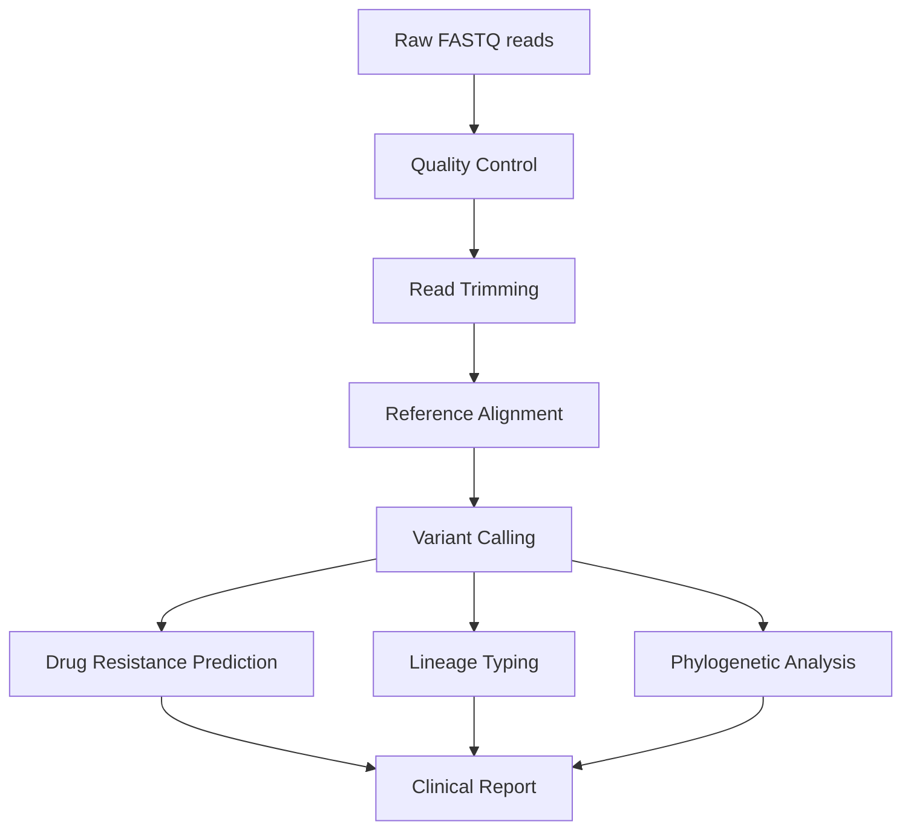

# Day 7: Applied Genomics & Advanced Nextflow Topics

**Date**: September 9, 2025
**Duration**: 09:00-13:00 CAT
**Focus**: MTB analysis pipelines, genome assembly workflows, advanced features, and deployment

## Overview

Day 7 builds upon the Nextflow foundations from Day 6, focusing on real-world genomic applications and advanced pipeline development. Participants will develop comprehensive MTB (Mycobacterium tuberculosis) analysis pipelines, learn genome assembly workflows, explore advanced Nextflow features, and understand deployment strategies for production environments.

## Learning Objectives

By the end of Day 7, you will be able to:

- Develop complete MTB genomic analysis pipelines for clinical applications
- Build genome assembly and annotation workflows
- Implement advanced Nextflow features (modules, subworkflows, operators)
- Optimize pipeline performance and resource management
- Test and validate pipeline components with real data
- Deploy pipelines across different execution platforms (local, HPC, cloud)
- Apply production-ready best practices and error handling
- Use nf-core tools and community resources

## Schedule

| Time (CAT) | Topic | Duration | Trainer |
|------------|-------|----------|---------|
| **09:00** | *Applied Genomics: MTB Analysis Pipeline* | 75 min | Mamana Mbiyavanga |
| **10:15** | *Genome Assembly Workflows* | 75 min | Mamana Mbiyavanga |
| **11:30** | **Break** | 15 min | |
| **11:45** | *Advanced Topics: Optimization & Deployment* | 75 min | Mamana Mbiyavanga |

## Key Topics

### 1. Applied Genomics: MTB Analysis Pipeline (75 minutes)

- Clinical TB genomics workflow requirements
- Quality control and read preprocessing
- Reference-based variant calling pipeline
- Drug resistance prediction and lineage typing
- Phylogenetic analysis and transmission clustering
- Clinical reporting and interpretation

### 2. Genome Assembly Workflows (75 minutes)

- De novo assembly pipeline development
- Assembly quality assessment and validation
- Genome annotation and functional analysis
- Comparative genomics approaches
- Multi-sample assembly processing
- Integration with downstream analyses

### 3. Advanced Topics: Optimization & Deployment (75 minutes)

- Advanced Nextflow features and modules
- Performance optimization and resource management
- Testing frameworks and continuous integration
- Deployment strategies (local, HPC, cloud)
- Production deployment and monitoring
- Best practices for collaborative development

## Tools and Software

### Bioinformatics Tools for MTB Analysis

- **BWA** - Read alignment to reference genome
- **SAMtools/BCFtools** - SAM/BAM manipulation and variant calling
- **GATK** - Genome Analysis Toolkit for variant calling
- **FastQC/MultiQC** - Quality control and reporting
- **Trimmomatic** - Read trimming and filtering
- **TB-Profiler** - Drug resistance prediction
- **SNP-sites** - SNP extraction from alignments
- **IQ-TREE** - Phylogenetic tree construction

### Genome Assembly Tools

- **SPAdes** - De novo genome assembly
- **QUAST** - Assembly quality assessment
- **Prokka** - Genome annotation
- **BUSCO** - Assembly completeness assessment
- **Bandage** - Assembly graph visualization

### Advanced Nextflow Features

- **nf-core tools** - Pipeline development framework
- **nf-test** - Testing framework
- **Nextflow Tower** - Pipeline monitoring
- **Docker/Singularity** - Container technologies

## Part 1: Applied Genomics - MTB Analysis Pipeline

### The Global TB Crisis and Genomics Revolution

Tuberculosis kills more people than any other infectious disease caused by a single agent. In 2023, 10.6 million people fell ill with TB and 1.3 million died. Drug-resistant TB threatens to reverse decades of progress. This section equips you with cutting-edge genomic tools to combat this ancient disease using modern technology.

### Why TB Genomics Matters

**Clinical Impact:**

- Reduce diagnosis time from weeks to days
- Detect drug resistance before treatment failure
- Guide personalized treatment regimens
- Identify extensively drug-resistant (XDR) strains early

**Public Health Applications:**

- Track transmission chains in real-time
- Identify super-spreaders and hotspots
- Monitor emergence of new resistance mutations
- Support contact tracing with genomic evidence

### MTB Genomics Workflow Overview



### Exercise 1: MTB Quality Control Pipeline (30 minutes)

**Objective**: Build a QC pipeline for MTB sequencing data

Create `mtb_qc.nf`:

```nextflow
#!/usr/bin/env nextflow

// Parameters
params.reads = "data/mtb/*_R{1,2}.fastq.gz"
params.outdir = "results"
params.reference = "data/reference/H37Rv.fasta"

// Main workflow
workflow {
    // Input channels
    reads_ch = Channel.fromFilePairs(params.reads, checkIfExists: true)
    reference_ch = Channel.fromPath(params.reference, checkIfExists: true)

    // Quality control
    FASTQC(reads_ch)

    // Read trimming
    TRIMMOMATIC(reads_ch)

    // Post-trimming QC
    FASTQC_TRIMMED(TRIMMOMATIC.out.trimmed)

    // Aggregate reports
    qc_files = FASTQC.out.zip.mix(FASTQC_TRIMMED.out.zip).collect()
    MULTIQC(qc_files)
}

// Process definitions
process FASTQC {
    tag "$sample_id"
    container 'biocontainers/fastqc:v0.11.9_cv8'
    publishDir "${params.outdir}/fastqc_raw", mode: 'copy'

    input:
    tuple val(sample_id), path(reads)

    output:
    tuple val(sample_id), path("*_fastqc.{html,zip}"), emit: reports
    path "*_fastqc.zip", emit: zip

    script:
    """
    fastqc ${reads}
    """
}

process TRIMMOMATIC {
    tag "$sample_id"
    container 'quay.io/biocontainers/trimmomatic:0.39--hdfd78af_2'
    publishDir "${params.outdir}/trimmed", mode: 'copy'

    input:
    tuple val(sample_id), path(reads)

    output:
    tuple val(sample_id), path("${sample_id}_R{1,2}_trimmed.fastq.gz"), emit: trimmed
    path "${sample_id}_trimming_report.txt", emit: report

    script:
    """
    trimmomatic PE \\
        ${reads[0]} ${reads[1]} \\
        ${sample_id}_R1_trimmed.fastq.gz ${sample_id}_R1_unpaired.fastq.gz \\
        ${sample_id}_R2_trimmed.fastq.gz ${sample_id}_R2_unpaired.fastq.gz \\
        ILLUMINACLIP:TruSeq3-PE.fa:2:30:10 \\
        LEADING:3 TRAILING:3 SLIDINGWINDOW:4:20 MINLEN:36 \\
        2> ${sample_id}_trimming_report.txt
    """
}

process FASTQC_TRIMMED {
    tag "$sample_id"
    container 'biocontainers/fastqc:v0.11.9_cv8'
    publishDir "${params.outdir}/fastqc_trimmed", mode: 'copy'

    input:
    tuple val(sample_id), path(reads)

    output:
    tuple val(sample_id), path("*_fastqc.{html,zip}"), emit: reports
    path "*_fastqc.zip", emit: zip

    script:
    """
    fastqc ${reads}
    """
}

process MULTIQC {
    container 'quay.io/biocontainers/multiqc:1.12--pyhdfd78af_0'
    publishDir "${params.outdir}/multiqc", mode: 'copy'

    input:
    path qc_files

    output:
    path "multiqc_report.html"
    path "multiqc_data"

    script:
    """
    multiqc .
    """
}
```

### Exercise 2: MTB Variant Calling Pipeline (45 minutes)

**Objective**: Build a complete MTB variant calling workflow

Create `mtb_variant_calling.nf`:

```nextflow
#!/usr/bin/env nextflow

// Parameters
params.reads = "data/mtb/*_R{1,2}.fastq.gz"
params.reference = "data/reference/H37Rv.fasta"
params.outdir = "results"

workflow {
    // Input channels
    reads_ch = Channel.fromFilePairs(params.reads, checkIfExists: true)
    reference_ch = Channel.fromPath(params.reference, checkIfExists: true)

    // Index reference
    BWA_INDEX(reference_ch)

    // Align reads
    BWA_MEM(reads_ch, BWA_INDEX.out.index)

    // Call variants
    BCFTOOLS_MPILEUP(BWA_MEM.out.bam, reference_ch)

    // Drug resistance prediction
    TB_PROFILER(reads_ch)
}

process BWA_INDEX {
    container 'biocontainers/bwa:v0.7.17_cv1'

    input:
    path reference

    output:
    path "reference.*", emit: index

    script:
    """
    cp ${reference} reference.fasta
    bwa index reference.fasta
    """
}

process BWA_MEM {
    tag "$sample_id"
    container 'biocontainers/bwa:v0.7.17_cv1'

    input:
    tuple val(sample_id), path(reads)
    path index

    output:
    tuple val(sample_id), path("${sample_id}.bam"), emit: bam

    script:
    """
    bwa mem -t ${task.cpus} reference.fasta ${reads} | \\
    samtools sort -@ ${task.cpus} -o ${sample_id}.bam -
    samtools index ${sample_id}.bam
    """
}

process BCFTOOLS_MPILEUP {
    tag "$sample_id"
    container 'biocontainers/bcftools:v1.15.1_cv1'
    publishDir "${params.outdir}/variants", mode: 'copy'

    input:
    tuple val(sample_id), path(bam)
    path reference

    output:
    tuple val(sample_id), path("${sample_id}.vcf.gz"), emit: vcf

    script:
    """
    bcftools mpileup -f ${reference} ${bam} | \\
    bcftools call -mv -Oz -o ${sample_id}.vcf.gz
    bcftools index ${sample_id}.vcf.gz
    """
}

process TB_PROFILER {
    tag "$sample_id"
    container 'quay.io/biocontainers/tb-profiler:4.4.0--pyhdfd78af_0'
    publishDir "${params.outdir}/tb_profiler", mode: 'copy'

    input:
    tuple val(sample_id), path(reads)

    output:
    path "${sample_id}.*", emit: results

    script:
    """
    tb-profiler profile -1 ${reads[0]} -2 ${reads[1]} -p ${sample_id} --txt
    """
}
```

## Part 2: Genome Assembly Workflows

### De Novo Assembly Pipeline Development

Genome assembly is crucial for discovering new variants, understanding genome structure, and analyzing organisms without reference genomes.

### Exercise 3: Bacterial Genome Assembly Pipeline (45 minutes)

**Objective**: Build a complete de novo assembly workflow

Create `genome_assembly.nf`:

```nextflow
#!/usr/bin/env nextflow

nextflow.enable.dsl=2

// Process definitions
process FASTQC {
    tag "$sample_id"
    container 'biocontainers/fastqc:v0.11.9_cv8'
    
    input:
    tuple val(sample_id), path(reads)
    
    output:
    tuple val(sample_id), path("*_fastqc.{html,zip}")
    
    script:
    """
    fastqc ${reads}
    """
}

process TRIMMOMATIC {
    tag "$sample_id"
    container 'biocontainers/trimmomatic:v0.39-1'
    
    input:
    tuple val(sample_id), path(reads)
    
    output:
    tuple val(sample_id), path("*_paired.fastq.gz")
    
    script:
    """
    trimmomatic PE ${reads[0]} ${reads[1]} \
        ${sample_id}_R1_paired.fastq.gz ${sample_id}_R1_unpaired.fastq.gz \
        ${sample_id}_R2_paired.fastq.gz ${sample_id}_R2_unpaired.fastq.gz \
        ILLUMINACLIP:adapters.fa:2:30:10 LEADING:3 TRAILING:3 SLIDINGWINDOW:4:15 MINLEN:36
    """
}

process SPADES {
    tag "$sample_id"
    container 'biocontainers/spades:v3.15.3-1'
    
    input:
    tuple val(sample_id), path(reads)
    
    output:
    tuple val(sample_id), path("${sample_id}_assembly.fasta")
    
    script:
    """
    spades.py --careful -1 ${reads[0]} -2 ${reads[1]} -o spades_output
    cp spades_output/scaffolds.fasta ${sample_id}_assembly.fasta
    """
}

process QUAST {
    tag "$sample_id"
    container 'biocontainers/quast:v5.0.2-1'
    publishDir "${params.outdir}/quast", mode: 'copy'
    
    input:
    tuple val(sample_id), path(assembly)
    
    output:
    path "${sample_id}_quast"
    
    script:
    """
    quast.py ${assembly} -o ${sample_id}_quast
    """
}

process PROKKA {
    tag "$sample_id"
    container 'biocontainers/prokka:v1.14.6-1'
    publishDir "${params.outdir}/annotations", mode: 'copy'
    
    input:
    tuple val(sample_id), path(assembly)
    
    output:
    path "${sample_id}_annotation"
    
    script:
    """
    prokka ${assembly} --outdir ${sample_id}_annotation --prefix ${sample_id} \
        --kingdom Bacteria --cpus ${task.cpus}
    """
}

// Workflow definition
workflow {
    // Input data
    reads_ch = Channel.fromFilePairs(params.reads, checkIfExists: true)
    
    // QC and trimming
    FASTQC(reads_ch)
    TRIMMOMATIC(reads_ch)
    
    // Assembly
    SPADES(TRIMMOMATIC.out)
    
    // Quality assessment
    QUAST(SPADES.out)
    
    // Annotation
    PROKKA(SPADES.out)
}
```

## Part 3: Advanced Topics - Optimization & Deployment

### Advanced Nextflow Features

#### Modules and Subworkflows

Nextflow modules allow you to organize code into reusable components:

```nextflow
// modules/fastqc.nf
process FASTQC {
    tag "$meta.id"
    container 'biocontainers/fastqc:v0.11.9_cv8'

    input:
    tuple val(meta), path(reads)

    output:
    tuple val(meta), path("*.html"), emit: html
    tuple val(meta), path("*.zip") , emit: zip

    script:
    """
    fastqc ${reads}
    """
}
```

Include modules in your main workflow:

```nextflow
// main.nf
include { FASTQC } from './modules/fastqc'

workflow {
    reads_ch = Channel.fromFilePairs(params.reads)
    FASTQC(reads_ch)
}
```

#### Advanced Channel Operators

```nextflow
workflow {
    // Combine channels
    reads_ch = Channel.fromFilePairs(params.reads)
    reference_ch = Channel.fromPath(params.reference)

    // Cross product - each read pair with each reference
    combined_ch = reads_ch.combine(reference_ch)

    // Join channels by key
    metadata_ch = Channel.from([
        ['sample1', 'lineage1'],
        ['sample2', 'lineage2']
    ])

    reads_with_meta = reads_ch.join(metadata_ch)

    // Filter channels
    large_files = reads_ch.filter { sample, files ->
        files[0].size() > 1000000
    }

    // Transform data
    sample_names = reads_ch.map { sample, files -> sample }
}
```

### Exercise 4: Performance Optimization (30 minutes)

**Objective**: Optimize pipeline performance and resource usage

Create `nextflow.config` with optimized settings:

```groovy
// nextflow.config
params {
    // Input parameters
    reads = "data/*_R{1,2}.fastq.gz"
    outdir = "results"

    // Resource defaults
    max_cpus = 16
    max_memory = '64.GB'
    max_time = '24.h'
}

// Profile configurations
profiles {
    local {
        process.executor = 'local'
        process.cpus = 4
        process.memory = '8.GB'
        docker.enabled = true
    }

    slurm {
        process.executor = 'slurm'
        process.queue = 'batch'
        process.cpus = 16
        process.memory = '32.GB'
        singularity.enabled = true
    }

    cloud {
        process.executor = 'awsbatch'
        aws.batch.cliPath = '/home/ec2-user/miniconda/bin/aws'
        aws.region = 'us-west-2'
    }
}

// Process-specific resource allocation
process {
    // Default resources
    cpus = 2
    memory = 4.GB
    time = '1.hour'

    // Process-specific optimization
    withName: SPADES {
        cpus = { 8 * task.attempt }
        memory = { 16.GB * task.attempt }
        time = { 4.hour * task.attempt }
        errorStrategy = 'retry'
        maxRetries = 3
    }

    withName: BWA_MEM {
        cpus = 8
        memory = 16.GB
        time = 2.hour
    }

    withName: FASTQC {
        cpus = 1
        memory = 2.GB
        time = 30.min
    }
}
```

```groovy
// nextflow.config
params {
    // Input parameters
    reads = "data/*_R{1,2}_001.fastq.gz"
    outdir = "results"
    
    // Resource defaults
    max_cpus = 16
    max_memory = '64.GB'
    max_time = '24.h'
}

// Profile configurations
profiles {
    local {
        process.executor = 'local'
        process.cpus = 4
        process.memory = '8.GB'
        docker.enabled = true
    }
    
    slurm {
        process.executor = 'slurm'
        process.queue = 'batch'
        process.cpus = 16
        process.memory = '32.GB'
        singularity.enabled = true
    }
    
    conda {
        conda.enabled = true
        process.conda = 'envs/microbial_genomics.yml'
    }
}

// Process-specific configurations
process {
    withName: SPADES {
        cpus = 8
        memory = '16.GB'
        time = '4.h'
    }
    
    withName: PROKKA {
        cpus = 4
        memory = '8.GB'
        time = '2.h'
    }
}
```

## Key Concepts

### Nextflow Language Features
- **Processes**: Encapsulated tasks with inputs, outputs, and script
- **Channels**: Asynchronous data streams connecting processes
- **Operators**: Transform and manipulate channel data
- **Workflows**: Orchestrate process execution and data flow

### Best Practices
- **Modularity**: Break complex workflows into reusable components
- **Parameterization**: Make pipelines configurable and flexible
- **Error handling**: Implement robust error recovery mechanisms
- **Testing**: Validate pipeline components and outputs
- **Documentation**: Clear usage instructions and examples

### Configuration Management
```groovy
// Environment-specific settings
profiles {
    standard {
        process.container = 'ubuntu:20.04'
    }
    docker {
        docker.enabled = true
        docker.runOptions = '-u $(id -u):$(id -g)'
    }
    singularity {
        singularity.enabled = true
        singularity.autoMounts = true
    }
}
```

## Pipeline Development Workflow

### 1. Planning Phase
- Define pipeline objectives and scope
- Identify required tools and dependencies
- Design modular architecture
- Plan testing and validation strategy

### 2. Development Phase
- Create process definitions for each step
- Implement workflow logic and data flow
- Add configuration and parameterization
- Include error handling and logging

### 3. Testing Phase
- Test individual processes with sample data
- Validate complete workflow execution
- Performance testing and optimization
- Edge case and error condition testing

### 4. Deployment Phase
- Containerize tools and dependencies
- Create user documentation
- Set up continuous integration
- Community sharing and feedback

## Assessment Activities

### Individual Tasks
- Create simple Nextflow process for bioinformatics tool
- Develop multi-step pipeline with proper data flow
- Configure pipeline for different execution environments
- Test pipeline with provided datasets

### Group Exercise
- Collaborate on pipeline feature development
- Review and optimize pipeline code
- Share experiences with different configuration profiles
- Troubleshoot common pipeline issues

## Common Challenges

### Resource Management
```groovy
// Dynamic resource allocation
process ASSEMBLY {
    memory { 4.GB * task.attempt }
    time { 2.h * task.attempt }
    errorStrategy 'retry'
    maxRetries 3
    
    script:
    """
    spades.py --memory ${task.memory.toGiga()} -t ${task.cpus} ...
    """
}
```

### Data Staging Issues
```groovy
// Proper input handling
process ANALYSIS {
    stageInMode 'copy'  // Ensure file availability
    scratch true        // Use local scratch space
    
    input:
    path(large_file)
    
    script:
    """
    # Process large file locally
    analysis_tool ${large_file}
    """
}
```

### Container Compatibility
```groovy
// Container-specific configurations
process {
    withName: SPECIAL_TOOL {
        container = 'custom/special-tool:v1.0'
        containerOptions = '--user root'
    }
}
```

## Resources

### Documentation
- [Nextflow Documentation](https://nextflow.io/docs/latest/)
- [nf-core Website](https://nf-co.re/)
- [Nextflow Patterns](https://nextflow-io.github.io/patterns/)

### Training Materials
- [Nextflow Training](https://training.nextflow.io/)
- [nf-core Bytesize Talks](https://nf-co.re/events/bytesize)
- [Seqera Community Forum](https://community.seqera.io/)

### Development Tools
- [nf-core tools](https://nf-co.re/tools)
- [Nextflow VS Code Extension](https://marketplace.visualstudio.com/items?itemName=nextflow.nextflow)
- [nf-test Framework](https://nf-test.com/)

## Looking Ahead

**Course Completion**: You now have the skills to:

- Develop reproducible bioinformatics workflows for clinical and research applications
- Apply quality control and analysis methods to microbial genomics data
- Use version control for collaborative development and sharing
- Deploy pipelines across different platforms (local, HPC, cloud)
- Optimize performance and troubleshoot complex pipeline issues

### Next Steps for Your Research

- **Apply to Your Data**: Adapt these pipelines to your specific research questions
- **Join the Community**: Contribute to nf-core and share your pipelines
- **Continue Learning**: Explore advanced Nextflow features and cloud deployment
- **Collaborate**: Use version control and sharing practices for team projects

### Real-world Applications

The skills you've learned enable you to:

- **Clinical Genomics**: Develop diagnostic pipelines for pathogen identification
- **Outbreak Investigation**: Build transmission analysis workflows
- **Research Collaboration**: Share reproducible analysis methods
- **High-throughput Analysis**: Scale pipelines for large datasets
- **Multi-platform Deployment**: Run pipelines from laptop to cloud

---

**Key Learning Outcome**: You now have the expertise to develop, optimize, and deploy production-ready bioinformatics pipelines that can scale from laptop to cloud, enabling reproducible and collaborative genomics research that can make a real impact in clinical and public health applications.
