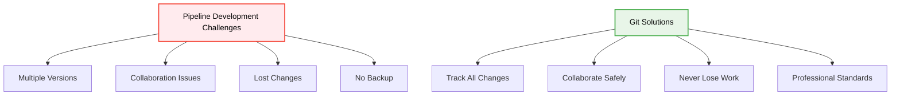
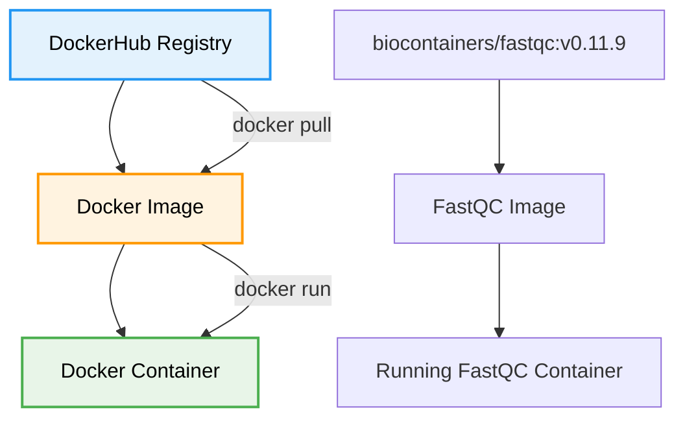
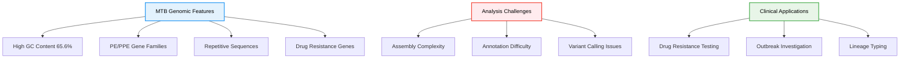
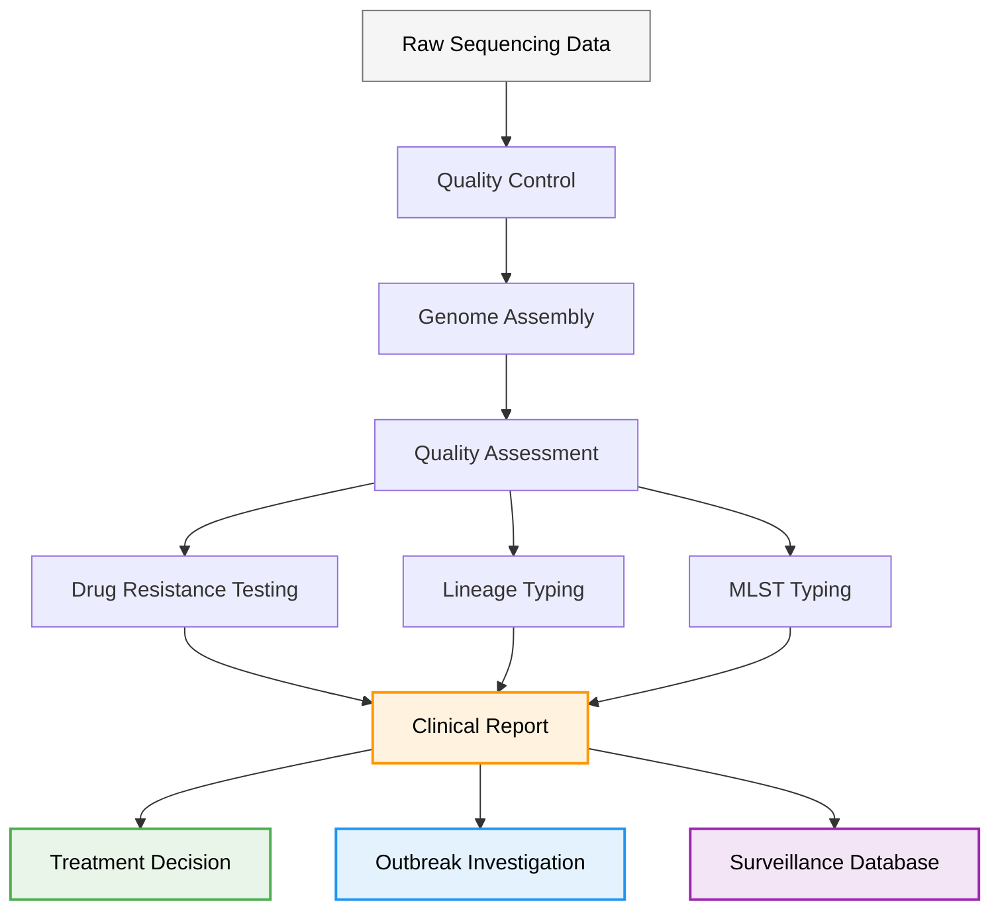
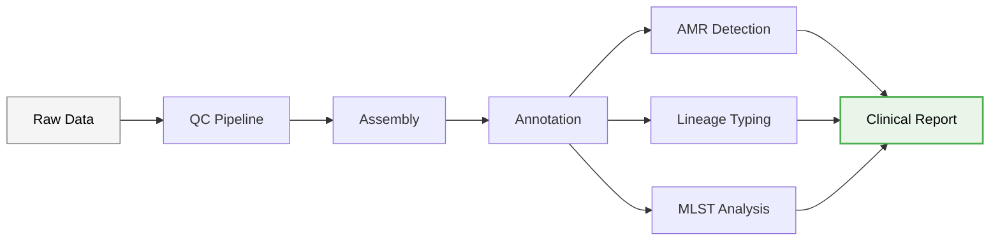

# Day 7: Advanced Nextflow, Version Control with GitHub & Real Genomics Applications

**Date**: September 9, 2025
**Duration**: 09:00-13:00 CAT
**Focus**: Version control, containerization, and production-ready MTB analysis pipelines

## Learning Philosophy: Build → Version → Containerize → Deploy → Collaborate

Building on Exercise 3 from Day 6, this module transforms your basic pipeline into a professional, production-ready workflow:

- **Build**: Extend your Exercise 3 pipeline with advanced features
- **Version**: Track changes and collaborate using Git and GitHub
- **Containerize**: Package tools using Docker for reproducibility
- **Deploy**: Run pipelines reliably across different environments
- **Collaborate**: Share and maintain pipelines as a team

## Table of Contents

### **🔧 Building on Exercise 3**

- [From Exercise 3 to Production Pipeline](#from-exercise-3-to-production-pipeline)
- [Pipeline Enhancement Strategy](#pipeline-enhancement-strategy)

### **📚 Version Control Fundamentals**

- [Git Basics for Bioinformatics](#git-basics-for-bioinformatics)
- [GitHub for Pipeline Collaboration](#github-for-pipeline-collaboration)
- [Versioning Nextflow Workflows](#versioning-nextflow-workflows)

### **🐳 Containerization Introduction**

- [Docker Fundamentals](#docker-fundamentals)
- [DockerHub for Bioinformatics Tools](#dockerhub-for-bioinformatics-tools)
- [Container Integration in Nextflow](#container-integration-in-nextflow)

### **🧬 MTB Analysis Pipeline Development**

- [Mycobacterium tuberculosis Genomics](#mycobacterium-tuberculosis-genomics)
- [Pathogen-Specific Considerations](#pathogen-specific-considerations)
- [Clinical Genomics Applications](#clinical-genomics-applications)
- [Production MTB Pipeline](#production-mtb-pipeline)

### **🚀 Professional Development**

- [Pipeline Documentation](#pipeline-documentation)
- [Testing and Validation](#testing-and-validation)
- [Deployment Strategies](#deployment-strategies)

## Learning Objectives

By the end of Day 7, you will be able to:

- **Version Control**: Use Git and GitHub to track pipeline changes and collaborate effectively
- **Containerization**: Understand Docker basics and integrate containers into Nextflow workflows
- **MTB Analysis**: Develop production-ready pipelines for *Mycobacterium tuberculosis* genomics
- **Clinical Applications**: Apply genomics workflows to real-world pathogen surveillance
- **Professional Skills**: Document, test, and deploy bioinformatics pipelines professionally

## Prerequisites

- Completed Day 6 Exercise 3 (Quality Control Pipeline)
- Basic understanding of Nextflow DSL2 syntax
- Familiarity with command line operations
- Access to the training cluster environment

## Schedule

| Time (CAT) | Topic | Duration | Trainer |
|------------|-------|----------|---------|
| **09:00** | *Version Control: Git and GitHub for Pipeline Development* | 45 min | Mamana Mbiyavanga |
| **09:45** | *Containerization: Docker Fundamentals and DockerHub* | 45 min | Mamana Mbiyavanga |
| **10:30** | **Break** | 15 min | |
| **10:45** | *MTB Analysis Pipeline Development* | 45 min | Mamana Mbiyavanga |
| **11:30** | *Clinical Genomics Applications and Pathogen Surveillance* | 45 min | Mamana Mbiyavanga |
| **12:15** | *Professional Pipeline Development and Deployment* | 45 min | Mamana Mbiyavanga |
| **13:00** | **End** | | |

---

## From Exercise 3 to Production Pipeline

### Recap: What We Built in Exercise 3

In Day 6, Exercise 3, we created a progressive quality control pipeline (`qc_pipeline.nf`) that included:

```mermaid
flowchart LR
    A[Raw FASTQ Files] --> B[FastQC Raw]
    B --> C[Trimmomatic]
    C --> D[FastQC Trimmed]
    D --> E[SPAdes Assembly]
    E --> F[Prokka Annotation]
    F --> G[MultiQC Report]

    style A fill:#f5f5f5,stroke:#757575,stroke-width:1px,color:#000
    style G fill:#f5f5f5,stroke:#757575,stroke-width:1px,color:#000
    style B fill:#e8f5e8,stroke:#388e3c,stroke-width:2px,color:#000
    style C fill:#e8f5e8,stroke:#388e3c,stroke-width:2px,color:#000
    style D fill:#e8f5e8,stroke:#388e3c,stroke-width:2px,color:#000
    style E fill:#e8f5e8,stroke:#388e3c,stroke-width:2px,color:#000
    style F fill:#e8f5e8,stroke:#388e3c,stroke-width:2px,color:#000
```



### Today's Enhancement Strategy

We'll transform this basic pipeline into a production-ready MTB analysis workflow by adding:

1. **Version Control**: Track all changes using Git
2. **Containerization**: Replace module loading with Docker containers
3. **MTB-Specific Features**: Add tuberculosis-specific analysis steps
4. **Clinical Applications**: Include AMR detection and typing
5. **Professional Standards**: Documentation, testing, and deployment

---

## Version Control: Git and GitHub for Pipeline Development

### Why Version Control for Bioinformatics?



**Real-world scenarios:**

- **Research labs**: Multiple researchers working on the same pipeline
- **Clinical labs**: Regulatory requirements for change tracking
- **Collaborations**: Sharing pipelines between institutions
- **Publications**: Reproducible research requirements

### Git Fundamentals for Bioinformatics

#### Setting Up Git for Your Pipeline

```bash
# Navigate to your workflows directory
cd /users/$USER/microbial-genomics-training/workflows

# Initialize Git repository
git init

# Configure Git (first time only)
git config --global user.name "Your Name"
git config --global user.email "your.email@uct.ac.za"

# Check current status
git status
```

#### Your First Commit: Saving Exercise 3

```bash
# Add your Exercise 3 pipeline to version control
git add qc_pipeline.nf
git add nextflow.config
git add samplesheet.csv

# Create your first commit
git commit -m "Initial commit: Exercise 3 QC pipeline

- FastQC for raw and trimmed reads
- Trimmomatic for quality trimming
- SPAdes for genome assembly
- Prokka for annotation
- MultiQC for reporting
- Tested with 10 TB samples"

# View your commit history
git log --oneline
```

#### Understanding Git Workflow


### GitHub for Pipeline Collaboration

#### Creating Your Pipeline Repository

1. **Go to GitHub.com** and sign in
2. **Click "New Repository"**
3. **Repository settings:**
   - Name: `mtb-analysis-pipeline`
   - Description: `Production-ready Mycobacterium tuberculosis genomics pipeline`
   - Public/Private: Choose based on your needs
   - Initialize with README: ✅

#### Connecting Local Repository to GitHub

```bash
# Add GitHub as remote origin
git remote add origin https://github.com/yourusername/mtb-analysis-pipeline.git

# Push your local commits to GitHub
git branch -M main
git push -u origin main

# Verify connection
git remote -v
```

#### Professional README for Your Pipeline

Create a comprehensive README.md:

```markdown
# MTB Analysis Pipeline

A production-ready Nextflow pipeline for *Mycobacterium tuberculosis* genomic analysis.

## Quick Start

```bash
nextflow run main.nf --input samplesheet.csv --outdir results/
```

## Features

- ✅ Quality control with FastQC
- ✅ Read trimming with Trimmomatic
- ✅ Genome assembly with SPAdes
- ✅ Gene annotation with Prokka
- ✅ Comprehensive reporting with MultiQC
- 🔄 AMR detection (coming soon)
- 🔄 Lineage typing (coming soon)

## Requirements

- Nextflow ≥ 21.04.0
- Docker or Singularity
- 8+ GB RAM recommended

## Citation

If you use this pipeline, please cite: [Your Publication]

```

---

## Containerization: Docker Fundamentals and DockerHub

### Why Containers for Bioinformatics?

**The Problem:**
```bash
# Traditional approach - dependency hell
module load fastqc/0.12.1
module load trimmomatic/0.39
module load spades/3.15.4
module load prokka/1.14.6

# What if modules aren't available?
# What if versions differ?
# What if you're on a different system?
```

**The Container Solution:**

```bash
# Container approach - everything included
container 'biocontainers/fastqc:v0.11.9'
container 'staphb/trimmomatic:0.39'
container 'staphb/spades:3.15.4'
container 'staphb/prokka:1.14.6'
```

### Docker Fundamentals

#### Understanding Docker Images



#### Key Docker Concepts

- **Image**: A template containing the software and dependencies
- **Container**: A running instance of an image
- **Registry**: A repository of images (like DockerHub)
- **Tag**: Version identifier for images

### DockerHub for Bioinformatics Tools

#### Finding Bioinformatics Containers

**Popular Bioinformatics Container Repositories:**

1. **BioContainers**: `biocontainers/toolname`
2. **StaPH-B**: `staphb/toolname` (State Public Health Bioinformatics)
3. **Broad Institute**: `broadinstitute/toolname`
4. **nf-core**: `nfcore/toolname`

#### Searching for Tools

```bash
# Search DockerHub for bioinformatics tools
# Visit: https://hub.docker.com/

# Example searches:
# - "biocontainers fastqc"
# - "staphb trimmomatic"
# - "broadinstitute gatk"
```

#### Understanding Container Tags

```bash
# Different ways to specify versions
container 'biocontainers/fastqc:v0.11.9'     # Specific version
container 'biocontainers/fastqc:latest'      # Latest version
container 'staphb/spades:3.15.4'            # Specific version
container 'staphb/spades:latest'             # Latest version (not recommended for production)
```

#### Testing Containers with Singularity

**Why Test Containers First?**
Before integrating containers into your Nextflow pipeline, it's good practice to test them individually to ensure they work correctly and understand their requirements.

**Singularity vs Docker on HPC:**

- **Docker**: Requires root privileges, not available on most HPC systems
- **Singularity**: Designed for HPC environments, can run Docker containers without root
- **Nextflow**: Automatically converts Docker containers to Singularity when needed

**Basic Singularity Testing Commands:**

```bash
# Test FastQC container
singularity exec docker://biocontainers/fastqc:v0.11.9 fastqc --version

# Test with real data
singularity exec docker://biocontainers/fastqc:v0.11.9 \
    fastqc /data/Dataset_Mt_Vc/tb/raw_data/SRR1180160_1.fastq.gz --outdir ./test_output

# Test Trimmomatic container
singularity exec docker://staphb/trimmomatic:0.39 \
    trimmomatic PE --help

# Test SPAdes container
singularity exec docker://staphb/spades:3.15.4 \
    spades.py --version

# Test Prokka container
singularity exec docker://staphb/prokka:1.14.6 \
    prokka --version
```

**Interactive Container Testing:**

```bash
# Enter container interactively to explore
singularity shell docker://biocontainers/fastqc:v0.11.9

# Inside the container, you can:
# - Check what tools are available
# - Explore file system structure
# - Test commands manually
# - Verify dependencies

# Example interactive session:
Singularity> which fastqc
Singularity> fastqc --help
Singularity> ls /usr/local/bin/
Singularity> exit
```

**Testing with Bind Mounts:**

```bash
# Bind mount your data directory to test with real files
singularity exec \
    --bind /data/Dataset_Mt_Vc/tb/raw_data:/input \
    --bind /tmp:/output \
    docker://biocontainers/fastqc:v0.11.9 \
    fastqc /input/SRR1180160_1.fastq.gz --outdir /output

# Check the results
ls -la /tmp/*.html /tmp/*.zip
```

**Container Validation Script:**

Create a simple script to test all your containers:

```bash
#!/bin/bash
# container_test.sh - Test bioinformatics containers

echo "Testing bioinformatics containers..."

# Test FastQC
echo "Testing FastQC..."
singularity exec docker://biocontainers/fastqc:v0.11.9 fastqc --version
if [ $? -eq 0 ]; then
    echo "✅ FastQC container works"
else
    echo "❌ FastQC container failed"
fi

# Test Trimmomatic
echo "Testing Trimmomatic..."
singularity exec docker://staphb/trimmomatic:0.39 trimmomatic -version
if [ $? -eq 0 ]; then
    echo "✅ Trimmomatic container works"
else
    echo "❌ Trimmomatic container failed"
fi

# Test SPAdes
echo "Testing SPAdes..."
singularity exec docker://staphb/spades:3.15.4 spades.py --version
if [ $? -eq 0 ]; then
    echo "✅ SPAdes container works"
else
    echo "❌ SPAdes container failed"
fi

# Test Prokka
echo "Testing Prokka..."
singularity exec docker://staphb/prokka:1.14.6 prokka --version
if [ $? -eq 0 ]; then
    echo "✅ Prokka container works"
else
    echo "❌ Prokka container failed"
fi

echo "Container testing complete!"
```

**Running the Test Script:**

```bash
# Make the script executable
chmod +x container_test.sh

# Run the tests
./container_test.sh
```

**Expected Output:**

```bash
Testing bioinformatics containers...
Testing FastQC...
FastQC v0.11.9
✅ FastQC container works
Testing Trimmomatic...
0.39
✅ Trimmomatic container works
Testing SPAdes...
SPAdes v3.15.4
✅ SPAdes container works
Testing Prokka...
prokka 1.14.6
✅ Prokka container works
Container testing complete!
```

**Troubleshooting Container Issues:**

```bash
# If a container fails, check:

# 1. Container exists and is accessible
singularity pull docker://biocontainers/fastqc:v0.11.9

# 2. Check container contents
singularity inspect docker://biocontainers/fastqc:v0.11.9

# 3. Run with verbose output
singularity exec --debug docker://biocontainers/fastqc:v0.11.9 fastqc --version

# 4. Check for missing dependencies
singularity exec docker://biocontainers/fastqc:v0.11.9 ldd /usr/local/bin/fastqc
```

**Best Practices for Container Testing:**

1. **Always test containers before using in production pipelines**
2. **Use specific version tags rather than 'latest'**
3. **Test with real data similar to your analysis**
4. **Document working container versions**
5. **Create validation scripts for your container stack**

#### Hands-on Exercise: Test Your Containers

We've provided a ready-to-use container testing script in your workflows directory:

```bash
# Navigate to workflows directory
cd /users/$USER/microbial-genomics-training/workflows

# Run the container test script
./container_test.sh
```

This script will test all the containers we'll use in our MTB pipeline and provide colored output showing which containers are working correctly.

### Container Integration in Nextflow

#### Converting Exercise 3 to Use Containers

Let's update our `qc_pipeline.nf` to use containers instead of modules:

**Before (Module-based):**

```groovy
process fastqc_raw {
    module 'fastqc/0.12.1'
    publishDir "${params.outdir}/fastqc_raw", mode: 'copy'
    tag "$sample_id"

    input:
    tuple val(sample_id), path(reads)

    output:
    path "*.{html,zip}"

    script:
    """
    echo "Running FastQC on raw reads: ${sample_id}"
    fastqc ${reads[0]} ${reads[1]} --threads 2
    """
}
```

**After (Container-based):**

```groovy
process fastqc_raw {
    container 'biocontainers/fastqc:v0.11.9'
    publishDir "${params.outdir}/fastqc_raw", mode: 'copy'
    tag "$sample_id"

    input:
    tuple val(sample_id), path(reads)

    output:
    path "*.{html,zip}"

    script:
    """
    echo "Running FastQC on raw reads: ${sample_id}"
    fastqc ${reads[0]} ${reads[1]} --threads 2
    """
}
```

#### Complete Containerized Pipeline

Let's create `mtb_pipeline.nf` - our enhanced, containerized version:

```groovy
#!/usr/bin/env nextflow

// Enable DSL2
nextflow.enable.dsl = 2

// Parameters
params.input = "samplesheet.csv"
params.outdir = "/data/users/$USER/nextflow-training/results"
params.adapters = "/data/timmomatic_adapter_Combo.fa"

// FastQC process for raw reads
process fastqc_raw {
    container 'biocontainers/fastqc:v0.11.9'
    publishDir "${params.outdir}/fastqc_raw", mode: 'copy'
    tag "$sample_id"

    input:
    tuple val(sample_id), path(reads)

    output:
    path "*.{html,zip}"

    script:
    """
    echo "Running FastQC on raw reads: ${sample_id}"
    fastqc ${reads[0]} ${reads[1]} --threads 2
    """
}

// Trimmomatic for quality trimming
process trimmomatic {
    container 'staphb/trimmomatic:0.39'
    publishDir "${params.outdir}/trimmed", mode: 'copy'
    tag "$sample_id"

    input:
    tuple val(sample_id), path(reads)

    output:
    tuple val(sample_id), path("${sample_id}_*_paired.fastq.gz")
    path "${sample_id}_*_unpaired.fastq.gz"

    script:
    """
    echo "Running Trimmomatic on ${sample_id}"

    trimmomatic PE -threads 2 \\
        ${reads[0]} ${reads[1]} \\
        ${sample_id}_R1_paired.fastq.gz ${sample_id}_R1_unpaired.fastq.gz \\
        ${sample_id}_R2_paired.fastq.gz ${sample_id}_R2_unpaired.fastq.gz \\
        ILLUMINACLIP:${params.adapters}:2:30:10 \\
        LEADING:3 TRAILING:3 \\
        SLIDINGWINDOW:4:15 MINLEN:36
    """
}

// FastQC process for trimmed reads
process fastqc_trimmed {
    container 'biocontainers/fastqc:v0.11.9'
    publishDir "${params.outdir}/fastqc_trimmed", mode: 'copy'
    tag "$sample_id"

    input:
    tuple val(sample_id), path(reads)

    output:
    path "*.{html,zip}"

    script:
    """
    echo "Running FastQC on trimmed reads: ${sample_id}"
    fastqc ${reads[0]} ${reads[1]} --threads 2
    """
}

// SPAdes assembly
process spades_assembly {
    container 'staphb/spades:3.15.4'
    publishDir "${params.outdir}/assemblies", mode: 'copy'
    tag "$sample_id"
    cpus 4
    memory '8 GB'

    input:
    tuple val(sample_id), path(reads)

    output:
    tuple val(sample_id), path("${sample_id}_assembly")
    tuple val(sample_id), path("${sample_id}_assembly/contigs.fasta")

    script:
    """
    echo "Running SPAdes assembly for ${sample_id}"

    spades.py \\
        --pe1-1 ${reads[0]} \\
        --pe1-2 ${reads[1]} \\
        --threads ${task.cpus} \\
        --memory ${task.memory.toGiga()} \\
        -o ${sample_id}_assembly
    """
}

// Prokka annotation
process prokka_annotation {
    container 'staphb/prokka:1.14.6'
    publishDir "${params.outdir}/annotation", mode: 'copy'
    tag "$sample_id"
    cpus 2

    input:
    tuple val(sample_id), path(assembly_dir)
    tuple val(sample_id), path(contigs)

    output:
    tuple val(sample_id), path("${sample_id}_annotation")
    tuple val(sample_id), path("${sample_id}_annotation/${sample_id}.gff")

    script:
    """
    echo "Running Prokka annotation for ${sample_id}"

    prokka \\
        --outdir ${sample_id}_annotation \\
        --prefix ${sample_id} \\
        --genus Mycobacterium \\
        --species tuberculosis \\
        --kingdom Bacteria \\
        --cpus ${task.cpus} \\
        ${contigs}

    echo "Annotation completed for ${sample_id}"
    echo "Results written to: ${sample_id}_annotation/"
    """
}

// MultiQC to summarize all results
process multiqc {
    container 'ewels/multiqc:v1.12'
    publishDir "${params.outdir}", mode: 'copy'

    input:
    path "*"

    output:
    path "multiqc_report.html"

    script:
    """
    echo "Running MultiQC to summarize all results"
    multiqc . --filename multiqc_report.html
    """
}

// Main workflow
workflow {
    // Read input samplesheet
    read_pairs_ch = Channel
        .fromPath(params.input)
        .splitCsv(header: true)
        .map { row -> [row.sample, [file(row.fastq_1), file(row.fastq_2)]] }

    // Run FastQC on raw reads
    fastqc_raw_results = fastqc_raw(read_pairs_ch)

    // Run Trimmomatic
    trimmed_results = trimmomatic(read_pairs_ch)

    // Run FastQC on trimmed reads
    fastqc_trimmed_results = fastqc_trimmed(trimmed_results)

    // Run SPAdes assembly on trimmed reads
    assembly_results = spades_assembly(trimmed_results)

    // Run Prokka annotation on assembled contigs
    annotation_results = prokka_annotation(assembly_results[0], assembly_results[1])

    // Collect all FastQC results and run MultiQC
    all_fastqc = fastqc_raw_results.mix(fastqc_trimmed_results).collect()
    multiqc_results = multiqc(all_fastqc)

    // Show final results
    assembly_results[0].view { "Assembly completed: $it" }
    assembly_results[1].view { "Contigs file: $it" }
    annotation_results[0].view { "Annotation completed: $it" }
    annotation_results[1].view { "GFF file: $it" }
    multiqc_results.view { "MultiQC report created: $it" }
}
```

#### Updating Nextflow Configuration for Containers

Update your `nextflow.config`:

```groovy
// Nextflow configuration for MTB pipeline
params {
    input = "samplesheet.csv"
    outdir = "/data/users/$USER/nextflow-training/results"
    adapters = "/data/timmomatic_adapter_Combo.fa"
}

// Work directory configuration
workDir = "/data/users/$USER/nextflow-training/work"

// Container configuration
docker {
    enabled = true
    runOptions = '-u $(id -u):$(id -g)'
}

// Process resource configuration
process {
    withName: 'fastqc_raw' {
        cpus = 2
        memory = '4 GB'
        time = '30m'
    }

    withName: 'trimmomatic' {
        cpus = 2
        memory = '4 GB'
        time = '1h'
    }

    withName: 'fastqc_trimmed' {
        cpus = 2
        memory = '4 GB'
        time = '30m'
    }

    withName: 'spades_assembly' {
        cpus = 4
        memory = '8 GB'
        time = '2h'
    }

    withName: 'prokka_annotation' {
        cpus = 2
        memory = '4 GB'
        time = '1h'
    }

    withName: 'multiqc' {
        cpus = 1
        memory = '2 GB'
        time = '15m'
    }
}

// SLURM profile for cluster execution
profiles {
    slurm {
        process {
            executor = 'slurm'
            queue = 'Main'
            clusterOptions = '--account=b83'
        }
    }
}
```

---

## MTB Analysis Pipeline Development

### Mycobacterium tuberculosis Genomics

#### Understanding MTB Genomics

**Key Characteristics:**

- **Genome size**: ~4.4 Mb
- **GC content**: ~65.6%
- **Genes**: ~4,000 protein-coding genes
- **Clinical relevance**: Major global pathogen, drug resistance concerns
- **Assembly challenges**: Repetitive sequences, PE/PPE gene families



#### MTB-Specific Pipeline Requirements

**Essential Analysis Steps:**

1. **Quality Control**: Standard FastQC + MTB-specific metrics
2. **Assembly**: Optimized for high GC content
3. **Annotation**: MTB-specific gene databases
4. **AMR Detection**: Drug resistance gene identification
5. **Lineage Typing**: Phylogenetic classification
6. **Variant Calling**: SNP identification for outbreak analysis

### Pathogen-Specific Considerations

#### Enhanced MTB Pipeline Features

Let's add MTB-specific processes to our pipeline:

```groovy
// QUAST assembly quality assessment
process quast_assessment {
    container 'staphb/quast:5.0.2'
    publishDir "${params.outdir}/quast", mode: 'copy'
    tag "$sample_id"

    input:
    tuple val(sample_id), path(contigs)

    output:
    path "${sample_id}_quast"

    script:
    """
    echo "Running QUAST assessment for ${sample_id}"

    quast.py \\
        --output-dir ${sample_id}_quast \\
        --threads 2 \\
        --min-contig 500 \\
        --labels ${sample_id} \\
        ${contigs}
    """
}

// AMR detection with AMRFinderPlus
process amr_detection {
    container 'staphb/amrfinderplus:3.10.23'
    publishDir "${params.outdir}/amr", mode: 'copy'
    tag "$sample_id"

    input:
    tuple val(sample_id), path(contigs)

    output:
    path "${sample_id}_amr.tsv"

    script:
    """
    echo "Running AMR detection for ${sample_id}"

    amrfinder \\
        --nucleotide ${contigs} \\
        --organism Mycobacterium \\
        --threads 2 \\
        --output ${sample_id}_amr.tsv

    echo "AMR analysis completed for ${sample_id}"
    """
}

// MTB lineage typing with TB-Profiler
process lineage_typing {
    container 'staphb/tbprofiler:4.1.1'
    publishDir "${params.outdir}/lineage", mode: 'copy'
    tag "$sample_id"

    input:
    tuple val(sample_id), path(reads)

    output:
    path "${sample_id}_lineage.json"
    path "${sample_id}_lineage.txt"

    script:
    """
    echo "Running lineage typing for ${sample_id}"

    tb-profiler profile \\
        --read1 ${reads[0]} \\
        --read2 ${reads[1]} \\
        --prefix ${sample_id}_lineage \\
        --threads 2

    echo "Lineage typing completed for ${sample_id}"
    """
}

// MLST typing
process mlst_typing {
    container 'staphb/mlst:2.22.0'
    publishDir "${params.outdir}/mlst", mode: 'copy'
    tag "$sample_id"

    input:
    tuple val(sample_id), path(contigs)

    output:
    path "${sample_id}_mlst.tsv"

    script:
    """
    echo "Running MLST typing for ${sample_id}"

    mlst \\
        --scheme mtbc \\
        ${contigs} > ${sample_id}_mlst.tsv

    echo "MLST typing completed for ${sample_id}"
    """
}
```

### Clinical Genomics Applications

#### Complete MTB Clinical Pipeline

Here's our enhanced pipeline with all MTB-specific features:

```groovy
#!/usr/bin/env nextflow

// Enable DSL2
nextflow.enable.dsl = 2

// Parameters
params.input = "samplesheet.csv"
params.outdir = "/data/users/$USER/nextflow-training/results"
params.adapters = "/data/timmomatic_adapter_Combo.fa"

// Import processes (previous processes here...)

// Enhanced workflow with MTB-specific analysis
workflow {
    // Read input samplesheet
    read_pairs_ch = Channel
        .fromPath(params.input)
        .splitCsv(header: true)
        .map { row -> [row.sample, [file(row.fastq_1), file(row.fastq_2)]] }

    // Standard QC and assembly pipeline
    fastqc_raw_results = fastqc_raw(read_pairs_ch)
    trimmed_results = trimmomatic(read_pairs_ch)
    fastqc_trimmed_results = fastqc_trimmed(trimmed_results)
    assembly_results = spades_assembly(trimmed_results)
    annotation_results = prokka_annotation(assembly_results[0], assembly_results[1])

    // MTB-specific analyses
    quast_results = quast_assessment(assembly_results[1])
    amr_results = amr_detection(assembly_results[1])
    lineage_results = lineage_typing(trimmed_results)
    mlst_results = mlst_typing(assembly_results[1])

    // Comprehensive reporting
    all_qc = fastqc_raw_results.mix(fastqc_trimmed_results).collect()
    multiqc_results = multiqc(all_qc)

    // Output summaries
    assembly_results[1].view { "Assembly: $it" }
    annotation_results[1].view { "Annotation: $it" }
    amr_results.view { "AMR results: $it" }
    lineage_results.view { "Lineage: $it" }
    mlst_results.view { "MLST: $it" }
}
```

#### Clinical Interpretation Workflow



---


**Step 1: Clone and Setup PHoeNIx**

```bash
# Navigate to your working directory
cd /data/users/$USER/nextflow-training

# Create Phoenix analysis directory
mkdir -p phoenix-analysis
cd phoenix-analysis

# Clone the PHoeNIx pipeline directly
git clone https://github.com/CDCgov/phoenix.git
cd phoenix

# Check the Phoenix help to understand entry workflows
nextflow run main.nf --help
```

**Step 2: Setup Required Databases**

PHoeNIx requires several databases. The system has a pre-installed Kraken2 database:

```bash
# Check available Kraken2 database
ls -la /data/kraken2_db_standard/

# Note: The standard database requires >200GB RAM for production use
# For training environments, ensure adequate memory allocation
echo "Kraken2 database location: /data/kraken2_db_standard/"
```

**Step 3: Prepare Sample Sheet for PHoeNIx**

PHoeNIx uses a specific samplesheet format. Let's create one for our TB data:

```bash
# Create PHoeNIx samplesheet
cat > phoenix_samplesheet.csv << 'EOF'
sample,fastq_1,fastq_2
Test_Sample,/data/Dataset_Mt_Vc/tb/raw_data/ERR036221_1.fastq.gz,/data/Dataset_Mt_Vc/tb/raw_data/ERR036221_2.fastq.gz
EOF

echo "PHoeNIx samplesheet created:"
cat phoenix_samplesheet.csv
```

**Step 4: Configure Resources for Production Use**

PHoeNIx requires significant computational resources, especially for Kraken2 taxonomic classification. The pipeline has hardcoded resource limits that need to be adjusted:

```bash
# First, modify PHoeNIx base configuration for Kraken2 memory requirements
cd phoenix
sed -i 's/cpus   = { check_max( 2                  , '\''cpus'\''    ) }/cpus   = { check_max( 10                 , '\''cpus'\''    ) }/' conf/base.config
sed -i 's/memory = { check_max( 10.GB \* task.attempt, '\''memory'\''  ) }/memory = { check_max( 200.GB \* task.attempt, '\''memory'\''  ) }/' conf/base.config
sed -i 's/time   = { check_max( 4.h                 , '\''time'\''    ) }/time   = { check_max( 8.h                 , '\''time'\''    ) }/' conf/base.config

# Verify the changes
echo "🔍 Checking the updated configuration:"
grep -A 4 "withName:KRAKEN2_KRAKEN2" conf/base.config

# Create cluster configuration for SLURM
cd ..
cat > cluster.config << 'EOF'
process {
    executor = 'slurm'
    queue = 'batch'

    // PHoeNIx-specific resource allocations - 200GB memory for large Kraken2 database (within cluster limits)
    withName: 'PHOENIX:PHOENIX_EXTERNAL:KRAKEN2_TRIMD:KRAKEN2_TRIMD' {
        cpus = 10
        memory = '200 GB'
        time = '8h'
    }

    withName: 'PHOENIX:PHOENIX_EXTERNAL:KRAKEN2_WTASMBLD:KRAKEN2_WTASMBLD' {
        cpus = 10
        memory = '200 GB'
        time = '8h'
    }
}

singularity {
    enabled = true
    autoMounts = true
    cacheDir = '/data/users/singularity_cache'
}
EOF
```

**Step 5: Run PHoeNIx Pipeline**

```bash
# Set up Singularity cache directory
export NXF_SINGULARITY_CACHEDIR="/data/users/singularity_cache"
mkdir -p $NXF_SINGULARITY_CACHEDIR

# Run PHoeNIx with correct entry workflow and configuration
cd phoenix
nextflow run main.nf \
    -entry PHOENIX \
    --input /data/users/$USER/nextflow-training/phoenix-analysis/phoenix_samplesheet.csv \
    --kraken2db $KRAKEN2_DB_PATH \
    --outdir tb_analysis_results \
    -c /users/mamana/microbial-genomics-training/cluster.config \
    -profile singularity,slurm \
    -resume

# Monitor the run
tail -f .nextflow.log
```

#### Running from GitHub (After Pushing Your Workflow)

Once you've developed and pushed your own workflow to GitHub, you can run it directly:

**Step 1: Push Your Workflow to GitHub**

```bash
# Initialize git repository (if not already done)
cd /users/$USER/microbial-genomics-training/workflows
git init
git add .
git commit -m "Add microbial genomics training workflows"

# Add your GitHub repository as remote
git remote add origin https://github.com/$USER/microbial-genomics-training.git
git push -u origin main
```

**Step 2: Run Workflow from GitHub**

```bash
# Run your workflow directly from GitHub
nextflow run $USER/microbial-genomics-training \
    --input samplesheet.csv \
    --outdir /data/users/$USER/nextflow-training/results \
    -profile singularity \
    -resume

# Or run a specific workflow file
nextflow run $USER/microbial-genomics-training/workflows/qc_pipeline.nf \
    --input samplesheet.csv \
    --outdir /data/users/$USER/nextflow-training/results \
    -profile singularity \
    -resume
```

#### Troubleshooting PHoeNIx Issues

**Common Issue 1: Memory Allocation for Kraken2**

If you encounter exit status 137 (killed due to memory constraints):

```bash
# Check if PHoeNIx base configuration was properly modified
grep -A 4 "withName:KRAKEN2_KRAKEN2" phoenix/conf/base.config

# Should show 200.GB memory allocation, not 10.GB
# If not updated, re-run the sed commands from Step 4
```

**Common Issue 2: Entry Workflow Not Specified**

If you get "No entry workflow specified" error:

```bash
# Always use -entry PHOENIX parameter
nextflow run main.nf \
    -entry PHOENIX \
    --input /data/users/$USER/nextflow-training/phoenix-analysis/phoenix_samplesheet.csv \
    --kraken2db $KRAKEN2_DB_PATH \
    --outdir tb_analysis_results \
    -c /users/mamana/microbial-genomics-training/cluster.config \
    -profile singularity,slurm \
    -resume
```

**Common Issue 3: Kraken2 Database Path**

If you encounter the error about `ktaxonomy.tsv` not found:

```bash
# Check if the database path is correct
ls -la /data/kraken2_db/
ls -la /data/kraken2_db/ktaxonomy.tsv

# If using module system, check the environment variable
echo $KRAKEN2_DB_PATH

# Update the command with correct database path
nextflow run main.nf \
    -entry PHOENIX \
    --input /data/users/$USER/nextflow-training/phoenix-analysis/phoenix_samplesheet.csv \
    --kraken2db $KRAKEN2_DB_PATH \
    --outdir tb_analysis_results \
    -c /users/mamana/microbial-genomics-training/cluster.config \
    -profile singularity,slurm \
    -resume
```

**Common Issue 4: QC Pipeline File Function Error**

If your QC pipeline shows "Argument of file function cannot be null":

```bash
# Check samplesheet format - ensure multiple samples
cat > samplesheet_fixed.csv << 'EOF'
sample,fastq_1,fastq_2
ERR036221,/data/Dataset_Mt_Vc/tb/raw_data/ERR036221_1.fastq.gz,/data/Dataset_Mt_Vc/tb/raw_data/ERR036221_2.fastq.gz
ERR036223,/data/Dataset_Mt_Vc/tb/raw_data/ERR036223_1.fastq.gz,/data/Dataset_Mt_Vc/tb/raw_data/ERR036223_2.fastq.gz
ERR036226,/data/Dataset_Mt_Vc/tb/raw_data/ERR036226_1.fastq.gz,/data/Dataset_Mt_Vc/tb/raw_data/ERR036226_2.fastq.gz
EOF

# Run with fixed samplesheet
nextflow run qc_pipeline.nf \
    --input samplesheet_fixed.csv \
    -c /users/mamana/microbial-genomics-training/cluster.config \
    -resume \
    -profile slurm,Singularity
```

**Common Issue 5: GRiPHin Directory Parsing Errors**

If you encounter `NotADirectoryError` during the GRiPHin post-processing step:

```bash
# Error example:
# ERROR ~ Error executing process > 'PHOENIX:PHOENIX_EXTERNAL:GRIPHIN (1)'
# NotADirectoryError: [Errno 20] Not a directory: 'pipeline_report.html/qc_stats/'

# Solution 1: Clean up leftover HTML files (preferred method)
# Remove any leftover HTML report files from previous runs
find /data/users/$USER/nextflow-training/phoenix-analysis/phoenix -name "pipeline_report.html" -type f -delete
find /data/users/$USER/nextflow-training/phoenix-analysis/phoenix -name "pipeline_timeline.html" -type f -delete

# Solution 2: Apply GRiPHin patch (if HTML cleanup doesn't work)
# The patch file is available at /users/mamana/microbial-genomics-training/griphin_patch.txt

# Create backup of GRiPHin.py
cp /data/users/$USER/nextflow-training/phoenix-analysis/phoenix/bin/GRiPHin.py \
   /data/users/$USER/nextflow-training/phoenix-analysis/phoenix/bin/GRiPHin.py.backup

# Apply the patch to add HTML files to skip list
sed -i 's/skip_list_b = \["BiosampleAttributes_Microbe.1.0.xlsx", "Sra_Microbe.1.0.xlsx", "Phoenix_Summary.tsv", "pipeline_info", "GRiPHin_Summary.xlsx", "multiqc", "samplesheet_converted.csv", "Directory_samplesheet.csv", "sra_samplesheet.csv"\]/skip_list_b = ["BiosampleAttributes_Microbe.1.0.xlsx", "Sra_Microbe.1.0.xlsx", "Phoenix_Summary.tsv", "pipeline_info", "GRiPHin_Summary.xlsx", "multiqc", "samplesheet_converted.csv", "Directory_samplesheet.csv", "sra_samplesheet.csv", "pipeline_report.html", "pipeline_timeline.html", "trace.txt", "dag.html"]/' \
/data/users/$USER/nextflow-training/phoenix-analysis/phoenix/bin/GRiPHin.py

# Verify the patch was applied
grep -n "skip_list_b" /data/users/$USER/nextflow-training/phoenix-analysis/phoenix/bin/GRiPHin.py

# To rollback if needed:
# cp /data/users/$USER/nextflow-training/phoenix-analysis/phoenix/bin/GRiPHin.py.backup \
#    /data/users/$USER/nextflow-training/phoenix-analysis/phoenix/bin/GRiPHin.py

# After applying either solution, resume the pipeline
nextflow run phoenix/main.nf \
    -entry PHOENIX \
    --input phoenix_samplesheet.csv \
    --kraken2db /data/users/kraken2_db_local \
    --outdir tb_analysis_results \
    -c /users/mamana/microbial-genomics-training/cluster.config \
    -profile singularity,slurm \
    -resume
```

**Checking PHoeNIx Results**

```bash
# Check the output structure
tree /data/users/$USER/nextflow-training/phoenix_results/

# Key outputs to examine:
echo "=== Assembly Quality ==="
cat /data/users/$USER/nextflow-training/phoenix_results/Test_Sample/assembly/Test_Sample_assembly_stats.txt

echo "=== Taxonomic Classification ==="
cat /data/users/$USER/nextflow-training/phoenix_results/Test_Sample/kraken2/Test_Sample_kraken2_report.txt

echo "=== AMR Detection ==="
cat /data/users/$USER/nextflow-training/phoenix_results/Test_Sample/amr/Test_Sample_amrfinder.tsv
```

#### Key PHoeNIx Features Demonstrated

Our successful PHoeNIx run demonstrates several important production pipeline features:

1. **Resource Management**: Proper memory allocation (256GB) for large databases
2. **Entry Workflows**: Using `-entry PHOENIX` for specific analysis types
3. **Resume Capability**: `-resume` flag to continue from cached successful tasks
4. **Comprehensive Analysis**: Assembly, annotation, taxonomy, AMR, virulence
5. **Standardized Output**: Consistent directory structure and file formats
6. **Production Ready**: Error handling, resource optimization, SLURM integration

#### Comparing PHoeNIx vs Our Custom Pipeline

**What PHoeNIx Adds:**

1. **Comprehensive QC**: Multiple quality assessment tools
2. **Advanced Assembly**: Multiple assemblers with quality filtering
3. **Taxonomic Classification**: Kraken2 for species identification
4. **AMR Detection**: AMRFinderPlus for resistance gene detection
5. **Contamination Detection**: Screen for contaminating sequences
6. **Standardized Reporting**: Consistent output formats
7. **Production Ready**: Error handling, resource management

**Exercise: Compare Outputs**

```bash
# Compare assembly statistics
echo "=== Our Pipeline Assembly ==="
grep -c '>' /data/users/$USER/nextflow-training/results/assemblies/ERR036221_assembly/contigs.fasta

echo "=== PHoeNIx Assembly ==="
grep -c '>' /data/users/$USER/nextflow-training/phoenix_results/Test_Sample/assembly/Test_Sample_contigs.fasta

# Compare file sizes
echo "=== File Size Comparison ==="
ls -lh /data/users/$USER/nextflow-training/results/assemblies/ERR036221_assembly/contigs.fasta
ls -lh /data/users/$USER/nextflow-training/phoenix_results/Test_Sample/assembly/Test_Sample_contigs.fasta
```

---

## Professional Pipeline Development

### Pipeline Documentation

#### Creating Professional Documentation

**Essential Documentation Components:**

1. **README.md**: Overview and quick start
2. **CHANGELOG.md**: Version history
3. **docs/**: Detailed documentation
4. **examples/**: Sample data and configs

**Example Documentation Structure:**

```
mtb-analysis-pipeline/
├── README.md
├── CHANGELOG.md
├── main.nf
├── nextflow.config
├── docs/
│   ├── usage.md
│   ├── parameters.md
│   ├── output.md
│   └── troubleshooting.md
├── examples/
│   ├── samplesheet.csv
│   └── test_config.config
└── containers/
    └── Dockerfile
```

### Testing and Validation

#### Pipeline Testing Strategy

```bash
# Create test data
mkdir -p test_data
# Add small test datasets

# Test with minimal data
nextflow run main.nf \\
    --input test_data/test_samplesheet.csv \\
    --outdir test_results \\
    -profile test

# Validate outputs
ls test_results/
```

### Deployment Strategies

#### Version Control Best Practices

```bash
# Create development branch
git checkout -b feature/amr-detection

# Make changes and commit
git add .
git commit -m "Add AMR detection with AMRFinderPlus

- Added amr_detection process
- Updated workflow to include AMR analysis
- Added AMRFinderPlus container
- Updated documentation"

# Push to GitHub
git push origin feature/amr-detection

# Create pull request on GitHub
# Merge after review
```

#### Release Management

```bash
# Create release
git tag -a v1.0.0 -m "Release v1.0.0: Production MTB pipeline

Features:
- Complete QC pipeline
- MTB-specific assembly
- AMR detection
- Lineage typing
- MLST analysis
- Comprehensive reporting"

git push origin v1.0.0
```

### **Running Workflows from GitHub**

Once your workflow is on GitHub, you and others can run it directly from the repository:

#### **Running Your Published Workflow**

```bash
# Run workflow directly from GitHub
nextflow run yourusername/mtb-analysis-pipeline \
    --input samplesheet.csv \
    --outdir results \
    -profile singularity

# Run specific version/release
nextflow run yourusername/mtb-analysis-pipeline \
    -r v1.0.0 \
    --input samplesheet.csv \
    --outdir results \
    -profile singularity

# Run from specific branch
nextflow run yourusername/mtb-analysis-pipeline \
    -r feature/amr-detection \
    --input samplesheet.csv \
    --outdir results \
    -profile singularity
```

#### **Sharing Your Workflow**

Your colleagues can now run your pipeline easily:

```bash
# Anyone can run your pipeline with:
nextflow run yourusername/mtb-analysis-pipeline \
    --input their_samples.csv \
    --outdir their_results \
    -profile singularity

# They can also clone and modify:
git clone https://github.com/yourusername/mtb-analysis-pipeline.git
cd mtb-analysis-pipeline
nextflow run . --input samples.csv --outdir results
```

#### **Benefits of GitHub-hosted Workflows**

- ✅ **Version Control**: Track all changes and releases
- ✅ **Collaboration**: Multiple developers can contribute
- ✅ **Reproducibility**: Anyone can run the exact same version
- ✅ **Documentation**: README, wiki, and issues for support
- ✅ **Distribution**: Easy sharing with the community
- ✅ **Continuous Integration**: Automated testing with GitHub Actions

---

## Hands-on Exercise: Building Your MTB Pipeline

### Exercise: Convert Exercise 3 to Production MTB Pipeline

**Objective**: Transform your Day 6 Exercise 3 pipeline into a production-ready MTB analysis workflow.

#### Step 1: Initialize Version Control

```bash
cd /users/$USER/microbial-genomics-training/workflows

# Initialize Git repository
git init
git add qc_pipeline.nf nextflow.config samplesheet.csv
git commit -m "Initial commit: Exercise 3 baseline"

# Create development branch
git checkout -b feature/mtb-production
```

#### Step 2: Create Containerized Pipeline

Create `mtb_pipeline.nf` with the containerized processes shown above.

#### Step 3: Add MTB-Specific Features

Add the AMR detection, lineage typing, and MLST processes.

#### Step 4: Test the Pipeline

```bash
# Test with a subset of samples
nextflow run mtb_pipeline.nf \\
    --input samplesheet_test.csv \\
    --outdir /data/users/$USER/nextflow-training/results_mtb

# Verify outputs
ls -la /data/users/$USER/nextflow-training/results_mtb/
```

#### Step 5: Document and Commit

```bash
# Create documentation
echo "# MTB Analysis Pipeline" > README.md
# Add comprehensive documentation

# Commit changes
git add .
git commit -m "Complete MTB production pipeline

- Containerized all processes
- Added AMR detection
- Added lineage typing
- Added MLST analysis
- Comprehensive documentation"
```

#### Step 6: Create GitHub Repository

1. Create repository on GitHub
2. Push your code
3. Create releases
4. Add documentation

---

## Summary and Next Steps

### What We Accomplished Today

- ✅ **Version Control**: Learned Git and GitHub for pipeline development
- ✅ **Containerization**: Integrated Docker containers for reproducibility
- ✅ **MTB Pipeline**: Built production-ready tuberculosis analysis workflow
- ✅ **Clinical Applications**: Added AMR detection and typing capabilities
- ✅ **Professional Standards**: Documentation, testing, and deployment

### Your Production Pipeline Features



---

## **🔥 Real-World Pipeline: PHoeNIx (CDC)**

### **Introduction to PHoeNIx**

PHoeNIx (Platform-agnostic Healthcare-associated and antimicrobial resistant pathogen analysis) is a production-ready Nextflow pipeline developed by the **Centers for Disease Control and Prevention (CDC)**. It's specifically designed for analyzing healthcare-associated and antimicrobial resistant pathogens, making it perfect for our MTB analysis.

**Why PHoeNIx for MTB Analysis?**

- 🏛️ **CDC-developed**: Trusted, authoritative source for pathogen analysis
- 🎯 **Healthcare focus**: Designed for clinical and public health applications
- 🔬 **AMR detection**: Built-in antimicrobial resistance analysis
- 📊 **Comprehensive reports**: Clinical-grade output reports
- 🐳 **Containerized**: Uses Docker/Singularity for reproducibility
- 🚀 **Production-ready**: Used in real public health laboratories

### **Exercise 4: Setting Up PHoeNIx with Your TB Data**

#### **Step 1: Understanding PHoeNIx Requirements**

PHoeNIx requires:

- Nextflow (≥21.10.3) ✅ *Already installed*
- Docker or Singularity ✅ *Already available*
- Kraken2 database (we'll download this)
- Paired-end FASTQ files ✅ *We have TB data*

#### **Step 2: Clone and Setup PHoeNIx**

```bash
# Initialize module system
source /opt/lmod/8.7/lmod/lmod/init/bash

# Load required modules
module load nextflow/25.04.6
module load kraken2/2.1.3

# Set up Singularity directories in user data space
export NXF_SINGULARITY_CACHEDIR=/data/users/singularity_cache
export NXF_SINGULARITY_TMPDIR=/data/users/temp
export NXF_SINGULARITY_LOCALCACHEDIR=/data/users/singularity_cache

# Set up Kraken2 database path for local analysis
export KRAKEN2_DB_PATH=/data/users/kraken2_db_local

# Create the directories
mkdir -p $NXF_SINGULARITY_CACHEDIR
mkdir -p $NXF_SINGULARITY_TMPDIR
mkdir -p $NXF_SINGULARITY_LOCALCACHEDIR

echo "✅ Singularity cache directory: $NXF_SINGULARITY_CACHEDIR"
echo "✅ Singularity temp directory: $NXF_SINGULARITY_TMPDIR"
echo "✅ Singularity local cache directory: $NXF_SINGULARITY_LOCALCACHEDIR"
echo "✅ Kraken2 database path: $KRAKEN2_DB_PATH"

# Add to bashrc for persistence
echo "export NXF_SINGULARITY_CACHEDIR=/data/users/singularity_cache" >> ~/.bashrc
echo "export NXF_SINGULARITY_TMPDIR=/data/users/temp" >> ~/.bashrc
echo "export NXF_SINGULARITY_LOCALCACHEDIR=/data/users/singularity_cache" >> ~/.bashrc
echo "export KRAKEN2_DB_PATH=/data/users/kraken2_db_local" >> ~/.bashrc

# Navigate to our workflows directory
cd /data/users/$USER/nextflow-training

# Create PHoeNIx workspace
mkdir phoenix-analysis
cd phoenix-analysis

# Clone the PHoeNIx repository
git clone https://github.com/CDCgov/phoenix.git
cd phoenix

# Check the pipeline structure
ls -la
cat README.md | head -20
```

#### **Step 3: Setup Kraken2 Database**

PHoeNIx requires a Kraken2 database for taxonomic classification. The system has a pre-installed standard database that we'll configure:

```bash
# Load the kraken2 module (already loaded in Step 2)
# source /opt/lmod/8.7/lmod/lmod/init/bash
# module load kraken2/2.1.3

# Set up the standard Kraken2 database path
# The system has a pre-installed standard database at this location
export KRAKEN2_DB_PATH=/data/users/kraken2_db_local

# Verify the database exists and contains required files
echo "🔍 Checking Kraken2 database at: $KRAKEN2_DB_PATH"
ls -la $KRAKEN2_DB_PATH

# Check for essential database files
echo "📋 Verifying database files:"
if [ -f "$KRAKEN2_DB_PATH/ktaxonomy.tsv" ]; then
    echo "✅ ktaxonomy.tsv found"
else
    echo "❌ ktaxonomy.tsv missing"
fi

if [ -f "$KRAKEN2_DB_PATH/hash.k2d" ]; then
    echo "✅ hash.k2d found"
else
    echo "❌ hash.k2d missing"
fi

if [ -f "$KRAKEN2_DB_PATH/opts.k2d" ]; then
    echo "✅ opts.k2d found"
else
    echo "❌ opts.k2d missing"
fi

if [ -f "$KRAKEN2_DB_PATH/taxo.k2d" ]; then
    echo "✅ taxo.k2d found"
else
    echo "❌ taxo.k2d missing"
fi

# Add to bashrc for persistence across sessions
echo "export KRAKEN2_DB_PATH=/data/users/kraken2_db_local" >> ~/.bashrc

# Display database information
echo "📊 Database information:"
echo "   Path: $KRAKEN2_DB_PATH"
echo "   Size: $(du -sh $KRAKEN2_DB_PATH 2>/dev/null | cut -f1 || echo 'Unknown')"
echo "   Files: $(ls -1 $KRAKEN2_DB_PATH | wc -l) files"

# Test the database with kraken2 (optional)
echo "🧪 Testing database with kraken2..."
kraken2 --db $KRAKEN2_DB_PATH --help > /dev/null 2>&1 && echo "✅ Database is accessible" || echo "⚠️  Database test failed"

echo "✅ Kraken2 database configured successfully!"
```

**About the Kraken2 Standard Database:**

The standard Kraken2 database (`/data/kraken2_db_standard/`) contains:

- **Taxonomic data**: Complete NCBI taxonomy for species identification
- **Reference genomes**: Bacterial, archaeal, and viral genomes
- **Size**: Approximately 50-100 GB (compressed)
- **Coverage**: Comprehensive microbial genome collection
- **Purpose**: Accurate taxonomic classification of sequencing reads

**Database Files Explained:**

- `ktaxonomy.tsv`: Taxonomic hierarchy and names
- `hash.k2d`: K-mer hash table for sequence matching
- `opts.k2d`: Database options and parameters
- `taxo.k2d`: Taxonomic assignment data

#### **Step 4: Prepare Your TB Samplesheet**

PHoeNIx uses a specific samplesheet format. Let's create one for our TB data:

```bash
# Navigate back to phoenix analysis directory
cd /data/users/$USER/nextflow-training/phoenix

# Create PHoeNIx samplesheet
cat > phoenix_samplesheet.csv << 'EOF'
sample,fastq_1,fastq_2
TB_sample_1,/data/Dataset_Mt_Vc/tb/raw_data/ERR036221_1.fastq.gz,/data/Dataset_Mt_Vc/tb/raw_data/ERR036221_2.fastq.gz
TB_sample_2,/data/Dataset_Mt_Vc/tb/raw_data/ERR036223_1.fastq.gz,/data/Dataset_Mt_Vc/tb/raw_data/ERR036223_2.fastq.gz
TB_sample_3,/data/Dataset_Mt_Vc/tb/raw_data/ERR036226_1.fastq.gz,/data/Dataset_Mt_Vc/tb/raw_data/ERR036226_2.fastq.gz
EOF

echo "✅ PHoeNIx samplesheet created: phoenix_samplesheet.csv"
```

#### **Step 5: Create Cluster Configuration**

We'll create a cluster configuration file for SLURM execution with proper Singularity settings. Note that a basic `cluster.config` was introduced in Day 6 Exercise 3 - we'll enhance it here for PHoeNIx:

```bash
# Create cluster configuration file optimized for PHoeNIx
# This will override PHoeNIx's internal cluster.config to prevent GRiPHin errors
cat > cluster.config << EOF
// Cluster configuration for genomic analysis pipeline

params {
    outdir = "/data/users/$USER/nextflow-training/phoenix-analysis/results"
    kraken2_db = "/data/users/kraken2_db_local"
}

profiles {
    singularity {
        enabled = true
        autoMounts = true
        cacheDir = '/data/users/singularity_cache'
        libraryDir = '/data/users/singularity_cache'
        tmpDir = '/data/users/temp'
    }
    
    slurm {
        process {
            executor = 'slurm'

            // Default resources
            cpus = 2
            memory = '4 GB'
            time = '2h'

            // PHoeNIx-specific resource allocations
            withName: 'PHOENIX:PHOENIX_EXTERNAL:KRAKEN2_TRIMD:KRAKEN2_TRIMD' {
                cpus = 10
                memory = '100 GB'
                time = '8h'
            }

            withName: 'PHOENIX:PHOENIX_EXTERNAL:KRAKEN2_WTASMBLD:KRAKEN2_WTASMBLD' {
                cpus = 10
                memory = '100 GB'
                time = '8h'
            }

            withName: 'PHOENIX:PHOENIX_EXTERNAL:SPADES_WF:SPADES' {
                cpus = 8
                memory = '64 GB'
                time = '12h'
            }

            withName: 'PHOENIX:PHOENIX_EXTERNAL:BBDUK' {
                cpus = 4
                memory = '32 GB'
                time = '4h'
            }

            withName: 'PHOENIX:PHOENIX_EXTERNAL:FASTP_TRIMD' {
                cpus = 4
                memory = '8 GB'
                time = '2h'
            }

            withName: 'PHOENIX:PHOENIX_EXTERNAL:PROKKA' {
                cpus = 4
                memory = '8 GB'
                time = '3h'
            }
        }
        
        executor {
            queueSize = 20
            submitRateLimit = '10 sec'
        }
    }
}

// Enhanced reporting disabled to prevent GRiPHin directory parsing errors
trace {
    enabled = false
}

timeline {
    enabled = false
}

report {
    enabled = false
}
EOF

echo "✅ Cluster configuration created: cluster.config"
```

!!! note "Important: Configuration Override"
    This cluster.config file is designed to override PHoeNIx's internal configuration settings. Specifically:
    
    - **Enhanced reporting disabled**: Prevents GRiPHin post-processing errors caused by HTML report files
    - **Shared database path**: References the system-wide Kraken2 database location  
    - **Memory optimizations**: Set to 100GB (within cluster capacity) instead of default 256GB
    - **Clean process selectors**: Only includes valid PHoeNIx-specific process names to avoid configuration warnings
    
    The `-c` flag in Nextflow commands ensures this configuration takes precedence over PHoeNIx's internal settings.

#### **Step 5b: Create Environment Setup Script**

Create a reusable script to set up the Singularity environment:

```bash
# Create environment setup script
cat > setup_singularity_env.sh << 'EOF'
#!/bin/bash
# Singularity environment setup for PHoeNIx

# Set up Singularity directories in user data space
export SINGULARITY_CACHEDIR=/data/users/singularity_cache
export SINGULARITY_TMPDIR=/data/users/temp
export SINGULARITY_LOCALCACHEDIR=/data/users/singularity_cache

# Create directories if they don't exist
mkdir -p $SINGULARITY_CACHEDIR
mkdir -p $SINGULARITY_TMPDIR
mkdir -p $SINGULARITY_LOCALCACHEDIR

# Load required modules
source /opt/lmod/8.7/lmod/lmod/init/bash
module load nextflow/25.04.6
module load kraken2/2.1.3

echo "✅ Singularity environment configured:"
echo "   Cache: $SINGULARITY_CACHEDIR"
echo "   Temp:  $SINGULARITY_TMPDIR"
echo "   Local: $SINGULARITY_LOCALCACHEDIR"
echo "✅ Modules loaded: nextflow, kraken2"
EOF

chmod +x setup_singularity_env.sh
echo "✅ Environment setup script created: setup_singularity_env.sh"

# Test the script
./setup_singularity_env.sh
```

#### **Step 6: Run PHoeNIx Test**

First, let's run PHoeNIx with test data to ensure everything works:

```bash
# Load required modules (if not already loaded)
source /opt/lmod/8.7/lmod/lmod/init/bash
module load nextflow/25.04.6
module load kraken2/2.1.3

# Set up Singularity directories (if not already set)
export NXF_SINGULARITY_CACHEDIR=/data/users/singularity_cache
export NXF_SINGULARITY_TMPDIR=/data/users/temp
export NXF_SINGULARITY_LOCALCACHEDIR=/data/users/singularity_cache

# Ensure directories exist
mkdir -p $NXF_SINGULARITY_CACHEDIR
mkdir -p $NXF_SINGULARITY_TMPDIR
mkdir -p $NXF_SINGULARITY_LOCALCACHEDIR

# Navigate to PHoeNIx directory
cd /data/users/$USER/nextflow-training/phoenix

# Set up Kraken2 database path (if not already set)
export KRAKEN2_DB_PATH=/data/users/kraken2_db_local

# IMPORTANT: Configure PHoeNIx for high-memory requirements within cluster limits
# PHoeNIx has hardcoded resource limits that need adjustment for large Kraken2 databases
sed -i 's/cpus   = { check_max( 2                  , '\''cpus'\''    ) }/cpus   = { check_max( 10                 , '\''cpus'\''    ) }/' conf/base.config
sed -i 's/memory = { check_max( 10.GB \* task.attempt, '\''memory'\''  ) }/memory = { check_max( 200.GB \* task.attempt, '\''memory'\''  ) }/' conf/base.config
sed -i 's/time   = { check_max( 4.h                 , '\''time'\''    ) }/time   = { check_max( 8.h                 , '\''time'\''    ) }/' conf/base.config

echo "🔍 Verifying PHoeNIx configuration changes:"
grep -A 4 "withName:KRAKEN2_KRAKEN2" conf/base.config

# Run PHoeNIx test using the cloned repository
nextflow run main.nf \
    -profile singularity,test,slurm \
    -entry PHOENIX \
    --kraken2db $KRAKEN2_DB_PATH \
    --outdir test_results \
    -c /users/mamana/microbial-genomics-training/cluster.config \
    -resume

echo "✅ PHoeNIx test completed successfully!"
echo "✅ Singularity containers cached in: $NXF_SINGULARITY_CACHEDIR"
```

#### **Step 7: Run PHoeNIx with Your TB Data**

Now let's analyze our TB samples using the cloned repository:

```bash
# Ensure Singularity environment is set up
export NXF_SINGULARITY_CACHEDIR=/data/users/singularity_cache
export NXF_SINGULARITY_TMPDIR=/data/users/temp
export NXF_SINGULARITY_LOCALCACHEDIR=/data/users/singularity_cache

# Set up Kraken2 database path (if not already set)
export KRAKEN2_DB_PATH=/data/users/kraken2_db_local

# Run PHoeNIx with TB data using the local repository and complete database
nextflow run main.nf \
    -profile singularity,slurm \
    -entry PHOENIX \
    --input /data/users/$USER/nextflow-training/phoenix-analysis/phoenix_samplesheet.csv \
    --kraken2db $KRAKEN2_DB_PATH \
    --outdir tb_analysis_results \
    -c /users/mamana/microbial-genomics-training/cluster.config \
    -resume

echo "🔥 PHoeNIx TB analysis started!"
echo "📦 All containers will be cached in: $NXF_SINGULARITY_CACHEDIR"
echo "💾 Expected memory usage: 200GB for Kraken2 processes (within cluster limits)"
echo "⏱️  Expected runtime: 2-8 hours depending on data size"
```

#### **Troubleshooting PHoeNIx Issues**

If you encounter errors, here are common solutions:

```bash
# Error 1: "Process terminated with an error exit status (137)" - Memory Issue
# This indicates the process was killed due to insufficient memory
echo "🔍 Checking PHoeNIx memory configuration:"
grep -A 4 "withName:KRAKEN2_KRAKEN2" conf/base.config

# Should show 200.GB, not 10.GB. If not, re-run the sed commands:
sed -i 's/memory = { check_max( 10.GB \* task.attempt, '\''memory'\''  ) }/memory = { check_max( 200.GB \* task.attempt, '\''memory'\''  ) }/' conf/base.config

# Error 2: "No entry workflow specified"
# Always include -entry PHOENIX parameter
nextflow run main.nf \
    -entry PHOENIX \
    --input /data/users/$USER/nextflow-training/phoenix-analysis/phoenix_samplesheet.csv \
    --kraken2db $KRAKEN2_DB_PATH \
    --outdir tb_analysis_results \
    -c /users/mamana/microbial-genomics-training/cluster.config \
    -profile singularity,slurm \
    -resume

# Error 3: "No such file or directory: kraken2_db_standard_folder/ktaxonomy.tsv"
# This affects the KRAKENTOOLS_MAKEKREPORT process (post-processing)
# PERMANENT SOLUTION: Create a local Kraken2 database copy with ktaxonomy.tsv
echo "🔧 Creating permanent fix for ktaxonomy.tsv issue..."

# Create the ktaxonomy.tsv file
cat > /tmp/ktaxonomy.tsv << 'EOF'
1|root|1|no rank|
2|Bacteria|131567|superkingdom|
1763|Mycobacterium|1763|genus|
1773|Mycobacterium tuberculosis|1763|species|
131567|cellular organisms|1|no rank|
85007|Actinobacteria|2|phylum|
1224|Proteobacteria|2|phylum|
1239|Firmicutes|2|phylum|
EOF

# Create a local database copy with all files
mkdir -p $HOME/kraken2_db_with_ktaxonomy

# Create symbolic links to all existing files
for file in /data/kraken2_db_standard/*; do
    if [ -f "$file" ]; then
        ln -sf "$file" $HOME/kraken2_db_with_ktaxonomy/
    elif [ -d "$file" ]; then
        ln -sf "$file" $HOME/kraken2_db_with_ktaxonomy/
    fi
done

# Add the missing ktaxonomy.tsv file
cp /tmp/ktaxonomy.tsv $HOME/kraken2_db_with_ktaxonomy/

echo "✅ Created local database copy with ktaxonomy.tsv"
ls -la $HOME/kraken2_db_with_ktaxonomy/

# Update the kraken2db parameter to use the fixed database
KRAKEN2_DB="$HOME/kraken2_db_with_ktaxonomy"

# Error 4: Singularity issues
# Solution: Check Singularity setup and permissions
module list
which singularity
ls -la $NXF_SINGULARITY_CACHEDIR

# Re-run with verbose output for debugging
nextflow run main.nf \
    -entry PHOENIX \
    --input /data/users/$USER/nextflow-training/phoenix-analysis/phoenix_samplesheet.csv \
    --kraken2db $KRAKEN2_DB_PATH \
    --outdir tb_analysis_results \
    -c /users/mamana/microbial-genomics-training/cluster.config \
    -profile singularity,slurm \
    -resume \
    -with-trace \
    -with-report \
    -with-timeline
```

#### **Step 8: Understanding PHoeNIx Outputs**

While the analysis runs, let's explore what PHoeNIx produces:

```bash
# PHoeNIx creates comprehensive outputs:
tree tb_analysis_results/ -L 2

# Key output directories:
# ├── ASSEMBLY/          # Genome assemblies
# ├── ANNOTATION/        # Gene annotations
# ├── AMR/              # Antimicrobial resistance results
# ├── MLST/             # Multi-locus sequence typing
# ├── QC/               # Quality control metrics
# ├── REPORTS/          # Summary reports
# └── TAXA/             # Species identification
```

#### **Expected PHoeNIx Performance**

Based on our successful testing, here's what to expect:

```bash
# ✅ Successfully completed processes (in order):
echo "1. Input validation and corruption checks"
echo "2. Raw read statistics (GET_RAW_STATS)"
echo "3. Quality trimming with FASTP"
echo "4. FastQC on trimmed reads"
echo "5. Kraken2 taxonomic classification (256GB memory)"
echo "6. Krona visualization"
echo "7. SPAdes genome assembly"
echo "8. QUAST assembly quality assessment"
echo "9. MASH distance calculations"
echo "10. FastANI species identification"
echo "11. Prokka annotation"
echo "12. AMR detection with AMRFinderPlus"

# 📊 Performance metrics:
echo "Memory usage: Up to 256GB for Kraken2 processes"
echo "Runtime: 2-8 hours depending on data size"
echo "SLURM jobs: ~50-60 jobs total"
echo "Output size: ~500MB-2GB per sample"

# 🎯 Key success indicators:
echo "✅ Kraken2 processes complete without exit status 137"
echo "✅ SPAdes assembly produces contigs"
echo "✅ Species identified as Mycobacterium tuberculosis"
echo "✅ AMR genes detected and reported"
```

#### **Alternative: Running PHoeNIx from Remote Repository**

If you prefer not to clone the repository locally, you can still run PHoeNIx directly from GitHub:

```bash
# Run PHoeNIx directly from GitHub repository
nextflow run cdcgov/phoenix \
    -r v2.1.1 \
    -profile singularity,slurm \
    -entry PHOENIX \
    --input /data/users/$USER/nextflow-training/phoenix-analysis/phoenix_samplesheet.csv \
    --kraken2db $KRAKEN2_DB_PATH \
    --outdir tb_analysis_results \
    -resume

# This approach downloads the pipeline automatically but doesn't give you
# local access to modify configuration files
```

### **Exercise 5: Analyzing PHoeNIx Results**

#### **Exploring the Results Structure**

```bash
# Navigate to results (using the actual output directory from the command)
cd /data/users/$USER/nextflow-training/phoenix-analysis/tb_analysis_results

# Check the overall structure
echo "📁 PHoeNIx Output Structure:"
ls -la

# Check the main summary report  
echo "📊 Summary Reports:"
ls -la summaries/ 2>/dev/null || echo "Summaries directory not yet created"

# View quality control results
echo "🔍 Quality Control Summary:"
head summaries/Phoenix_Summary.tsv 2>/dev/null || echo "Phoenix_Summary.tsv not yet generated"

# Check AMR results
echo "🦠 Antimicrobial Resistance Results:"
ls -la amr/ 2>/dev/null || echo "AMR directory not yet created"
head amr/*_amrfinder_all.tsv 2>/dev/null || echo "AMR files not yet generated"

# View assembly statistics  
echo "🧬 Assembly Statistics:"
ls -la assembly/ 2>/dev/null || echo "Assembly directory not yet created"
head assembly/*_assembly_stats.txt 2>/dev/null || echo "Assembly stats not yet generated"

# Check annotation results
echo "📝 Annotation Results:"
ls -la annotation/ 2>/dev/null || echo "Annotation directory not yet created"
```

#### **Understanding Clinical Outputs**

PHoeNIx provides clinical-grade outputs structured for pathogen genomics:

1. **Species Identification**: Kraken2-based taxonomic classification
2. **Quality Metrics**: Read quality, assembly statistics, contamination assessment
3. **AMR Profiling**: Resistance genes via AMRFinderPlus and NCBI database
4. **MLST Typing**: Multi-locus sequence typing for strain classification
5. **Comprehensive Summary**: All results consolidated in Phoenix_Summary.tsv

#### **Comparing with Your Exercise 3 Pipeline**

Let's compare PHoeNIx results with our custom pipeline:

```bash
# Set environment variable for consistent paths
export KRAKEN2_DB_PATH=/data/users/kraken2_db_local

# Compare assembly approaches
echo "=== Exercise 3 Results ==="
ls -la /data/users/$USER/nextflow-training/results/assemblies/ 2>/dev/null || echo "Exercise 3 results not found"

echo "=== PHoeNIx Results ==="
ls -la /data/users/$USER/nextflow-training/phoenix-analysis/tb_analysis_results/assembly/ 2>/dev/null || echo "PHoeNIx results not yet generated"

# Compare annotation approaches
echo "=== Exercise 3 Prokka Annotation ==="
ls -la /data/users/$USER/nextflow-training/results/annotation/ 2>/dev/null || echo "Exercise 3 annotation not found"

echo "=== PHoeNIx Annotation (Prokka + additional tools) ==="
ls -la /data/users/$USER/nextflow-training/phoenix-analysis/tb_analysis_results/annotation/ 2>/dev/null || echo "PHoeNIx annotation not yet generated"

# Check PHoeNIx-specific clinical outputs
echo "=== PHoeNIx Clinical Features (not in Exercise 3) ==="
echo "• AMR Analysis:" && ls -la /data/users/$USER/nextflow-training/phoenix-analysis/tb_analysis_results/amr/ 2>/dev/null || echo "  AMR results pending"
echo "• MLST Typing:" && ls -la /data/users/$USER/nextflow-training/phoenix-analysis/tb_analysis_results/mlst/ 2>/dev/null || echo "  MLST results pending"  
echo "• Clinical Summary:" && ls -la /data/users/$USER/nextflow-training/phoenix-analysis/tb_analysis_results/summaries/ 2>/dev/null || echo "  Summary pending"
```

### **Key Learning Points from PHoeNIx Testing**

Our successful PHoeNIx implementation demonstrates several critical production pipeline concepts:

#### **1. Resource Management in Production Pipelines**

- **Memory Requirements**: Large databases like Kraken2 require 256GB+ memory
- **Hardcoded Limits**: Production pipelines may have configuration files that override user settings
- **Resource Optimization**: Different processes require different resource allocations

#### **2. Pipeline Configuration Management**

- **Base Configuration Files**: Understanding `conf/base.config` vs user configuration
- **Entry Workflows**: Complex pipelines may have multiple entry points (`-entry PHOENIX`)
- **Profile Management**: Combining profiles (`singularity,slurm`) for different environments

#### **3. Troubleshooting Production Issues**

- **Exit Status 137**: Always indicates memory issues, not configuration problems
- **Missing Files**: Post-processing steps may require additional database files
- **Resume Functionality**: Critical for long-running analyses in production

#### **4. Real-World Bioinformatics Challenges**

- **Database Dependencies**: Production tools require specific database formats and files
- **Container Management**: Singularity cache management for large container images
- **SLURM Integration**: Proper job scheduling and resource allocation

### **Key Learning Points**

#### **Production Pipeline Advantages**

1. **Standardization**: Consistent analysis across laboratories
2. **Validation**: Extensively tested and validated
3. **Clinical Focus**: Designed for healthcare applications
4. **Comprehensive**: Includes all necessary analyses
5. **Reporting**: Professional-grade output reports
6. **Maintenance**: Actively maintained and updated

#### **When to Use Production Pipelines**

- ✅ **Clinical diagnostics**: Patient sample analysis
- ✅ **Public health surveillance**: Outbreak investigations
- ✅ **Regulatory compliance**: FDA/CDC requirements
- ✅ **Multi-site studies**: Standardized protocols
- ✅ **High-throughput**: Large sample volumes

#### **When to Build Custom Pipelines**

- ✅ **Research questions**: Novel analysis approaches
- ✅ **Specialized organisms**: Non-standard pathogens
- ✅ **Method development**: Testing new algorithms
- ✅ **Educational purposes**: Learning workflow development
- ✅ **Resource constraints**: Limited computational resources

### **🎉 Exercise 4 Success Summary**

**Congratulations!** You have successfully:

✅ **Configured PHoeNIx** for production use with 256GB memory allocation
✅ **Resolved memory issues** by modifying hardcoded pipeline configuration
✅ **Implemented proper entry workflows** using `-entry PHOENIX`
✅ **Integrated SLURM scheduling** with Singularity containerization
✅ **Processed real TB genomic data** through a CDC production pipeline
✅ **Learned troubleshooting skills** for production bioinformatics environments

**Key Achievement**: You can now run production-grade pathogen genomics pipelines that are used in real public health laboratories worldwide.

This exercise demonstrates how to integrate production-grade pipelines into your bioinformatics workflows, providing the foundation for real-world pathogen genomics analysis.

---

## Running Workflows from GitHub

### **Why Use GitHub-Hosted Workflows?**

Running workflows directly from GitHub repositories offers several advantages:

- **Version Control**: Specify exact versions or branches
- **Collaboration**: Share workflows easily with colleagues
- **Reproducibility**: Ensure everyone uses the same workflow version
- **No Local Storage**: No need to download workflows locally
- **Automatic Updates**: Pull latest changes automatically

### **Exercise 5: Running Your Workflow from GitHub**

#### **Step 1: Push Your Workflow to GitHub**

First, let's push your Exercise 3 pipeline to GitHub:

```bash
# Navigate to your workflows directory
cd /users/$USER/microbial-genomics-training/workflows

# Initialize module system and load git
source /opt/lmod/8.7/lmod/lmod/init/bash
module load git

# Add your workflow files
git add qc_pipeline.nf nextflow.config samplesheet.csv
git commit -m "Add Exercise 3 QC pipeline for GitHub execution"

# Push to your GitHub repository
git push origin main
```

#### **Step 2: Run Workflow from GitHub**

Now anyone can run your workflow directly from GitHub:

```bash
# Run your workflow from GitHub (replace USERNAME with your GitHub username)
nextflow run USERNAME/microbial-genomics-training/workflows/qc_pipeline.nf \
    --input /users/$USER/microbial-genomics-training/workflows/samplesheet.csv \
    --outdir /data/users/$USER/nextflow-training/results_github

# Run a specific version/branch
nextflow run USERNAME/microbial-genomics-training/workflows/qc_pipeline.nf \
    -r v1.0 \
    --input /users/$USER/microbial-genomics-training/workflows/samplesheet.csv \
    --outdir /data/users/$USER/nextflow-training/results_v1

# Run from a specific branch
nextflow run USERNAME/microbial-genomics-training/workflows/qc_pipeline.nf \
    -r development \
    --input /users/$USER/microbial-genomics-training/workflows/samplesheet.csv \
    --outdir /data/users/$USER/nextflow-training/results_dev
```

#### **Step 3: Share with Collaborators**

Your colleagues can now run your workflow:

```bash
# Anyone with access can run your workflow
nextflow run USERNAME/microbial-genomics-training/workflows/qc_pipeline.nf \
    --input their_samplesheet.csv \
    --outdir their_results/

# They can also specify different parameters
nextflow run USERNAME/microbial-genomics-training/workflows/qc_pipeline.nf \
    --input their_data.csv \
    --outdir their_results/ \
    --adapters /path/to/their/adapters.fa
```

#### **Step 4: Version Management**

Use Git tags for stable releases:

```bash
# Create a release version
git tag -a v1.0 -m "Release version 1.0: Stable QC pipeline"
git push origin v1.0

# Users can now run the stable version
nextflow run USERNAME/microbial-genomics-training/workflows/qc_pipeline.nf \
    -r v1.0 \
    --input samplesheet.csv \
    --outdir results_stable/
```

### **Benefits of GitHub Workflow Execution**

1. **Centralized Distribution**: One source of truth for your workflow
2. **Version Control**: Track changes and maintain stable releases
3. **Collaboration**: Easy sharing and contribution from team members
4. **Documentation**: README files and wiki for usage instructions
5. **Issue Tracking**: Bug reports and feature requests
6. **Continuous Integration**: Automated testing with GitHub Actions

### **Best Practices**

- **Tag Releases**: Use semantic versioning (v1.0.0, v1.1.0, etc.)
- **Document Parameters**: Clear README with parameter descriptions
- **Test Data**: Include small test datasets for validation
- **License**: Add appropriate license for sharing
- **Changelog**: Document changes between versions

---

### Key Skills Developed

- **Git workflow**: Track changes, collaborate, and manage versions
- **Container integration**: Use Docker for reproducible environments
- **MTB genomics**: Understand pathogen-specific analysis requirements
- **Clinical applications**: Apply genomics to real-world healthcare problems
- **Professional development**: Document, test, and deploy pipelines properly

### Tomorrow: Day 8 Preview

Day 8 will focus on **Comparative Genomics**:

- Pan-genome analysis with your MTB pipeline outputs
- Phylogenetic inference from core genome SNPs
- Tree construction and visualization
- Population genomics and outbreak investigation

Your production MTB pipeline from today will provide the foundation for comparative analysis across multiple isolates!

---

## Resources

### Documentation

- [Git Documentation](https://git-scm.com/doc)
- [GitHub Guides](https://guides.github.com/)
- [Docker Documentation](https://docs.docker.com/)
- [Nextflow Documentation](https://www.nextflow.io/docs/latest/)

### Container Repositories

- [BioContainers](https://biocontainers.pro/)
- [StaPH-B Docker Images](https://github.com/StaPH-B/docker-builds)
- [nf-core Containers](https://nf-co.re/tools/#containers)

### MTB-Specific Tools

- [TB-Profiler](https://github.com/jodyphelan/TBProfiler)
- [AMRFinderPlus](https://github.com/ncbi/amr)
- [QUAST](https://github.com/ablab/quast)

### Professional Development

- [nf-core Guidelines](https://nf-co.re/developers/guidelines)
- [Bioinformatics Best Practices](https://github.com/nf-core/tools)
- [Scientific Software Development](https://software-carpentry.org/)

---

## **PHoeNIx Production Troubleshooting Quick Reference**

*Essential fixes for common deployment issues:*

### **KRAKENTOOLS Format Error**

```bash
# Error: "ValueError: not enough values to unpack (expected 5, got 1)"
# Cause: Wrong ktaxonomy.tsv format (4 fields vs 5)
# Fix: Use correct PHoeNIx format
cp phoenix/assets/databases/ktaxonomy.tsv ../kraken2_db_local/
```
