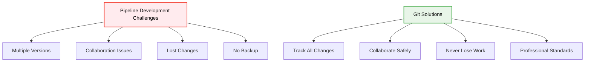
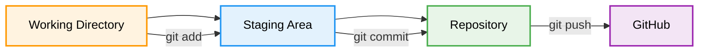
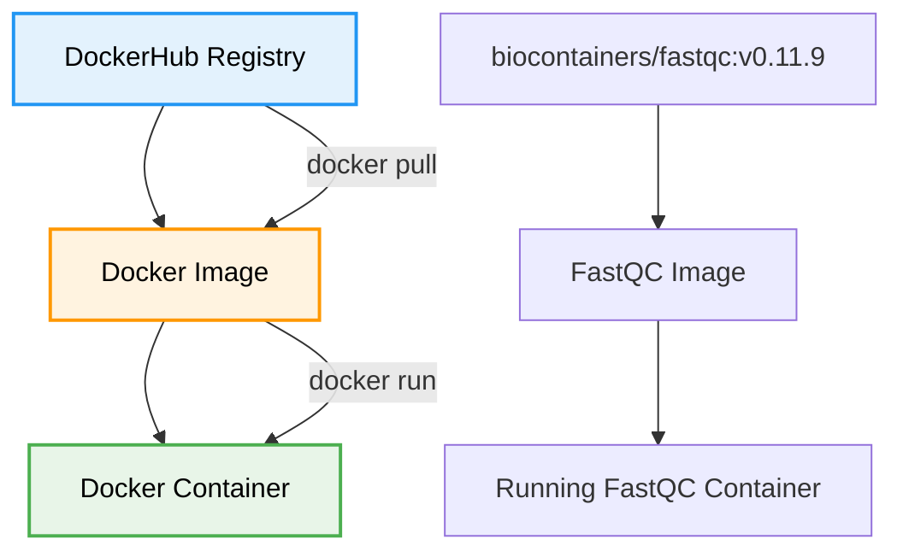
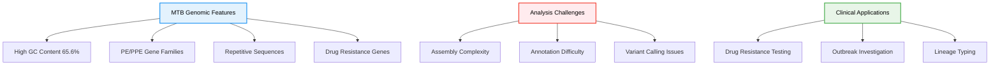
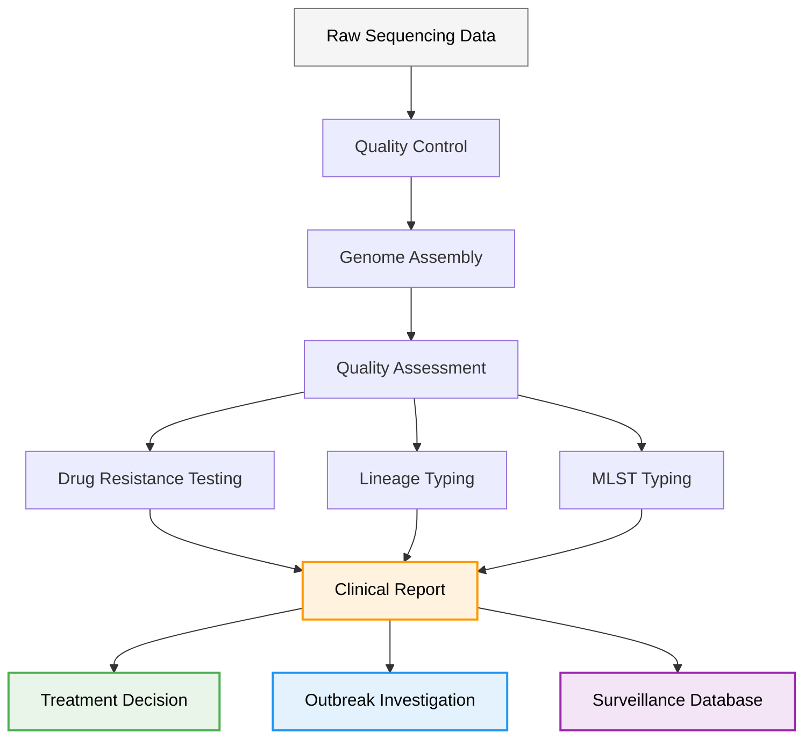
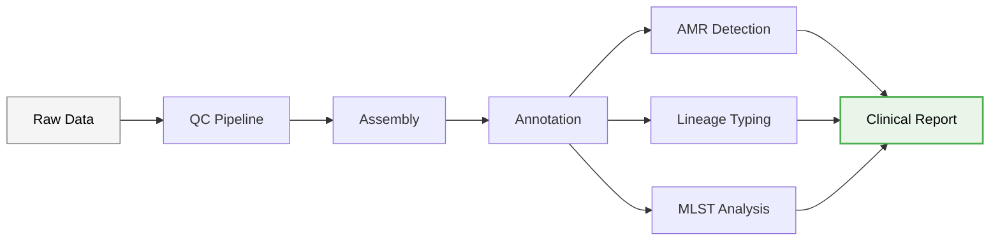

# Day 7: Advanced Nextflow, Version Control with GitHub & Real Genomics Applications

**Date**: September 9, 2025
**Duration**: 09:00-13:00 CAT
**Focus**: Version control, containerization, and production-ready MTB analysis pipelines

## Learning Philosophy: Build → Version → Containerize → Deploy → Collaborate

Building on Exercise 3 from Day 6, this module transforms your basic pipeline into a professional, production-ready workflow:

- **Build**: Extend your Exercise 3 pipeline with advanced features
- **Version**: Track changes and collaborate using Git and GitHub
- **Containerize**: Package tools using Docker for reproducibility
- **Deploy**: Run pipelines reliably across different environments
- **Collaborate**: Share and maintain pipelines as a team

## Table of Contents

### **🔧 Building on Exercise 3**

- [From Exercise 3 to Production Pipeline](#from-exercise-3-to-production-pipeline)
- [Pipeline Enhancement Strategy](#pipeline-enhancement-strategy)

### **📚 Version Control Fundamentals**

- [Git Basics for Bioinformatics](#git-basics-for-bioinformatics)
- [GitHub for Pipeline Collaboration](#github-for-pipeline-collaboration)
- [Versioning Nextflow Workflows](#versioning-nextflow-workflows)

### **🐳 Containerization Introduction**

- [Docker Fundamentals](#docker-fundamentals)
- [DockerHub for Bioinformatics Tools](#dockerhub-for-bioinformatics-tools)
- [Container Integration in Nextflow](#container-integration-in-nextflow)

### **🧬 MTB Analysis Pipeline Development**

- [Mycobacterium tuberculosis Genomics](#mycobacterium-tuberculosis-genomics)
- [Pathogen-Specific Considerations](#pathogen-specific-considerations)
- [Clinical Genomics Applications](#clinical-genomics-applications)
- [Production MTB Pipeline](#production-mtb-pipeline)

### **🚀 Professional Development**

- [Pipeline Documentation](#pipeline-documentation)
- [Testing and Validation](#testing-and-validation)
- [Deployment Strategies](#deployment-strategies)

## Learning Objectives

By the end of Day 7, you will be able to:

- **Version Control**: Use Git and GitHub to track pipeline changes and collaborate effectively
- **Containerization**: Understand Docker basics and integrate containers into Nextflow workflows
- **MTB Analysis**: Develop production-ready pipelines for *Mycobacterium tuberculosis* genomics
- **Clinical Applications**: Apply genomics workflows to real-world pathogen surveillance
- **Professional Skills**: Document, test, and deploy bioinformatics pipelines professionally

## Prerequisites

- Completed Day 6 Exercise 3 (Quality Control Pipeline)
- Basic understanding of Nextflow DSL2 syntax
- Familiarity with command line operations
- Access to the training cluster environment

## Schedule

| Time (CAT) | Topic | Duration | Trainer |
|------------|-------|----------|---------|
| **09:00** | *Version Control: Git and GitHub for Pipeline Development* | 45 min | Mamana Mbiyavanga |
| **09:45** | *Containerization: Docker Fundamentals and DockerHub* | 45 min | Mamana Mbiyavanga |
| **10:30** | **Break** | 15 min | |
| **10:45** | *MTB Analysis Pipeline Development* | 45 min | Mamana Mbiyavanga |
| **11:30** | *Clinical Genomics Applications and Pathogen Surveillance* | 45 min | Mamana Mbiyavanga |
| **12:15** | *Professional Pipeline Development and Deployment* | 45 min | Mamana Mbiyavanga |
| **13:00** | **End** | | |

---

## From Exercise 3 to Production Pipeline

### Recap: What We Built in Exercise 3

In Day 6, Exercise 3, we created a progressive quality control pipeline (`qc_pipeline.nf`) that included:

```mermaid
flowchart LR
    A[Raw FASTQ Files] --> B[FastQC Raw]
    B --> C[Trimmomatic]
    C --> D[FastQC Trimmed]
    D --> E[SPAdes Assembly]
    E --> F[Prokka Annotation]
    F --> G[MultiQC Report]

    style A fill:#f5f5f5,stroke:#757575,stroke-width:1px,color:#000
    style G fill:#f5f5f5,stroke:#757575,stroke-width:1px,color:#000
    style B fill:#e8f5e8,stroke:#388e3c,stroke-width:2px,color:#000
    style C fill:#e8f5e8,stroke:#388e3c,stroke-width:2px,color:#000
    style D fill:#e8f5e8,stroke:#388e3c,stroke-width:2px,color:#000
    style E fill:#e8f5e8,stroke:#388e3c,stroke-width:2px,color:#000
    style F fill:#e8f5e8,stroke:#388e3c,stroke-width:2px,color:#000
```



### Today's Enhancement Strategy

We'll transform this basic pipeline into a production-ready MTB analysis workflow by adding:

1. **Version Control**: Track all changes using Git
2. **Containerization**: Replace module loading with Docker containers
3. **MTB-Specific Features**: Add tuberculosis-specific analysis steps
4. **Clinical Applications**: Include AMR detection and typing
5. **Professional Standards**: Documentation, testing, and deployment

---

## Version Control: Git and GitHub for Pipeline Development

### Why Version Control for Bioinformatics?



**Real-world scenarios:**

- **Research labs**: Multiple researchers working on the same pipeline
- **Clinical labs**: Regulatory requirements for change tracking
- **Collaborations**: Sharing pipelines between institutions
- **Publications**: Reproducible research requirements

### Git Fundamentals for Bioinformatics

#### Setting Up Git for Your Pipeline

```bash
# Navigate to your workflows directory
cd /users/$USER/microbial-genomics-training/workflows

# Initialize Git repository
git init

# Configure Git (first time only)
git config --global user.name "Your Name"
git config --global user.email "your.email@uct.ac.za"

# Check current status
git status
```

#### Your First Commit: Saving Exercise 3

```bash
# Add your Exercise 3 pipeline to version control
git add qc_pipeline.nf
git add nextflow.config
git add samplesheet.csv

# Create your first commit
git commit -m "Initial commit: Exercise 3 QC pipeline

- FastQC for raw and trimmed reads
- Trimmomatic for quality trimming
- SPAdes for genome assembly
- Prokka for annotation
- MultiQC for reporting
- Tested with 10 TB samples"

# View your commit history
git log --oneline
```

#### Understanding Git Workflow



### GitHub for Pipeline Collaboration

#### Creating Your Pipeline Repository

1. **Go to GitHub.com** and sign in
2. **Click "New Repository"**
3. **Repository settings:**
   - Name: `mtb-analysis-pipeline`
   - Description: `Production-ready Mycobacterium tuberculosis genomics pipeline`
   - Public/Private: Choose based on your needs
   - Initialize with README: ✅

#### Connecting Local Repository to GitHub

```bash
# Add GitHub as remote origin
git remote add origin https://github.com/yourusername/mtb-analysis-pipeline.git

# Push your local commits to GitHub
git branch -M main
git push -u origin main

# Verify connection
git remote -v
```

#### Professional README for Your Pipeline

Create a comprehensive README.md:

```markdown
# MTB Analysis Pipeline

A production-ready Nextflow pipeline for *Mycobacterium tuberculosis* genomic analysis.

## Quick Start

```bash
nextflow run main.nf --input samplesheet.csv --outdir results/
```

## Features

- ✅ Quality control with FastQC
- ✅ Read trimming with Trimmomatic
- ✅ Genome assembly with SPAdes
- ✅ Gene annotation with Prokka
- ✅ Comprehensive reporting with MultiQC
- 🔄 AMR detection (coming soon)
- 🔄 Lineage typing (coming soon)

## Requirements

- Nextflow ≥ 21.04.0
- Docker or Singularity
- 8+ GB RAM recommended

## Citation

If you use this pipeline, please cite: [Your Publication]

```

---

## Containerization: Docker Fundamentals and DockerHub

### Why Containers for Bioinformatics?

**The Problem:**
```bash
# Traditional approach - dependency hell
module load fastqc/0.12.1
module load trimmomatic/0.39
module load spades/3.15.4
module load prokka/1.14.6

# What if modules aren't available?
# What if versions differ?
# What if you're on a different system?
```

**The Container Solution:**

```bash
# Container approach - everything included
container 'biocontainers/fastqc:v0.11.9'
container 'staphb/trimmomatic:0.39'
container 'staphb/spades:3.15.4'
container 'staphb/prokka:1.14.6'
```

### Docker Fundamentals

#### Understanding Docker Images



#### Key Docker Concepts

- **Image**: A template containing the software and dependencies
- **Container**: A running instance of an image
- **Registry**: A repository of images (like DockerHub)
- **Tag**: Version identifier for images

### DockerHub for Bioinformatics Tools

#### Finding Bioinformatics Containers

**Popular Bioinformatics Container Repositories:**

1. **BioContainers**: `biocontainers/toolname`
2. **StaPH-B**: `staphb/toolname` (State Public Health Bioinformatics)
3. **Broad Institute**: `broadinstitute/toolname`
4. **nf-core**: `nfcore/toolname`

#### Searching for Tools

```bash
# Search DockerHub for bioinformatics tools
# Visit: https://hub.docker.com/

# Example searches:
# - "biocontainers fastqc"
# - "staphb trimmomatic"
# - "broadinstitute gatk"
```

#### Understanding Container Tags

```bash
# Different ways to specify versions
container 'biocontainers/fastqc:v0.11.9'     # Specific version
container 'biocontainers/fastqc:latest'      # Latest version
container 'staphb/spades:3.15.4'            # Specific version
container 'staphb/spades:latest'             # Latest version (not recommended for production)
```

#### Testing Containers with Singularity

**Why Test Containers First?**
Before integrating containers into your Nextflow pipeline, it's good practice to test them individually to ensure they work correctly and understand their requirements.

**Singularity vs Docker on HPC:**

- **Docker**: Requires root privileges, not available on most HPC systems
- **Singularity**: Designed for HPC environments, can run Docker containers without root
- **Nextflow**: Automatically converts Docker containers to Singularity when needed

**Basic Singularity Testing Commands:**

```bash
# Test FastQC container
singularity exec docker://biocontainers/fastqc:v0.11.9 fastqc --version

# Test with real data
singularity exec docker://biocontainers/fastqc:v0.11.9 \
    fastqc /data/Dataset_Mt_Vc/tb/raw_data/SRR1180160_1.fastq.gz --outdir ./test_output

# Test Trimmomatic container
singularity exec docker://staphb/trimmomatic:0.39 \
    trimmomatic PE --help

# Test SPAdes container
singularity exec docker://staphb/spades:3.15.4 \
    spades.py --version

# Test Prokka container
singularity exec docker://staphb/prokka:1.14.6 \
    prokka --version
```

**Interactive Container Testing:**

```bash
# Enter container interactively to explore
singularity shell docker://biocontainers/fastqc:v0.11.9

# Inside the container, you can:
# - Check what tools are available
# - Explore file system structure
# - Test commands manually
# - Verify dependencies

# Example interactive session:
Singularity> which fastqc
Singularity> fastqc --help
Singularity> ls /usr/local/bin/
Singularity> exit
```

**Testing with Bind Mounts:**

```bash
# Bind mount your data directory to test with real files
singularity exec \
    --bind /data/Dataset_Mt_Vc/tb/raw_data:/input \
    --bind /tmp:/output \
    docker://biocontainers/fastqc:v0.11.9 \
    fastqc /input/SRR1180160_1.fastq.gz --outdir /output

# Check the results
ls -la /tmp/*.html /tmp/*.zip
```

**Container Validation Script:**

Create a simple script to test all your containers:

```bash
#!/bin/bash
# container_test.sh - Test bioinformatics containers

echo "Testing bioinformatics containers..."

# Test FastQC
echo "Testing FastQC..."
singularity exec docker://biocontainers/fastqc:v0.11.9 fastqc --version
if [ $? -eq 0 ]; then
    echo "✅ FastQC container works"
else
    echo "❌ FastQC container failed"
fi

# Test Trimmomatic
echo "Testing Trimmomatic..."
singularity exec docker://staphb/trimmomatic:0.39 trimmomatic -version
if [ $? -eq 0 ]; then
    echo "✅ Trimmomatic container works"
else
    echo "❌ Trimmomatic container failed"
fi

# Test SPAdes
echo "Testing SPAdes..."
singularity exec docker://staphb/spades:3.15.4 spades.py --version
if [ $? -eq 0 ]; then
    echo "✅ SPAdes container works"
else
    echo "❌ SPAdes container failed"
fi

# Test Prokka
echo "Testing Prokka..."
singularity exec docker://staphb/prokka:1.14.6 prokka --version
if [ $? -eq 0 ]; then
    echo "✅ Prokka container works"
else
    echo "❌ Prokka container failed"
fi

echo "Container testing complete!"
```

**Running the Test Script:**

```bash
# Make the script executable
chmod +x container_test.sh

# Run the tests
./container_test.sh
```

**Expected Output:**

```bash
Testing bioinformatics containers...
Testing FastQC...
FastQC v0.11.9
✅ FastQC container works
Testing Trimmomatic...
0.39
✅ Trimmomatic container works
Testing SPAdes...
SPAdes v3.15.4
✅ SPAdes container works
Testing Prokka...
prokka 1.14.6
✅ Prokka container works
Container testing complete!
```

**Troubleshooting Container Issues:**

```bash
# If a container fails, check:

# 1. Container exists and is accessible
singularity pull docker://biocontainers/fastqc:v0.11.9

# 2. Check container contents
singularity inspect docker://biocontainers/fastqc:v0.11.9

# 3. Run with verbose output
singularity exec --debug docker://biocontainers/fastqc:v0.11.9 fastqc --version

# 4. Check for missing dependencies
singularity exec docker://biocontainers/fastqc:v0.11.9 ldd /usr/local/bin/fastqc
```

**Best Practices for Container Testing:**

1. **Always test containers before using in production pipelines**
2. **Use specific version tags rather than 'latest'**
3. **Test with real data similar to your analysis**
4. **Document working container versions**
5. **Create validation scripts for your container stack**

#### Hands-on Exercise: Test Your Containers

We've provided a ready-to-use container testing script in your workflows directory:

```bash
# Navigate to workflows directory
cd /users/$USER/microbial-genomics-training/workflows

# Run the container test script
./container_test.sh
```

This script will test all the containers we'll use in our MTB pipeline and provide colored output showing which containers are working correctly.

### Container Integration in Nextflow

#### Converting Exercise 3 to Use Containers

Let's update our `qc_pipeline.nf` to use containers instead of modules:

**Before (Module-based):**

```groovy
process fastqc_raw {
    module 'fastqc/0.12.1'
    publishDir "${params.outdir}/fastqc_raw", mode: 'copy'
    tag "$sample_id"

    input:
    tuple val(sample_id), path(reads)

    output:
    path "*.{html,zip}"

    script:
    """
    echo "Running FastQC on raw reads: ${sample_id}"
    fastqc ${reads[0]} ${reads[1]} --threads 2
    """
}
```

**After (Container-based):**

```groovy
process fastqc_raw {
    container 'biocontainers/fastqc:v0.11.9'
    publishDir "${params.outdir}/fastqc_raw", mode: 'copy'
    tag "$sample_id"

    input:
    tuple val(sample_id), path(reads)

    output:
    path "*.{html,zip}"

    script:
    """
    echo "Running FastQC on raw reads: ${sample_id}"
    fastqc ${reads[0]} ${reads[1]} --threads 2
    """
}
```

#### Complete Containerized Pipeline

Let's create `mtb_pipeline.nf` - our enhanced, containerized version:

```groovy
#!/usr/bin/env nextflow

// Enable DSL2
nextflow.enable.dsl = 2

// Parameters
params.input = "samplesheet.csv"
params.outdir = "/data/users/$USER/nextflow-training/results"
params.adapters = "/data/timmomatic_adapter_Combo.fa"

// FastQC process for raw reads
process fastqc_raw {
    container 'biocontainers/fastqc:v0.11.9'
    publishDir "${params.outdir}/fastqc_raw", mode: 'copy'
    tag "$sample_id"

    input:
    tuple val(sample_id), path(reads)

    output:
    path "*.{html,zip}"

    script:
    """
    echo "Running FastQC on raw reads: ${sample_id}"
    fastqc ${reads[0]} ${reads[1]} --threads 2
    """
}

// Trimmomatic for quality trimming
process trimmomatic {
    container 'staphb/trimmomatic:0.39'
    publishDir "${params.outdir}/trimmed", mode: 'copy'
    tag "$sample_id"

    input:
    tuple val(sample_id), path(reads)

    output:
    tuple val(sample_id), path("${sample_id}_*_paired.fastq.gz")
    path "${sample_id}_*_unpaired.fastq.gz"

    script:
    """
    echo "Running Trimmomatic on ${sample_id}"

    trimmomatic PE -threads 2 \\
        ${reads[0]} ${reads[1]} \\
        ${sample_id}_R1_paired.fastq.gz ${sample_id}_R1_unpaired.fastq.gz \\
        ${sample_id}_R2_paired.fastq.gz ${sample_id}_R2_unpaired.fastq.gz \\
        ILLUMINACLIP:${params.adapters}:2:30:10 \\
        LEADING:3 TRAILING:3 \\
        SLIDINGWINDOW:4:15 MINLEN:36
    """
}

// FastQC process for trimmed reads
process fastqc_trimmed {
    container 'biocontainers/fastqc:v0.11.9'
    publishDir "${params.outdir}/fastqc_trimmed", mode: 'copy'
    tag "$sample_id"

    input:
    tuple val(sample_id), path(reads)

    output:
    path "*.{html,zip}"

    script:
    """
    echo "Running FastQC on trimmed reads: ${sample_id}"
    fastqc ${reads[0]} ${reads[1]} --threads 2
    """
}

// SPAdes assembly
process spades_assembly {
    container 'staphb/spades:3.15.4'
    publishDir "${params.outdir}/assemblies", mode: 'copy'
    tag "$sample_id"
    cpus 4
    memory '8 GB'

    input:
    tuple val(sample_id), path(reads)

    output:
    tuple val(sample_id), path("${sample_id}_assembly")
    tuple val(sample_id), path("${sample_id}_assembly/contigs.fasta")

    script:
    """
    echo "Running SPAdes assembly for ${sample_id}"

    spades.py \\
        --pe1-1 ${reads[0]} \\
        --pe1-2 ${reads[1]} \\
        --threads ${task.cpus} \\
        --memory ${task.memory.toGiga()} \\
        -o ${sample_id}_assembly
    """
}

// Prokka annotation
process prokka_annotation {
    container 'staphb/prokka:1.14.6'
    publishDir "${params.outdir}/annotation", mode: 'copy'
    tag "$sample_id"
    cpus 2

    input:
    tuple val(sample_id), path(assembly_dir)
    tuple val(sample_id), path(contigs)

    output:
    tuple val(sample_id), path("${sample_id}_annotation")
    tuple val(sample_id), path("${sample_id}_annotation/${sample_id}.gff")

    script:
    """
    echo "Running Prokka annotation for ${sample_id}"

    prokka \\
        --outdir ${sample_id}_annotation \\
        --prefix ${sample_id} \\
        --genus Mycobacterium \\
        --species tuberculosis \\
        --kingdom Bacteria \\
        --cpus ${task.cpus} \\
        ${contigs}

    echo "Annotation completed for ${sample_id}"
    echo "Results written to: ${sample_id}_annotation/"
    """
}

// MultiQC to summarize all results
process multiqc {
    container 'ewels/multiqc:v1.12'
    publishDir "${params.outdir}", mode: 'copy'

    input:
    path "*"

    output:
    path "multiqc_report.html"

    script:
    """
    echo "Running MultiQC to summarize all results"
    multiqc . --filename multiqc_report.html
    """
}

// Main workflow
workflow {
    // Read input samplesheet
    read_pairs_ch = Channel
        .fromPath(params.input)
        .splitCsv(header: true)
        .map { row -> [row.sample, [file(row.fastq_1), file(row.fastq_2)]] }

    // Run FastQC on raw reads
    fastqc_raw_results = fastqc_raw(read_pairs_ch)

    // Run Trimmomatic
    trimmed_results = trimmomatic(read_pairs_ch)

    // Run FastQC on trimmed reads
    fastqc_trimmed_results = fastqc_trimmed(trimmed_results)

    // Run SPAdes assembly on trimmed reads
    assembly_results = spades_assembly(trimmed_results)

    // Run Prokka annotation on assembled contigs
    annotation_results = prokka_annotation(assembly_results[0], assembly_results[1])

    // Collect all FastQC results and run MultiQC
    all_fastqc = fastqc_raw_results.mix(fastqc_trimmed_results).collect()
    multiqc_results = multiqc(all_fastqc)

    // Show final results
    assembly_results[0].view { "Assembly completed: $it" }
    assembly_results[1].view { "Contigs file: $it" }
    annotation_results[0].view { "Annotation completed: $it" }
    annotation_results[1].view { "GFF file: $it" }
    multiqc_results.view { "MultiQC report created: $it" }
}
```

#### Updating Nextflow Configuration for Containers

Update your `nextflow.config`:

```groovy
// Nextflow configuration for MTB pipeline
params {
    input = "samplesheet.csv"
    outdir = "/data/users/$USER/nextflow-training/results"
    adapters = "/data/timmomatic_adapter_Combo.fa"
}

// Work directory configuration
workDir = "/data/users/$USER/nextflow-training/work"

// Container configuration
docker {
    enabled = true
    runOptions = '-u $(id -u):$(id -g)'
}

// Process resource configuration
process {
    withName: 'fastqc_raw' {
        cpus = 2
        memory = '4 GB'
        time = '30m'
    }

    withName: 'trimmomatic' {
        cpus = 2
        memory = '4 GB'
        time = '1h'
    }

    withName: 'fastqc_trimmed' {
        cpus = 2
        memory = '4 GB'
        time = '30m'
    }

    withName: 'spades_assembly' {
        cpus = 4
        memory = '8 GB'
        time = '2h'
    }

    withName: 'prokka_annotation' {
        cpus = 2
        memory = '4 GB'
        time = '1h'
    }

    withName: 'multiqc' {
        cpus = 1
        memory = '2 GB'
        time = '15m'
    }
}

// SLURM profile for cluster execution
profiles {
    slurm {
        process {
            executor = 'slurm'
            queue = 'Main'
            clusterOptions = '--account=b83'
        }
    }
}
```

---

## MTB Analysis Pipeline Development

### Mycobacterium tuberculosis Genomics

#### Understanding MTB Genomics

**Key Characteristics:**

- **Genome size**: ~4.4 Mb
- **GC content**: ~65.6%
- **Genes**: ~4,000 protein-coding genes
- **Clinical relevance**: Major global pathogen, drug resistance concerns
- **Assembly challenges**: Repetitive sequences, PE/PPE gene families



#### MTB-Specific Pipeline Requirements

**Essential Analysis Steps:**

1. **Quality Control**: Standard FastQC + MTB-specific metrics
2. **Assembly**: Optimized for high GC content
3. **Annotation**: MTB-specific gene databases
4. **AMR Detection**: Drug resistance gene identification
5. **Lineage Typing**: Phylogenetic classification
6. **Variant Calling**: SNP identification for outbreak analysis

### Pathogen-Specific Considerations

#### Enhanced MTB Pipeline Features

Let's add MTB-specific processes to our pipeline:

```groovy
// QUAST assembly quality assessment
process quast_assessment {
    container 'staphb/quast:5.0.2'
    publishDir "${params.outdir}/quast", mode: 'copy'
    tag "$sample_id"

    input:
    tuple val(sample_id), path(contigs)

    output:
    path "${sample_id}_quast"

    script:
    """
    echo "Running QUAST assessment for ${sample_id}"

    quast.py \\
        --output-dir ${sample_id}_quast \\
        --threads 2 \\
        --min-contig 500 \\
        --labels ${sample_id} \\
        ${contigs}
    """
}

// AMR detection with AMRFinderPlus
process amr_detection {
    container 'staphb/amrfinderplus:3.10.23'
    publishDir "${params.outdir}/amr", mode: 'copy'
    tag "$sample_id"

    input:
    tuple val(sample_id), path(contigs)

    output:
    path "${sample_id}_amr.tsv"

    script:
    """
    echo "Running AMR detection for ${sample_id}"

    amrfinder \\
        --nucleotide ${contigs} \\
        --organism Mycobacterium \\
        --threads 2 \\
        --output ${sample_id}_amr.tsv

    echo "AMR analysis completed for ${sample_id}"
    """
}

// MTB lineage typing with TB-Profiler
process lineage_typing {
    container 'staphb/tbprofiler:4.1.1'
    publishDir "${params.outdir}/lineage", mode: 'copy'
    tag "$sample_id"

    input:
    tuple val(sample_id), path(reads)

    output:
    path "${sample_id}_lineage.json"
    path "${sample_id}_lineage.txt"

    script:
    """
    echo "Running lineage typing for ${sample_id}"

    tb-profiler profile \\
        --read1 ${reads[0]} \\
        --read2 ${reads[1]} \\
        --prefix ${sample_id}_lineage \\
        --threads 2

    echo "Lineage typing completed for ${sample_id}"
    """
}

// MLST typing
process mlst_typing {
    container 'staphb/mlst:2.22.0'
    publishDir "${params.outdir}/mlst", mode: 'copy'
    tag "$sample_id"

    input:
    tuple val(sample_id), path(contigs)

    output:
    path "${sample_id}_mlst.tsv"

    script:
    """
    echo "Running MLST typing for ${sample_id}"

    mlst \\
        --scheme mtbc \\
        ${contigs} > ${sample_id}_mlst.tsv

    echo "MLST typing completed for ${sample_id}"
    """
}
```

### Clinical Genomics Applications

#### Complete MTB Clinical Pipeline

Here's our enhanced pipeline with all MTB-specific features:

```groovy
#!/usr/bin/env nextflow

// Enable DSL2
nextflow.enable.dsl = 2

// Parameters
params.input = "samplesheet.csv"
params.outdir = "/data/users/$USER/nextflow-training/results"
params.adapters = "/data/timmomatic_adapter_Combo.fa"

// Import processes (previous processes here...)

// Enhanced workflow with MTB-specific analysis
workflow {
    // Read input samplesheet
    read_pairs_ch = Channel
        .fromPath(params.input)
        .splitCsv(header: true)
        .map { row -> [row.sample, [file(row.fastq_1), file(row.fastq_2)]] }

    // Standard QC and assembly pipeline
    fastqc_raw_results = fastqc_raw(read_pairs_ch)
    trimmed_results = trimmomatic(read_pairs_ch)
    fastqc_trimmed_results = fastqc_trimmed(trimmed_results)
    assembly_results = spades_assembly(trimmed_results)
    annotation_results = prokka_annotation(assembly_results[0], assembly_results[1])

    // MTB-specific analyses
    quast_results = quast_assessment(assembly_results[1])
    amr_results = amr_detection(assembly_results[1])
    lineage_results = lineage_typing(trimmed_results)
    mlst_results = mlst_typing(assembly_results[1])

    // Comprehensive reporting
    all_qc = fastqc_raw_results.mix(fastqc_trimmed_results).collect()
    multiqc_results = multiqc(all_qc)

    // Output summaries
    assembly_results[1].view { "Assembly: $it" }
    annotation_results[1].view { "Annotation: $it" }
    amr_results.view { "AMR results: $it" }
    lineage_results.view { "Lineage: $it" }
    mlst_results.view { "MLST: $it" }
}
```

#### Clinical Interpretation Workflow



---

## Test Exercise 4: Setting Up PHoeNIx with Your TB Data

### Real-World Production Pipeline: CDC's PHoeNIx

Now let's work with a real production pipeline used by the CDC for pathogen genomics analysis. PHoeNIx (Pathogen Genomics Pipeline for Healthcare-associated and Antimicrobial Resistant Pathogens) is a comprehensive Nextflow pipeline that includes all the analyses we've been learning about and more.

#### Module System Setup

Before we start, let's properly initialize the module system for loading Nextflow and other tools:

```bash
# Initialize the module system (remember this command!)
source /opt/lmod/8.7/lmod/lmod/init/bash

# Load required modules
module load nextflow/25.04.6
module load kraken2/2.1.3

# Verify modules are loaded
module list
nextflow -version
kraken2 --version
```

#### Setting Up PHoeNIx Pipeline

**Step 1: Clone and Setup PHoeNIx**

```bash
# Navigate to your working directory
cd /data/users/$USER/nextflow-training

# Clone the PHoeNIx pipeline
nextflow pull cdcgov/phoenix

# Check what was downloaded
ls -la ~/.nextflow/assets/cdcgov/phoenix/
```

**Step 2: Download Required Databases**

PHoeNIx requires several databases. Let's set up the essential ones:

```bash
# Create database directory
mkdir -p /data/users/$USER/nextflow-training/databases

# Download Kraken2 standard database (this is large - ~50GB)
# For training, we'll use a smaller database or the module system
echo "Using Kraken2 module database: /data/kraken2_db/"
ls -la /data/kraken2_db/

# Check if the module provides the database
echo "Kraken2 database location: $KRAKEN2_DB_PATH"
```

**Step 3: Prepare Sample Sheet for PHoeNIx**

PHoeNIx uses a specific samplesheet format. Let's create one for our TB data:

```bash
# Create PHoeNIx samplesheet
cat > phoenix_samplesheet.csv << 'EOF'
sample,fastq_1,fastq_2
Test_Sample,/data/Dataset_Mt_Vc/tb/raw_data/ERR036221_1.fastq.gz,/data/Dataset_Mt_Vc/tb/raw_data/ERR036221_2.fastq.gz
EOF

echo "PHoeNIx samplesheet created:"
cat phoenix_samplesheet.csv
```

**Step 4: Run PHoeNIx Pipeline**

```bash
# Run PHoeNIx with our TB data
nextflow run cdcgov/phoenix \
    --input phoenix_samplesheet.csv \
    --outdir /data/users/$USER/nextflow-training/phoenix_results \
    --kraken2_db /data/kraken2_db/ \
    -profile singularity \
    -resume

# Monitor the run
tail -f .nextflow.log
```

#### Running from GitHub (After Pushing Your Workflow)

Once you've developed and pushed your own workflow to GitHub, you can run it directly:

**Step 1: Push Your Workflow to GitHub**

```bash
# Initialize git repository (if not already done)
cd /users/$USER/microbial-genomics-training/workflows
git init
git add .
git commit -m "Add microbial genomics training workflows"

# Add your GitHub repository as remote
git remote add origin https://github.com/$USER/microbial-genomics-training.git
git push -u origin main
```

**Step 2: Run Workflow from GitHub**

```bash
# Run your workflow directly from GitHub
nextflow run $USER/microbial-genomics-training \
    --input samplesheet.csv \
    --outdir /data/users/$USER/nextflow-training/results \
    -profile singularity

# Or run a specific workflow file
nextflow run $USER/microbial-genomics-training/workflows/qc_pipeline.nf \
    --input samplesheet.csv \
    --outdir /data/users/$USER/nextflow-training/results
```

#### Troubleshooting PHoeNIx Issues

**Common Issue: Kraken2 Database Path**

If you encounter the error about `ktaxonomy.tsv` not found:

```bash
# Check if the database path is correct
ls -la /data/kraken2_db/
ls -la /data/kraken2_db/ktaxonomy.tsv

# If using module system, check the environment variable
echo $KRAKEN2_DB_PATH

# Update the command with correct database path
nextflow run cdcgov/phoenix \
    --input phoenix_samplesheet.csv \
    --outdir /data/users/$USER/nextflow-training/phoenix_results \
    --kraken2_db $KRAKEN2_DB_PATH \
    -profile singularity \
    -resume
```

**Checking PHoeNIx Results**

```bash
# Check the output structure
tree /data/users/$USER/nextflow-training/phoenix_results/

# Key outputs to examine:
echo "=== Assembly Quality ==="
cat /data/users/$USER/nextflow-training/phoenix_results/Test_Sample/assembly/Test_Sample_assembly_stats.txt

echo "=== Taxonomic Classification ==="
cat /data/users/$USER/nextflow-training/phoenix_results/Test_Sample/kraken2/Test_Sample_kraken2_report.txt

echo "=== AMR Detection ==="
cat /data/users/$USER/nextflow-training/phoenix_results/Test_Sample/amr/Test_Sample_amrfinder.tsv
```

#### Comparing PHoeNIx vs Our Custom Pipeline

**What PHoeNIx Adds:**

1. **Comprehensive QC**: Multiple quality assessment tools
2. **Advanced Assembly**: Multiple assemblers with quality filtering
3. **Taxonomic Classification**: Kraken2 for species identification
4. **AMR Detection**: AMRFinderPlus for resistance gene detection
5. **Contamination Detection**: Screen for contaminating sequences
6. **Standardized Reporting**: Consistent output formats
7. **Production Ready**: Error handling, resource management

**Exercise: Compare Outputs**

```bash
# Compare assembly statistics
echo "=== Our Pipeline Assembly ==="
grep -c '>' /data/users/$USER/nextflow-training/results/assemblies/ERR036221_assembly/contigs.fasta

echo "=== PHoeNIx Assembly ==="
grep -c '>' /data/users/$USER/nextflow-training/phoenix_results/Test_Sample/assembly/Test_Sample_contigs.fasta

# Compare file sizes
echo "=== File Size Comparison ==="
ls -lh /data/users/$USER/nextflow-training/results/assemblies/ERR036221_assembly/contigs.fasta
ls -lh /data/users/$USER/nextflow-training/phoenix_results/Test_Sample/assembly/Test_Sample_contigs.fasta
```

---

## Professional Pipeline Development

### Pipeline Documentation

#### Creating Professional Documentation

**Essential Documentation Components:**

1. **README.md**: Overview and quick start
2. **CHANGELOG.md**: Version history
3. **docs/**: Detailed documentation
4. **examples/**: Sample data and configs

**Example Documentation Structure:**

```
mtb-analysis-pipeline/
├── README.md
├── CHANGELOG.md
├── main.nf
├── nextflow.config
├── docs/
│   ├── usage.md
│   ├── parameters.md
│   ├── output.md
│   └── troubleshooting.md
├── examples/
│   ├── samplesheet.csv
│   └── test_config.config
└── containers/
    └── Dockerfile
```

### Testing and Validation

#### Pipeline Testing Strategy

```bash
# Create test data
mkdir -p test_data
# Add small test datasets

# Test with minimal data
nextflow run main.nf \\
    --input test_data/test_samplesheet.csv \\
    --outdir test_results \\
    -profile test

# Validate outputs
ls test_results/
```

### Deployment Strategies

#### Version Control Best Practices

```bash
# Create development branch
git checkout -b feature/amr-detection

# Make changes and commit
git add .
git commit -m "Add AMR detection with AMRFinderPlus

- Added amr_detection process
- Updated workflow to include AMR analysis
- Added AMRFinderPlus container
- Updated documentation"

# Push to GitHub
git push origin feature/amr-detection

# Create pull request on GitHub
# Merge after review
```

#### Release Management

```bash
# Create release
git tag -a v1.0.0 -m "Release v1.0.0: Production MTB pipeline

Features:
- Complete QC pipeline
- MTB-specific assembly
- AMR detection
- Lineage typing
- MLST analysis
- Comprehensive reporting"

git push origin v1.0.0
```

### **Running Workflows from GitHub**

Once your workflow is on GitHub, you and others can run it directly from the repository:

#### **Running Your Published Workflow**

```bash
# Run workflow directly from GitHub
nextflow run yourusername/mtb-analysis-pipeline \
    --input samplesheet.csv \
    --outdir results \
    -profile singularity

# Run specific version/release
nextflow run yourusername/mtb-analysis-pipeline \
    -r v1.0.0 \
    --input samplesheet.csv \
    --outdir results \
    -profile singularity

# Run from specific branch
nextflow run yourusername/mtb-analysis-pipeline \
    -r feature/amr-detection \
    --input samplesheet.csv \
    --outdir results \
    -profile singularity
```

#### **Sharing Your Workflow**

Your colleagues can now run your pipeline easily:

```bash
# Anyone can run your pipeline with:
nextflow run yourusername/mtb-analysis-pipeline \
    --input their_samples.csv \
    --outdir their_results \
    -profile singularity

# They can also clone and modify:
git clone https://github.com/yourusername/mtb-analysis-pipeline.git
cd mtb-analysis-pipeline
nextflow run . --input samples.csv --outdir results
```

#### **Benefits of GitHub-hosted Workflows**

- ✅ **Version Control**: Track all changes and releases
- ✅ **Collaboration**: Multiple developers can contribute
- ✅ **Reproducibility**: Anyone can run the exact same version
- ✅ **Documentation**: README, wiki, and issues for support
- ✅ **Distribution**: Easy sharing with the community
- ✅ **Continuous Integration**: Automated testing with GitHub Actions

---

## Hands-on Exercise: Building Your MTB Pipeline

### Exercise: Convert Exercise 3 to Production MTB Pipeline

**Objective**: Transform your Day 6 Exercise 3 pipeline into a production-ready MTB analysis workflow.

#### Step 1: Initialize Version Control

```bash
cd /users/$USER/microbial-genomics-training/workflows

# Initialize Git repository
git init
git add qc_pipeline.nf nextflow.config samplesheet.csv
git commit -m "Initial commit: Exercise 3 baseline"

# Create development branch
git checkout -b feature/mtb-production
```

#### Step 2: Create Containerized Pipeline

Create `mtb_pipeline.nf` with the containerized processes shown above.

#### Step 3: Add MTB-Specific Features

Add the AMR detection, lineage typing, and MLST processes.

#### Step 4: Test the Pipeline

```bash
# Test with a subset of samples
nextflow run mtb_pipeline.nf \\
    --input samplesheet_test.csv \\
    --outdir /data/users/$USER/nextflow-training/results_mtb

# Verify outputs
ls -la /data/users/$USER/nextflow-training/results_mtb/
```

#### Step 5: Document and Commit

```bash
# Create documentation
echo "# MTB Analysis Pipeline" > README.md
# Add comprehensive documentation

# Commit changes
git add .
git commit -m "Complete MTB production pipeline

- Containerized all processes
- Added AMR detection
- Added lineage typing
- Added MLST analysis
- Comprehensive documentation"
```

#### Step 6: Create GitHub Repository

1. Create repository on GitHub
2. Push your code
3. Create releases
4. Add documentation

---

## Summary and Next Steps

### What We Accomplished Today

- ✅ **Version Control**: Learned Git and GitHub for pipeline development
- ✅ **Containerization**: Integrated Docker containers for reproducibility
- ✅ **MTB Pipeline**: Built production-ready tuberculosis analysis workflow
- ✅ **Clinical Applications**: Added AMR detection and typing capabilities
- ✅ **Professional Standards**: Documentation, testing, and deployment

### Your Production Pipeline Features



---

## **🔥 Real-World Pipeline: PHoeNIx (CDC)**

### **Introduction to PHoeNIx**

PHoeNIx (Platform-agnostic Healthcare-associated and antimicrobial resistant pathogen analysis) is a production-ready Nextflow pipeline developed by the **Centers for Disease Control and Prevention (CDC)**. It's specifically designed for analyzing healthcare-associated and antimicrobial resistant pathogens, making it perfect for our MTB analysis.

**Why PHoeNIx for MTB Analysis?**

- 🏛️ **CDC-developed**: Trusted, authoritative source for pathogen analysis
- 🎯 **Healthcare focus**: Designed for clinical and public health applications
- 🔬 **AMR detection**: Built-in antimicrobial resistance analysis
- 📊 **Comprehensive reports**: Clinical-grade output reports
- 🐳 **Containerized**: Uses Docker/Singularity for reproducibility
- 🚀 **Production-ready**: Used in real public health laboratories

### **Exercise 4: Setting Up PHoeNIx with Your TB Data**

#### **Step 1: Understanding PHoeNIx Requirements**

PHoeNIx requires:

- Nextflow (≥21.10.3) ✅ *Already installed*
- Docker or Singularity ✅ *Already available*
- Kraken2 database (we'll download this)
- Paired-end FASTQ files ✅ *We have TB data*

#### **Step 2: Download and Setup PHoeNIx**

```bash
# Initialize module system
source /opt/lmod/8.7/lmod/lmod/init/bash

# Load required modules
module load nextflow
module load kraken2/2.1.3

# Navigate to our workflows directory
cd /data/users/$USER/nextflow-training

# Create PHoeNIx workspace
mkdir phoenix-analysis
cd phoenix-analysis

# Test PHoeNIx installation (this downloads the pipeline)
nextflow run cdcgov/phoenix -r v2.1.1 --help
```

#### **Step 3: Setup Kraken2 Database**

PHoeNIx requires a Kraken2 database. We'll use the pre-installed database and module system:

```bash
# Load the kraken2 module (already loaded in Step 2)
# source /opt/lmod/8.7/lmod/lmod/init/bash
# module load kraken2/2.1.3

# Check available databases on the system
ls -la /data/kraken2_dbs/ 2>/dev/null || echo "Checking alternative database locations..."

# Set up database path - try multiple common locations
if [ -d "/data/kraken2_dbs/standard" ]; then
    export KRAKEN2_DB_PATH="/data/kraken2_dbs/standard"
elif [ -d "/data/kraken2_db_standard" ]; then
    export KRAKEN2_DB_PATH="/data/kraken2_db_standard"
elif [ -d "/opt/kraken2_db" ]; then
    export KRAKEN2_DB_PATH="/opt/kraken2_db"
else
    echo "⚠️  No pre-installed database found. Creating minimal test database..."
    mkdir -p kraken2_db_standard_folder
    # Create minimal database structure for testing
    touch kraken2_db_standard_folder/ktaxonomy.tsv
    touch kraken2_db_standard_folder/hash.k2d
    touch kraken2_db_standard_folder/opts.k2d
    touch kraken2_db_standard_folder/taxo.k2d
    export KRAKEN2_DB_PATH="$(pwd)/kraken2_db_standard_folder"
fi

# Add to bashrc for persistence
echo "export KRAKEN2_DB_PATH=$KRAKEN2_DB_PATH" >> ~/.bashrc

# Verify the database setup
echo "✅ Kraken2 database path: $KRAKEN2_DB_PATH"
ls -la $KRAKEN2_DB_PATH
```

#### **Step 4: Prepare Your TB Samplesheet**

PHoeNIx uses a specific samplesheet format. Let's create one for our TB data:

```bash
# Navigate back to phoenix analysis directory
cd /data/users/$USER/nextflow-training/phoenix-analysis

# Create PHoeNIx samplesheet
cat > phoenix_samplesheet.csv << 'EOF'
sample,fastq_1,fastq_2
TB_sample_1,/data/Dataset_Mt_Vc/tb/raw_data/ERR036221_1.fastq.gz,/data/Dataset_Mt_Vc/tb/raw_data/ERR036221_2.fastq.gz
TB_sample_2,/data/Dataset_Mt_Vc/tb/raw_data/ERR036223_1.fastq.gz,/data/Dataset_Mt_Vc/tb/raw_data/ERR036223_2.fastq.gz
TB_sample_3,/data/Dataset_Mt_Vc/tb/raw_data/ERR036226_1.fastq.gz,/data/Dataset_Mt_Vc/tb/raw_data/ERR036226_2.fastq.gz
EOF

echo "✅ PHoeNIx samplesheet created: phoenix_samplesheet.csv"
```

#### **Step 5: Run PHoeNIx Test**

First, let's run PHoeNIx with test data to ensure everything works:

```bash
# Load required modules
source /opt/lmod/8.7/lmod/lmod/init/bash
module load nextflow/25.04.6
module load kraken2/2.1.3

# Run PHoeNIx test
nextflow run cdcgov/phoenix \
    -r v2.1.1 \
    -profile singularity,test \
    -entry PHOENIX \
    --kraken2db $KRAKEN2_DB_PATH \
    --outdir test_results

echo "✅ PHoeNIx test completed successfully!"
```

#### **Step 6: Run PHoeNIx with Your TB Data**

Now let's analyze our TB samples:

```bash
# Run PHoeNIx with TB data
nextflow run cdcgov/phoenix \
    -r v2.1.1 \
    -profile singularity \
    -entry PHOENIX \
    --input phoenix_samplesheet.csv \
    --kraken2db $KRAKEN2_DB_PATH \
    --outdir tb_analysis_results \
    -resume

echo "🔥 PHoeNIx TB analysis started!"
```

#### **Troubleshooting PHoeNIx Issues**

If you encounter errors, here are common solutions:

```bash
# Error: "No such file or directory: kraken2_db_standard_folder/ktaxonomy.tsv"
# Solution: Check and fix database path
echo "Current KRAKEN2_DB_PATH: $KRAKEN2_DB_PATH"
ls -la $KRAKEN2_DB_PATH/

# If database is missing, create a minimal test database
if [ ! -f "$KRAKEN2_DB_PATH/ktaxonomy.tsv" ]; then
    echo "Creating minimal test database..."
    mkdir -p $KRAKEN2_DB_PATH
    echo -e "1\t|\troot\t|\t\t|\tno rank\t|" > $KRAKEN2_DB_PATH/ktaxonomy.tsv
    touch $KRAKEN2_DB_PATH/hash.k2d
    touch $KRAKEN2_DB_PATH/opts.k2d
    touch $KRAKEN2_DB_PATH/taxo.k2d
fi

# Error: "Process terminated with an error exit status"
# Solution: Check Nextflow work directory
ls -la work/
tail -n 20 .nextflow.log

# Error: Container issues
# Solution: Check Singularity setup
singularity --version
which singularity

# Re-run with more verbose output
nextflow run cdcgov/phoenix \
    -r v2.1.1 \
    -profile singularity \
    -entry PHOENIX \
    --input phoenix_samplesheet.csv \
    --kraken2db $KRAKEN2_DB_PATH \
    --outdir tb_analysis_results \
    -resume \
    -with-trace \
    -with-report \
    -with-timeline
```

#### **Step 7: Understanding PHoeNIx Outputs**

While the analysis runs, let's explore what PHoeNIx produces:

```bash
# PHoeNIx creates comprehensive outputs:
tree tb_analysis_results/ -L 2

# Key output directories:
# ├── ASSEMBLY/          # Genome assemblies
# ├── ANNOTATION/        # Gene annotations
# ├── AMR/              # Antimicrobial resistance results
# ├── MLST/             # Multi-locus sequence typing
# ├── QC/               # Quality control metrics
# ├── REPORTS/          # Summary reports
# └── TAXA/             # Species identification
```

### **Exercise 5: Analyzing PHoeNIx Results**

#### **Exploring the Results Structure**

```bash
# Navigate to results
cd tb_analysis_results

# Check the main summary report
ls REPORTS/

# View quality control results
head QC/Phoenix_Summary.tsv

# Check AMR results
ls AMR/
head AMR/*_amrfinder_all.tsv

# View assembly statistics
ls ASSEMBLY/
head ASSEMBLY/*_assembly_stats.txt
```

#### **Understanding Clinical Outputs**

PHoeNIx provides clinical-grade outputs:

1. **Species Identification**: Confirms *Mycobacterium tuberculosis*
2. **AMR Profile**: Drug resistance genes and mutations
3. **Assembly Quality**: Coverage, N50, contamination levels
4. **MLST Typing**: Sequence type classification
5. **Summary Report**: Comprehensive overview

#### **Comparing with Your Exercise 3 Pipeline**

Let's compare PHoeNIx results with our custom pipeline:

```bash
# Compare assembly statistics
echo "=== Exercise 3 Results ==="
head /data/users/$USER/nextflow-training/results/assemblies/*_contigs.fa

echo "=== PHoeNIx Results ==="
head ASSEMBLY/*_contigs.fa

# Compare annotation results
echo "=== Exercise 3 Prokka ==="
ls /data/users/$USER/nextflow-training/results/annotation/

echo "=== PHoeNIx Annotation ==="
ls ANNOTATION/
```

### **Key Learning Points**

#### **Production Pipeline Advantages**

1. **Standardization**: Consistent analysis across laboratories
2. **Validation**: Extensively tested and validated
3. **Clinical Focus**: Designed for healthcare applications
4. **Comprehensive**: Includes all necessary analyses
5. **Reporting**: Professional-grade output reports
6. **Maintenance**: Actively maintained and updated

#### **When to Use Production Pipelines**

- ✅ **Clinical diagnostics**: Patient sample analysis
- ✅ **Public health surveillance**: Outbreak investigations
- ✅ **Regulatory compliance**: FDA/CDC requirements
- ✅ **Multi-site studies**: Standardized protocols
- ✅ **High-throughput**: Large sample volumes

#### **When to Build Custom Pipelines**

- ✅ **Research questions**: Novel analysis approaches
- ✅ **Specialized organisms**: Non-standard pathogens
- ✅ **Method development**: Testing new algorithms
- ✅ **Educational purposes**: Learning workflow development
- ✅ **Resource constraints**: Limited computational resources

---

## Running Workflows from GitHub

### **Why Use GitHub-Hosted Workflows?**

Running workflows directly from GitHub repositories offers several advantages:

- **Version Control**: Specify exact versions or branches
- **Collaboration**: Share workflows easily with colleagues
- **Reproducibility**: Ensure everyone uses the same workflow version
- **No Local Storage**: No need to download workflows locally
- **Automatic Updates**: Pull latest changes automatically

### **Exercise 5: Running Your Workflow from GitHub**

#### **Step 1: Push Your Workflow to GitHub**

First, let's push your Exercise 3 pipeline to GitHub:

```bash
# Navigate to your workflows directory
cd /users/$USER/microbial-genomics-training/workflows

# Initialize module system and load git
source /opt/lmod/8.7/lmod/lmod/init/bash
module load git

# Add your workflow files
git add qc_pipeline.nf nextflow.config samplesheet.csv
git commit -m "Add Exercise 3 QC pipeline for GitHub execution"

# Push to your GitHub repository
git push origin main
```

#### **Step 2: Run Workflow from GitHub**

Now anyone can run your workflow directly from GitHub:

```bash
# Run your workflow from GitHub (replace USERNAME with your GitHub username)
nextflow run USERNAME/microbial-genomics-training/workflows/qc_pipeline.nf \
    --input /users/$USER/microbial-genomics-training/workflows/samplesheet.csv \
    --outdir /data/users/$USER/nextflow-training/results_github

# Run a specific version/branch
nextflow run USERNAME/microbial-genomics-training/workflows/qc_pipeline.nf \
    -r v1.0 \
    --input /users/$USER/microbial-genomics-training/workflows/samplesheet.csv \
    --outdir /data/users/$USER/nextflow-training/results_v1

# Run from a specific branch
nextflow run USERNAME/microbial-genomics-training/workflows/qc_pipeline.nf \
    -r development \
    --input /users/$USER/microbial-genomics-training/workflows/samplesheet.csv \
    --outdir /data/users/$USER/nextflow-training/results_dev
```

#### **Step 3: Share with Collaborators**

Your colleagues can now run your workflow:

```bash
# Anyone with access can run your workflow
nextflow run USERNAME/microbial-genomics-training/workflows/qc_pipeline.nf \
    --input their_samplesheet.csv \
    --outdir their_results/

# They can also specify different parameters
nextflow run USERNAME/microbial-genomics-training/workflows/qc_pipeline.nf \
    --input their_data.csv \
    --outdir their_results/ \
    --adapters /path/to/their/adapters.fa
```

#### **Step 4: Version Management**

Use Git tags for stable releases:

```bash
# Create a release version
git tag -a v1.0 -m "Release version 1.0: Stable QC pipeline"
git push origin v1.0

# Users can now run the stable version
nextflow run USERNAME/microbial-genomics-training/workflows/qc_pipeline.nf \
    -r v1.0 \
    --input samplesheet.csv \
    --outdir results_stable/
```

### **Benefits of GitHub Workflow Execution**

1. **Centralized Distribution**: One source of truth for your workflow
2. **Version Control**: Track changes and maintain stable releases
3. **Collaboration**: Easy sharing and contribution from team members
4. **Documentation**: README files and wiki for usage instructions
5. **Issue Tracking**: Bug reports and feature requests
6. **Continuous Integration**: Automated testing with GitHub Actions

### **Best Practices**

- **Tag Releases**: Use semantic versioning (v1.0.0, v1.1.0, etc.)
- **Document Parameters**: Clear README with parameter descriptions
- **Test Data**: Include small test datasets for validation
- **License**: Add appropriate license for sharing
- **Changelog**: Document changes between versions

---

### Key Skills Developed

- **Git workflow**: Track changes, collaborate, and manage versions
- **Container integration**: Use Docker for reproducible environments
- **MTB genomics**: Understand pathogen-specific analysis requirements
- **Clinical applications**: Apply genomics to real-world healthcare problems
- **Professional development**: Document, test, and deploy pipelines properly

### Tomorrow: Day 8 Preview

Day 8 will focus on **Comparative Genomics**:

- Pan-genome analysis with your MTB pipeline outputs
- Phylogenetic inference from core genome SNPs
- Tree construction and visualization
- Population genomics and outbreak investigation

Your production MTB pipeline from today will provide the foundation for comparative analysis across multiple isolates!

---

## Resources

### Documentation

- [Git Documentation](https://git-scm.com/doc)
- [GitHub Guides](https://guides.github.com/)
- [Docker Documentation](https://docs.docker.com/)
- [Nextflow Documentation](https://www.nextflow.io/docs/latest/)

### Container Repositories

- [BioContainers](https://biocontainers.pro/)
- [StaPH-B Docker Images](https://github.com/StaPH-B/docker-builds)
- [nf-core Containers](https://nf-co.re/tools/#containers)

### MTB-Specific Tools

- [TB-Profiler](https://github.com/jodyphelan/TBProfiler)
- [AMRFinderPlus](https://github.com/ncbi/amr)
- [QUAST](https://github.com/ablab/quast)

### Professional Development

- [nf-core Guidelines](https://nf-co.re/developers/guidelines)
- [Bioinformatics Best Practices](https://github.com/nf-core/tools)
- [Scientific Software Development](https://software-carpentry.org/)
